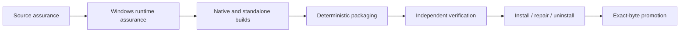

# WinCare validation and evidence gates

WinCare validation is layered so that source consistency, compilation, smoke tests, runtime behavior, package integrity, and installation lifecycle evidence cannot substitute for one another.

## Validation objectives

The validation system is designed to answer separate questions:

1. **Is the source tree structurally coherent?**
2. **Do contracts, exports, dispatchers, UI routes, and manifests agree?**
3. **Are filesystem, process, network, state, and archive operations bounded?**
4. **Does the code execute correctly on supported Windows environments?**
5. **Are native and standalone artifacts built from the audited source state?**
6. **Is the package deterministic and independently verifiable?**
7. **Can the exact release artifact be installed, repaired, launched, and uninstalled safely?**

A production claim requires the evidence appropriate to every applicable question.

## Evidence vocabulary

Use these terms precisely:

- **Verified** — the stated behavior was executed successfully in the stated environment.
- **Statically validated** — source or artifact structure was checked without executing the platform behavior.
- **Reviewed** — a human inspected the implementation or evidence against the stated contract.
- **Pending** — required evidence was not available in the current environment.
- **Blocked** — a declared prerequisite, policy, dependency, or environment condition prevented execution.
- **Failed** — the relevant check or behavior executed and did not satisfy its contract.

Compilation, parsing, source inspection, or a passing smoke test is not runtime-equivalence evidence.

## Gate overview



## 1. Source assurance

Source validators can run before a Windows environment is available. They cover repository-wide invariants such as:

- closed module/source membership;
- definition/export parity;
- action/dispatcher parity;
- public entry-point and parameter compatibility;
- current source-reference identity;
- anti-stub and synthetic-success rules;
- maintainability limits;
- network-egress authority;
- external-process authority;
- bounded runtime I/O;
- read-only state discipline;
- context-menu safety;
- test-fixture integrity;
- GUI catalog and resource consistency;
- release-tool and archive-adversarial behavior.

Run the complete Linux-capable/source suite from the repository root:

```bash
python tools/validate_source.py .
python tools/validate_module_manifest.py .
python tools/validate_action_bindings.py .
python tools/validate_powershell_calls.py .
python tools/validate_test_source_assertions.py .
python tools/validate_source_references.py .
python tools/audit_stub_inventory.py .
python tools/validate_maintainability.py .
python tools/validate_network_egress.py .
python tools/validate_external_processes.py .
python tools/validate_bounded_io.py .
python tools/validate_read_only_state.py .
python tools/validate_context_menu_catalog.py .
python tools/validate_test_fixtures.py .
python tools/validate_gui.py .
python -m unittest tools.test_release_tools tools.test_standalone_release tools.test_maintainability tools.test_security_invariants tools.test_cleaner_preview tools.test_gui tools.test_source_references tools.test_wincare_ps_source -v
```

These checks can prove source-level closure and reject known unsafe shapes. They cannot prove Windows provider behavior.

## 2. Windows runtime assurance

The mandatory Windows gate runs the repository in a supported Windows environment and exercises:

- normal module import and export discovery;
- PSScriptAnalyzer;
- the complete Pester suite;
- core, provider, platform, UI, and safety behavior;
- .NET 8 native builds from source;
- GUI catalog and XAML resource validation;
- standalone payload and executable behavior;
- deterministic package construction and verification;
- installation, repair, launch/self-test, and clean uninstallation.

Run:

```powershell
.\tools\Invoke-WindowsValidation.ps1 `
  -OutputDirectory .\artifacts\windows-validation
```

The output directory contains the validation evidence and diagnostics produced by the current script/workflow version.

A passing source suite with a missing Windows gate must be reported as **statically validated; Windows runtime evidence pending**, not verified.

## 3. Native and standalone assurance

Production native artifacts must be built from the current audited source closure. The release process records source and toolchain evidence and rejects mismatches between expected and produced artifacts.

Standalone assurance includes:

- construction of a manifest-bound payload;
- payload and manifest SHA-256 binding into the assemblies;
- source-built self-contained single-file executables;
- expected x64 PE architecture and console/GUI subsystem;
- no unexpected loose publish files;
- independent hashes for each executable;
- executable self-test;
- adversarial payload/cache/archive tests;
- restricted argument forwarding and side-effect-free help preflight.

The expected executables are:

- `WinCare.exe`;
- `WinCare-GUI.exe`;
- `WinCare-TUI.exe`.

## 4. Release-package assurance

The release builder must start from an absent or empty safe output directory and use one audited source state.

Run a local production-style build with:

```powershell
.\tools\Build-Release.ps1 `
  -OutputDirectory .\artifacts\release
```

Do not use `-SkipTests` or `-AllowDirty` for a promotable production candidate.

The release path produces or verifies evidence such as:

- closed release manifest;
- source/native/payload hashes;
- build and release receipts;
- asset checksums;
- SPDX SBOM;
- in-toto provenance;
- standalone build metadata;
- verifier results;
- installation lifecycle evidence.

See [Release Engineering](docs/RELEASE.md) for phase-level detail.

## 5. Independent archive verification

Independent verification treats archives and companion assets as hostile input. It rejects, as applicable:

- absolute or parent-traversal paths;
- Windows-reserved or otherwise unsafe names;
- duplicate and case-colliding paths;
- links and reparse-like content;
- excessive entries, member sizes, total size, or expansion;
- malformed manifests and unsupported schemas;
- missing or unmanifested files;
- hash mismatches;
- dirty production receipts;
- profile/version/native/payload/provenance mismatches;
- unexpected standalone assets or directories.

Verification must stream and bound archive processing; it must not extract untrusted content first and validate it afterward.

## 6. Installation lifecycle assurance

The exact final archive must pass the installation lifecycle gate. The gate verifies the current supported behavior, including:

- production receipt and manifest acceptance;
- safe installation destination;
- installation identity and managed-tree closure;
- GUI and console launcher/shortcut behavior where applicable;
- repair of a recognized installation;
- refusal of unrecognized or unsafe destinations;
- conservative corrupt-install recovery;
- uninstall identity and tombstone validation;
- optional product-data purge under separate data-root identity;
- no unexpected residue within the tested scope.

An archive that verifies but cannot pass the supported installation lifecycle is not promotable.

## 7. CI evidence aggregation

CI should preserve every gate result rather than hiding later failures behind the first failure. The workflow records:

- validation context;
- per-gate ID, description, status, exit code, duration, and log path;
- generated artifacts and hashes;
- job summary;
- complete diagnostic artifacts even when a gate fails.

The Windows matrix may exercise more than one supported runner image. A success on one image does not erase a failure on another required image.

## Promotion rule

A development artifact is not a production release.

Promotion requires:

1. all mandatory source and Windows gates pass;
2. native and standalone artifacts are source-built and verified;
3. the production package is deterministic for its declared inputs;
4. independent verification passes for the exact final archive and assets;
5. installation, repair, launch/self-test, and uninstall evidence passes;
6. receipts, manifests, SBOM, checksums, and provenance are coherent;
7. the published artifacts are the same immutable bytes that passed the gates.

Do not rebuild, re-zip, rename content internally, or regenerate evidence after verification and call it the same candidate.

## Diagnosing failures

When a gate fails:

1. preserve the gate log and diagnostic index;
2. identify whether the failure is caused by the candidate, pre-existing source state, environment, dependency outage, or flaky provider;
3. stop attempting to remediate unrelated failures;
4. continue only when the requested outcome can still be validated independently and safely;
5. otherwise treat the failure as a blocker;
6. rerun the focused gate after remediation;
7. rerun the complete mandatory chain before promotion.

Report unrelated/environmental failures separately from regressions introduced by the change.

## Change-to-gate mapping

| Change | Minimum focused evidence before full CI |
| --- | --- |
| Documentation only | link/command review; source validators that inspect docs/contracts when applicable |
| PowerShell core/provider | relevant Pester suite plus source/action/public-call validators |
| Export or module topology | module manifest, source, export/definition, and import tests |
| Filesystem/process/network authority | corresponding bounded-I/O/process/network validators and negative-path Pester tests |
| UI/XAML/catalog | GUI validator, UI contract tests, and Windows launch evidence |
| Native .NET | source build, native contract tests, provenance/hash evidence |
| Standalone host/payload | adversarial Python tests, publish, PE checks, self-test, final verifier |
| Installer/uninstaller | installation lifecycle suite on supported Windows |
| Release tooling | release-tool unit tests, deterministic build comparison, adversarial verifier cases |

Focused checks accelerate feedback; they do not replace the full mandatory release chain.

## Related documents

- [Testing](docs/Testing.md)
- [Release Engineering](docs/RELEASE.md)
- [Architecture](docs/ARCHITECTURE.md)
- [Security](SECURITY.md)
- [Contributing](CONTRIBUTING.md)
