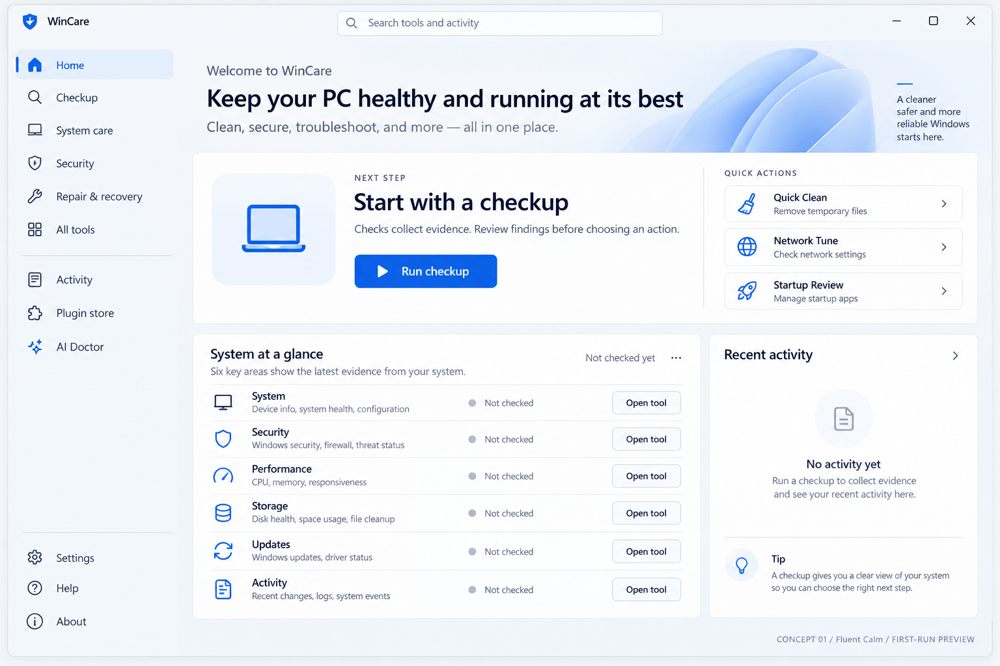
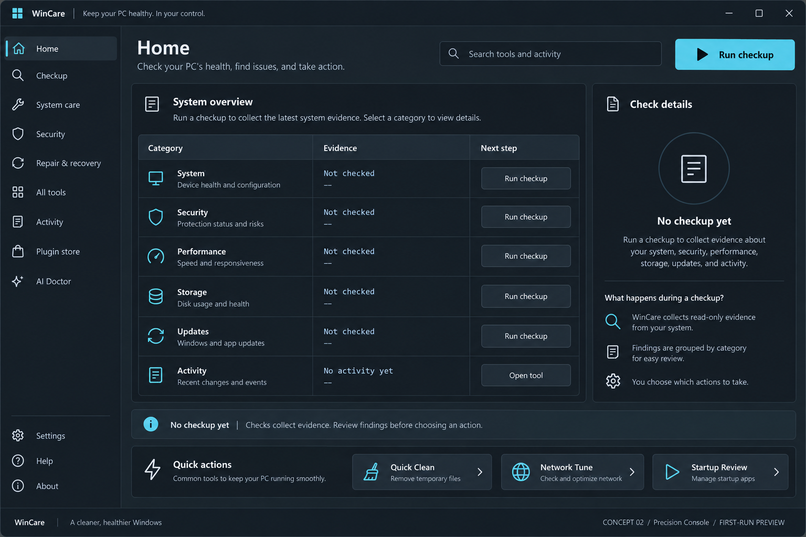
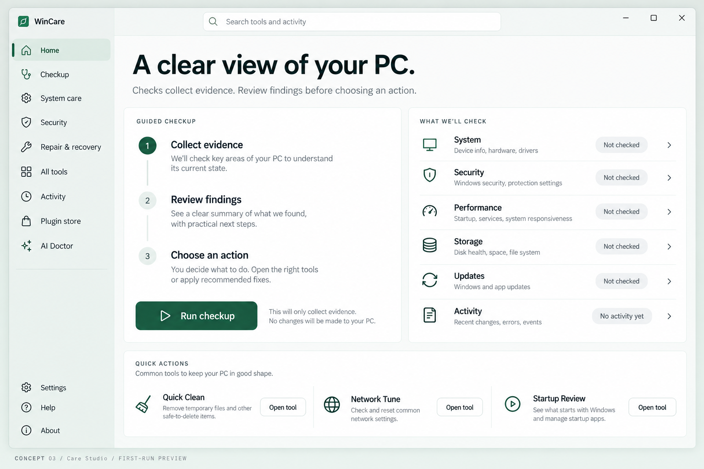
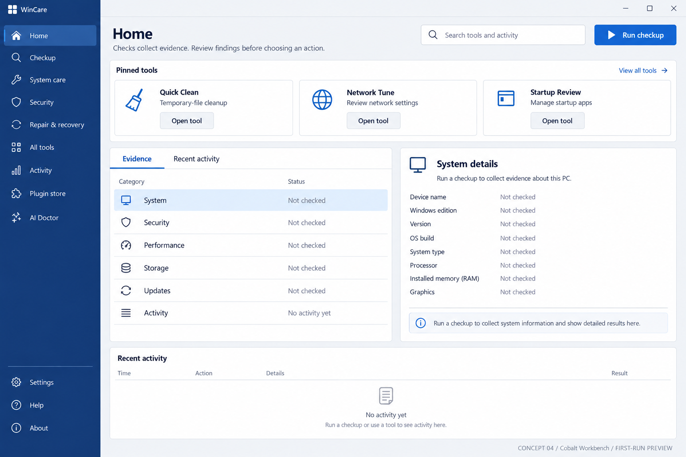
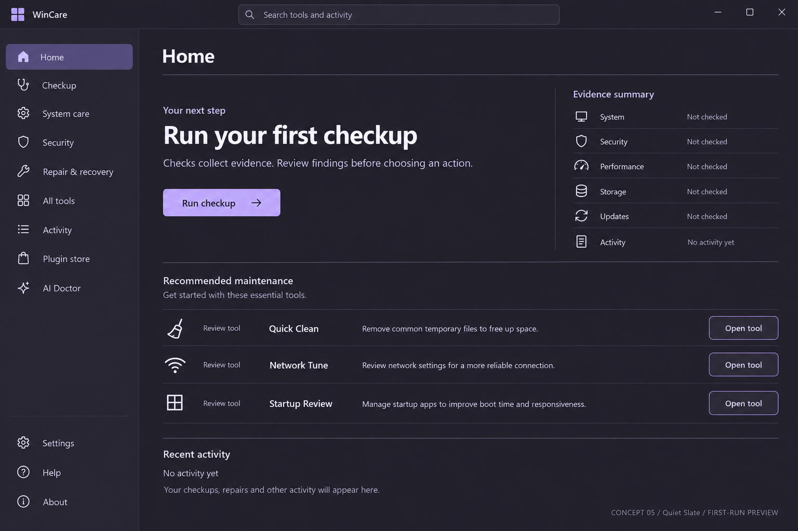

# WinCare — five visual directions

Generated first-run design concepts for selection, not screenshots of the running app.

## 1. Fluent Calm

Bright Windows-style workspace with a clear next step and readable evidence rows.

## 2. Precision Console

Dark technician workspace with a dense evidence table and a dedicated details pane.

## 3. Care Studio

A spacious green-accented interface that guides users through checkup, findings, and action.

## 4. Cobalt Workbench

A cobalt navigation rail, prominent tools shelf, and split evidence workspace.

## 5. Quiet Slate

A restrained dark interface with lavender accents, open space, and continuous maintenance rows.

Selection closed: the later Precision Console studies A, C, D and E form the hybrid. See the root DESIGN.md for the active specification. Generated icons and incidental copy remain subject to the app's actual functionality and standards.
