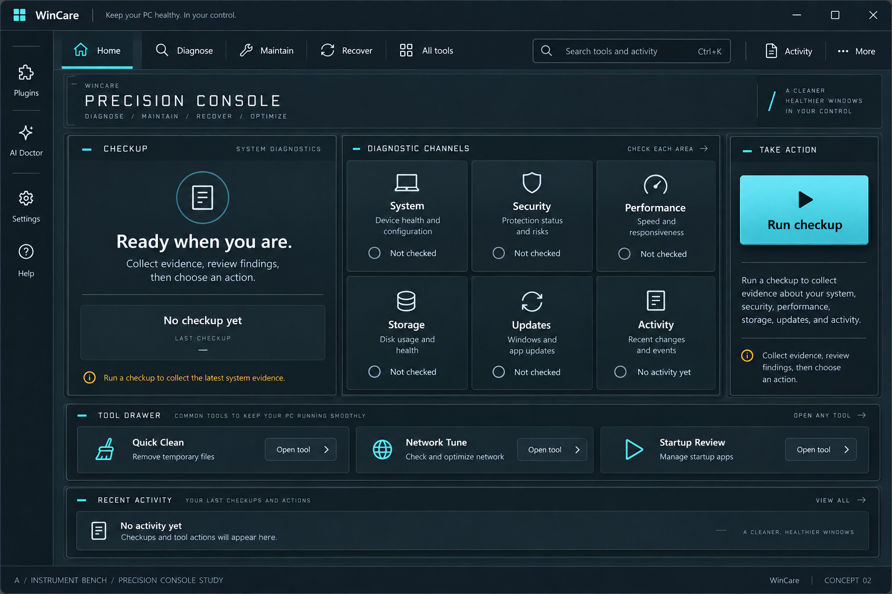
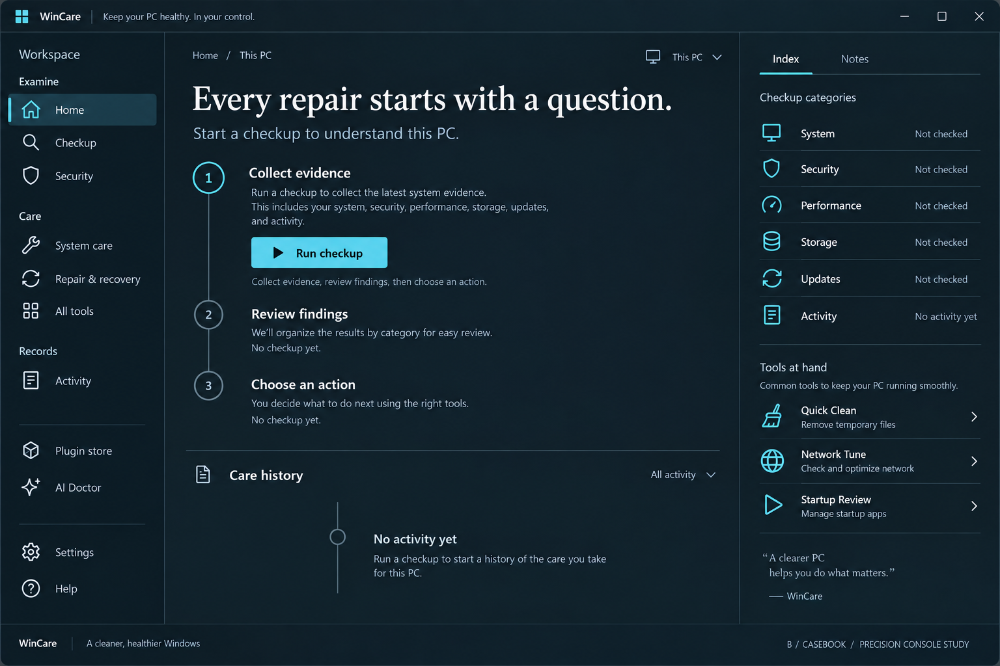
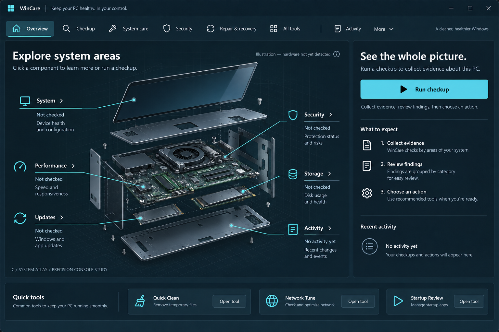
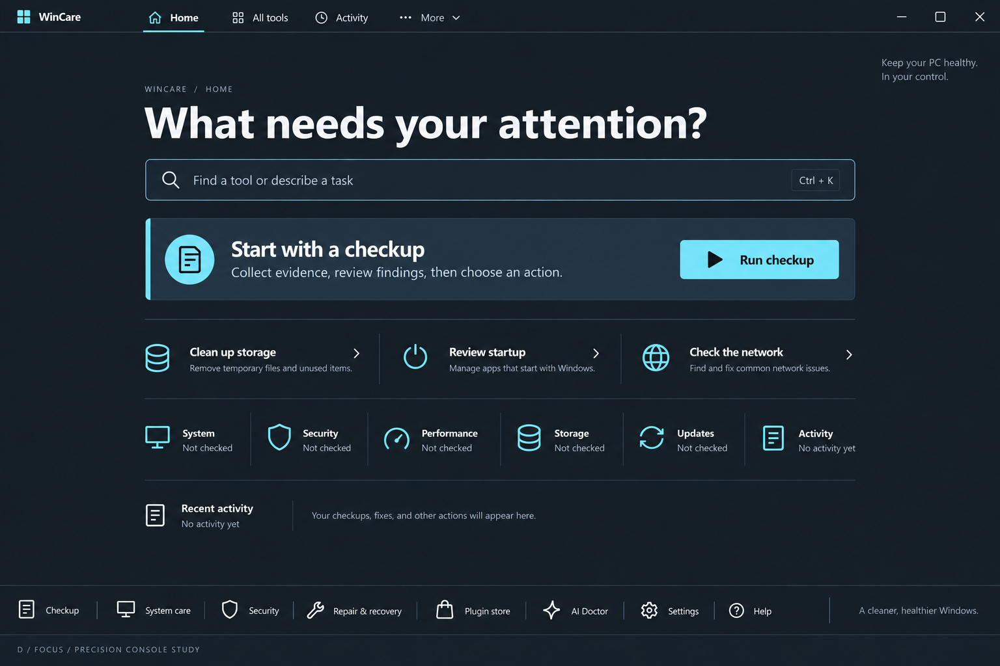
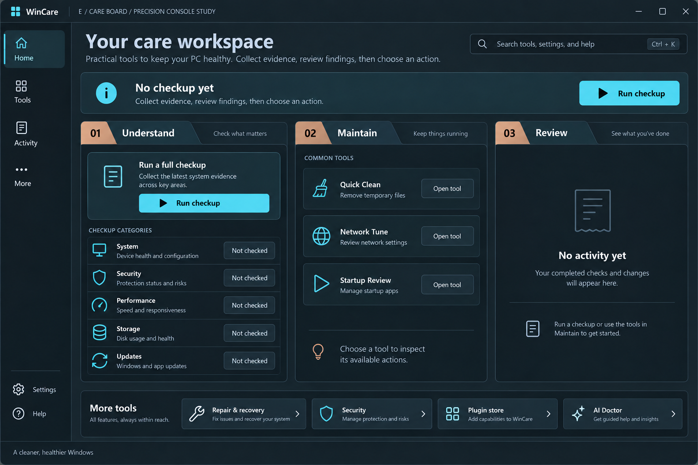

# Precision Console — five fresh directions

Status: A, C, D and E selected for the implemented Precision Workspace hybrid. These studies remain historical references; the root DESIGN.md describes the active visual system.

## Corrected brief

The user selected original option 2, Precision Console, and explicitly rejected the earlier set for being too similar. The current request is five fresh variations with soul and character. Original option 1 and its unrendered character prompts are superseded.

Preserve the dark technical feel, task clarity, evidence-first semantics, and Windows app identity. Vary composition, navigation, type, density and the organizing idea. These are image concepts, not verified running interfaces. New navigation groupings are proposals; existing functionality remains the implementation boundary.

## A — Instrument Bench

Engineered, tactile, exact. A broad integrated diagnostic instrument replaces the dashboard: horizontal navigation, six diagnostic channels, a dedicated start control and a low tool drawer. Character comes from enamel-like surfaces, precision typography and disciplined control geometry.

## B — Casebook

Thoughtful, investigative, personal. A continuous case page with a vertical evidence narrative, care history, and a right-side category index. Character comes from document rhythm and the feeling of keeping a reliable record of the PC.

## C — System Atlas

Curious, spatial, lucid. A large conceptual computer illustration provides category navigation, with a right-side inspector and bottom work tray. The illustration is explicitly not detected hardware. Character comes from a custom technical drawing that makes the system approachable.

## D — Focus

Direct, quiet, confident. A centered search and action workspace with almost no container chrome. Character comes from confident negative space, expressive typography and immediate access to the next task.

## E — Care Board

Resourceful, hands-on, organized. Three vertical work lanes — Understand, Maintain, Review — arrange evidence, tools and receipts by intent. Character comes from workshop-like tabs and tangible task organization. Dragging or queued automation is not implied.

## Implementation constraints after selection

- Keep the native WinUI application; choose one visual system and extend shared resources and controls before restyling all pages.
- Keep existing command and approval behavior, honest unknown states, plugin restrictions and activity receipts.
- Preserve keyboard access, meaningful automation names, high contrast and compact layouts. Static concept art does not verify accessibility or behavior.
- Preserve user-selected appearance support. Develop both theme variants after a direction is selected.
- A custom illustration, if chosen, is a separate asset behind live labels and controls. Never ship a screenshot as the interface.

Generated with the built-in image tool using the original Precision Console screenshot as a mood/product reference, explicitly excluding its layout. Full prompts: prompts.json.
