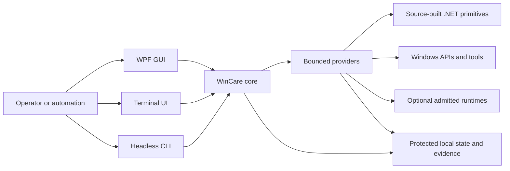
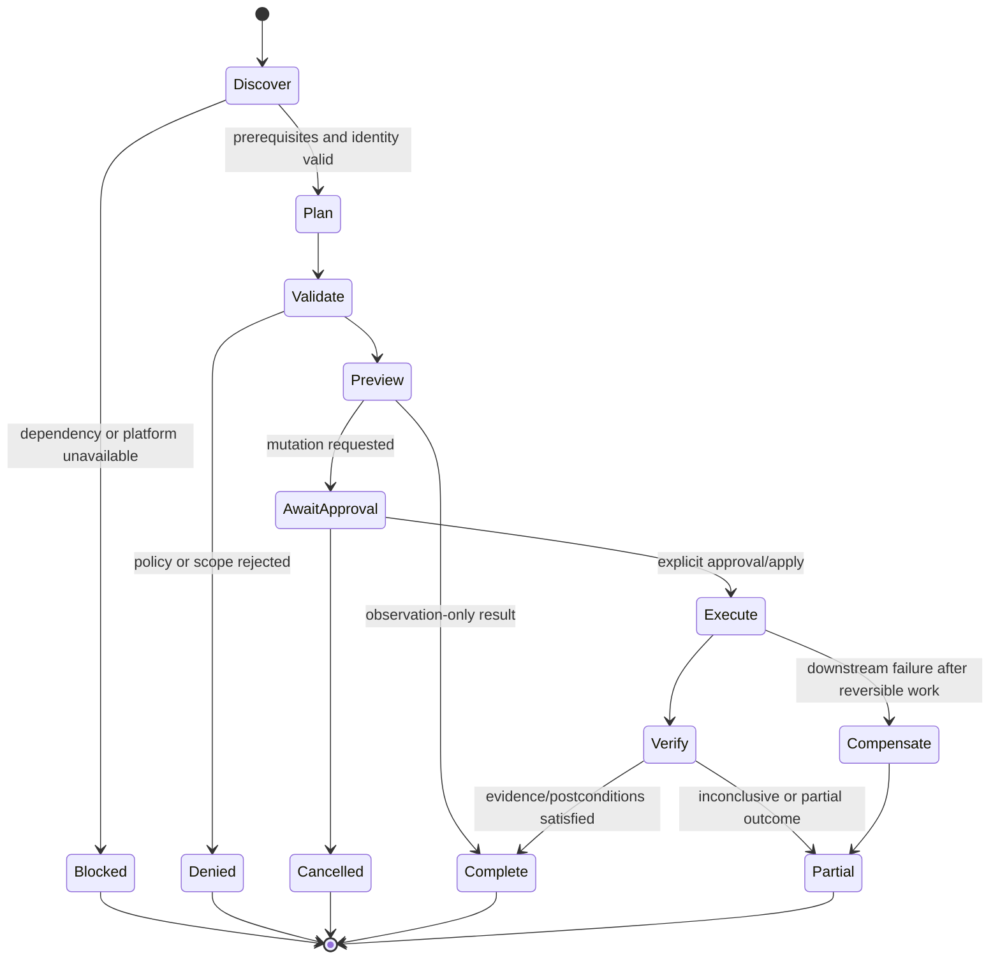
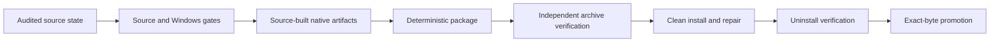

# WinCare architecture

WinCare is a safety-first Windows operations and diagnostics workstation. Its architecture separates presentation, orchestration, privileged operating-system interaction, compiled primitives, state/evidence, and release verification so that no single surface silently acquires unrestricted authority.

## Architectural goals

WinCare is designed to provide:

- one governed execution model across GUI, terminal, and headless surfaces;
- explicit separation between observation, planning, approval, execution, and verification;
- bounded interaction with filesystems, processes, networks, archives, and optional runtimes;
- truthful degradation when Windows providers or dependencies are unavailable;
- durable evidence, journals, receipts, and recovery information;
- deterministic, independently verifiable release artifacts.

## System context

The presentation surfaces share the same backend contracts. A GUI button, menu item, terminal action, and headless route must not implement independent mutation logic.

## Implementation ownership

### PowerShell

PowerShell owns:

- public entry points;
- environment and capability discovery;
- typed action and plan construction;
- policy and approval checks;
- provider orchestration;
- Windows administration;
- transactions, journals, receipts, postconditions, and compensation;
- GUI/TUI routing and headless result shaping;
- installation lifecycle orchestration.

### .NET 8

Source-built .NET components own narrow primitives that benefit from compiled code or direct Windows interop, including bounded file/binary operations and selected operating-system integrations. Native projects are built from the audited source tree during the mandatory Windows/release workflow.

The standalone host also uses .NET 8 to embed and verify the WinCare payload, constrain forwarded arguments, and launch the appropriate PowerShell surface.

### Python

Python tooling owns:

- cross-file structural validation;
- contract, source-reference, and maintainability checks;
- deterministic package construction;
- independent archive verification;
- release receipts, manifests, checksums, SBOM/provenance support;
- adversarial tests for release and verification tooling.

Python is not the runtime authority for Windows administration.

## Repository-level components

| Path or component | Responsibility |
| --- | --- |
| `WinCare.ps1` | canonical script entry point for terminal, GUI routing, and headless commands |
| `WinCare-GUI.ps1` / `WinCare-TUI.ps1` | surface-specific launch wrappers |
| `src/WinCare/WinCare.psd1` | module identity and public export contract |
| `src/WinCare/WinCare.psm1` | closed module composition/import path |
| `src/WinCare/Core/` | models, configuration, safety, policy, transaction, compatibility, and evidence infrastructure |
| `src/WinCare/Providers/` | bounded capability implementations and plans |
| `src/WinCare/UI/` | WPF/TUI catalogs, routing, resources, and presentation logic |
| `src/WinCare/Native/` | source-built compiled primitives |
| `src/WinCare/Standalone/` | self-contained executable host and project definitions |
| `src/WinCare/Install/` | installation, repair, shortcut, integrity, and uninstall implementation |
| `tests/` | Pester contract, provider, safety, UI, platform, and release tests |
| `tools/` | source validators, release builder/verifiers, Windows validation, and packaging tools |

## Execution lifecycle

A state-changing request moves through a single conceptual lifecycle:

The exact result schema varies by capability, but the architectural invariants are shared:

1. resolve the target and prerequisites;
2. construct a typed plan or observation request;
3. validate compatibility, policy, authority, and scope;
4. preview risk and affected resources;
5. acquire explicit apply/elevation authority when required;
6. execute through a bounded provider;
7. verify observable evidence or postconditions;
8. journal the result and compensate completed reversible steps when appropriate.

## Authority model

WinCare treats authority as layered rather than implicit:

| Authority | Meaning |
| --- | --- |
| Observe | read system/provider state without requesting persistence |
| Plan | construct a proposed mutation and disclose risk/resources |
| Apply | authorize the current plan to execute |
| Elevate | run the admitted high-impact operation with required administrator authority |
| Persist | create durable state, policy, task, service, rule, file, or configuration |
| Transmit | send data to an explicitly admitted endpoint or peer |
| Recover | compensate or repair a known WinCare transaction/installation |

Possessing one authority does not automatically grant another.

## Provider contract

A provider should expose a narrow capability rather than a general-purpose shell. Its contract identifies:

- prerequisite and platform requirements;
- accepted typed arguments;
- read-only versus mutating behavior;
- required approval/elevation;
- exact external tools or APIs used;
- resource and output limits;
- evidence/postconditions;
- blocked, unsupported, denied, partial, and failure behavior;
- compensation or non-recoverable steps.

Optional dependencies are discovered and reported; they are not silently installed.

## State, evidence, and recovery

WinCare keeps local state under a product-controlled state root and uses explicit schemas/identity records for protected or lifecycle-sensitive data. Depending on the capability, evidence may include:

- canonical target identity;
- before/after observations;
- selected action and arguments;
- policy/approval decisions;
- external process identity and exit code;
- hashes, manifests, or signatures;
- provider-specific postconditions;
- transaction journal and receipt;
- compensation result;
- blocked or unsupported reason.

Read-only mode must not gain persistent mutation authority merely because a provider is loaded.

## Failure semantics

WinCare distinguishes:

- **Blocked** — a declared prerequisite, dependency, policy, or environment condition prevents execution.
- **Unsupported** — the requested capability is not implemented or meaningful in the current environment.
- **Denied** — policy, approval, target, or authority validation rejected the request.
- **Failed** — execution was attempted but did not complete successfully.
- **Partial** — some work completed or evidence is incomplete; the result must disclose residual state.
- **Unknown** — the platform did not provide enough trustworthy evidence to assert a state.

These outcomes must not be normalized into success.

## Trust boundaries

The principal trust boundaries are documented in [SECURITY.md](../SECURITY.md). Architecturally, the most important are:

- all user-supplied values remain data and are validated against contracts;
- filesystem authority is canonical, bounded, and no-follow;
- external processes are admitted by exact identity and constrained execution;
- network activity uses explicit destinations and bounded responses;
- archives/packages are treated as hostile until independently verified;
- optional runtimes do not gain ambient filesystem/network authority;
- UI surfaces never bypass the core transaction/policy layer.

## Standalone executable architecture

Release builds can produce:

- `WinCare.exe`;
- `WinCare-GUI.exe`;
- `WinCare-TUI.exe`.

Each standalone host embeds a verified WinCare payload. At runtime the host:

1. validates assembly-bound payload and manifest hashes;
2. admits only the expected payload closure;
3. verifies safe archive membership and extraction constraints;
4. uses a hash-addressed local cache with synchronization;
5. verifies the selected entry script against the manifest;
6. accepts only the supported entry-point parameters;
7. starts the appropriate GUI or console surface.

The embedded payload remains the source of runtime behavior; the host is not a general-purpose PowerShell launcher.

## Installation architecture

The public installer and uninstaller are compatibility entry points over the installation module. Installation/repair behavior is bound to release evidence and product identity. The lifecycle includes:

- safe destination resolution;
- production receipt and manifest verification;
- managed-tree identity;
- transactional staging/replacement;
- shortcut identity and rollback;
- repair of recognized WinCare installations;
- conservative refusal of unrecognized or unsafe removal targets;
- optional guarded recovery for corrupt installations;
- clean uninstall and optional product-data purge under separate identity checks.

## Release architecture

A production release is an evidence bundle, not merely a ZIP or executable. The release workflow connects:

See [Release Engineering](RELEASE.md) and [Validation](../VALIDATION.md).

## Architectural change checklist

When changing architecture, verify:

- the responsible implementation layer remains clear;
- no surface gained an independent mutation path;
- action/export/dispatcher/module closure remains coherent;
- new authority is explicit and testable;
- failure and degradation results remain truthful;
- state schemas and recovery behavior remain compatible or are migrated;
- package/install/release evidence is updated when runtime closure changes;
- the capability, command, compatibility, security, test, and release docs are updated as applicable.
