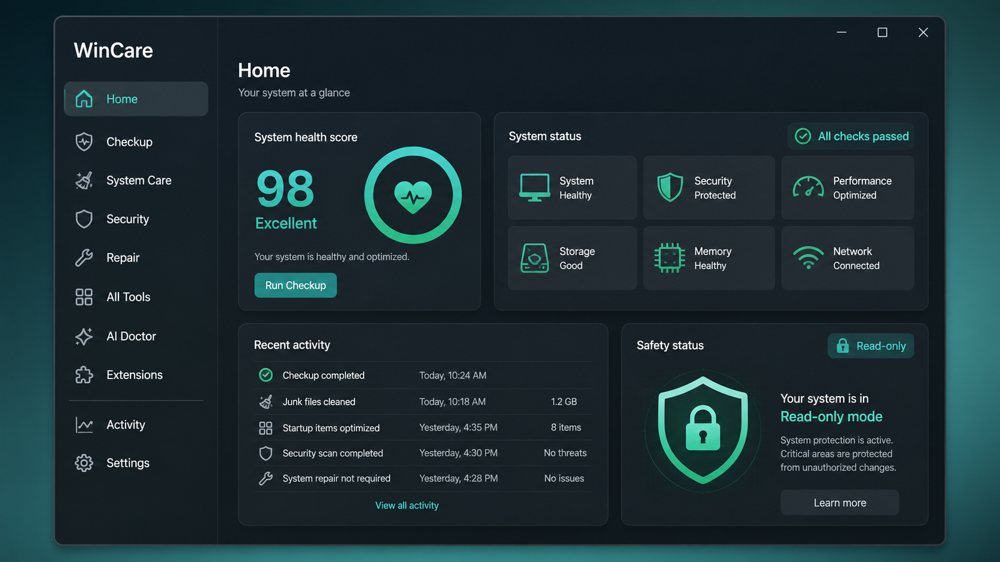
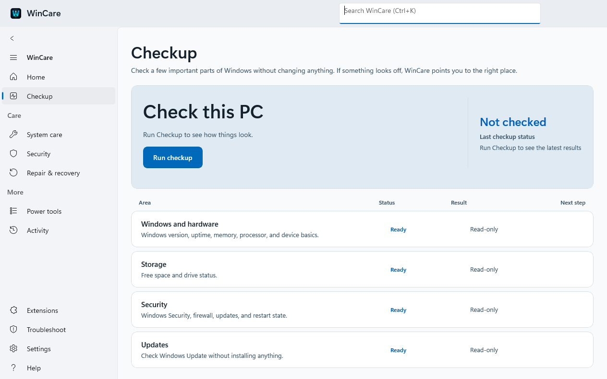
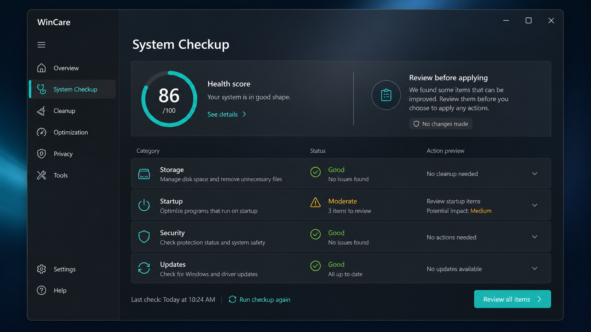
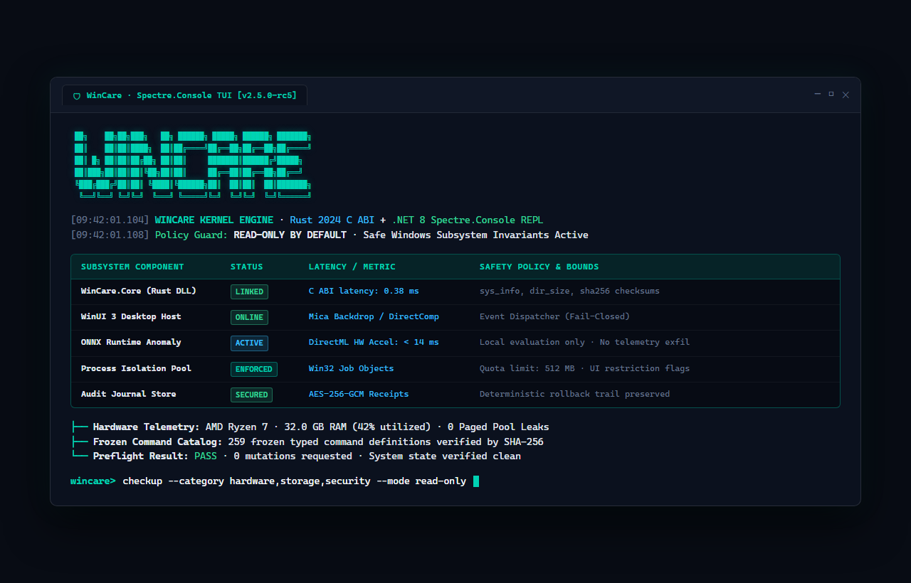
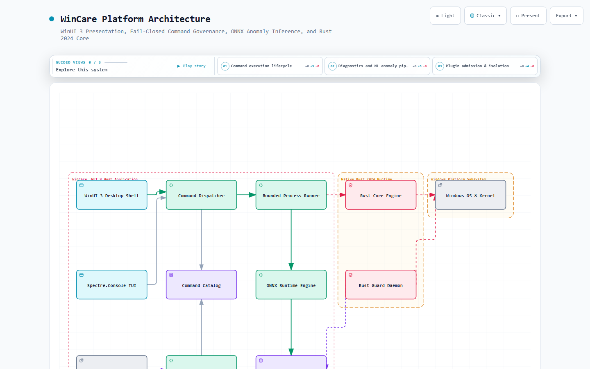
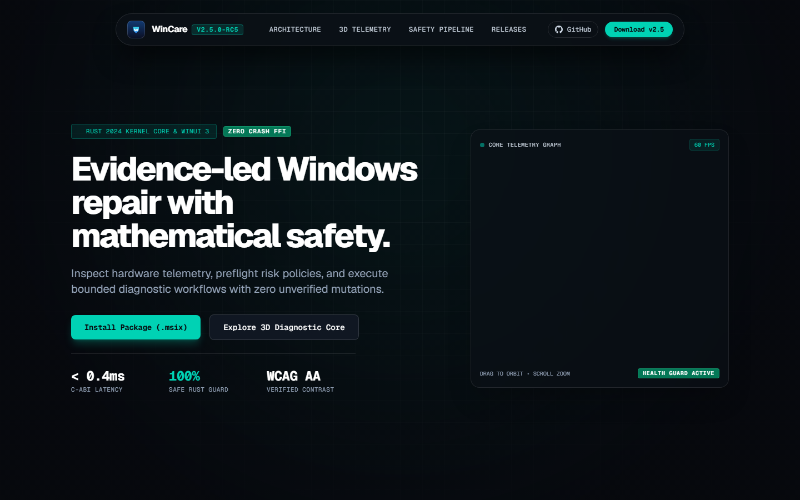

# Interface screenshots

The checked-in runtime images below were captured from the locally installed **v2.5.0.0 x64 MSIX** built from the `v2.5.0-rc5` source candidate. They are **historical runtime evidence for that exact package**, not a perpetual source of truth for later source changes.

PR #30 includes subsequent UI and product-hardening changes (including live Home evidence, genuine compact Checkup layouts, Activity report semantics, typed All Tools parameters, Help content, accessibility color adjustments, and plugin trust copy). Until a new installed candidate is captured, the current XAML/theme resources are authoritative for those changed surfaces and these images should be treated as baseline references only.

Concept images remain design references and are explicitly marked as concepts.

## Home

### Historical runtime — v2.5.0-rc5 candidate

**Capture status:** needs recapture after the current PR is packaged. The present source now derives dashboard evidence from Activity/check results and surfaces plugin-widget failures.

### Original concept

## Checkup

### Historical runtime — v2.5.0-rc5 candidate

**Capture status:** needs recapture after the current PR is packaged. The present source uses evidence-collection coverage rather than a machine-health claim, runs measurement-sensitive probes sequentially, and has a real stacked compact layout below the shared 920-DIP breakpoint.

### Original concept

## Spectre.Console TUI

### Headless Terminal & Diagnostic REPL

## Platform Architecture

### C4 Interactive Architecture Model

## Interactive Web Showcase

### Awwwards-Tier Engineering Showcase

**Interactive experience:** Open [`docs/showcase.html`](file:///D:/Github/WinCare/docs/showcase.html) in any modern browser for the live WebGL neural topology, interactive command execution simulator, and responsive telemetry panels.

## Capture policy

Every runtime image must record:

- the exact package/product version;
- architecture (`x64` or `ARM64`);
- the source commit SHA or release tag;
- whether the image came from an installed MSIX or portable build;
- the Windows appearance used when visually relevant.

Runtime captures must be taken from a known built artifact and kept free of machine names, account names, paths, license keys, tokens, or other personal data. Concept imagery must never be presented as a runtime capture.

A screenshot remains authoritative only for the exact build it names. Any UI-affecting change after that build automatically makes the screenshot **historical** until recaptured and visually checked again.
