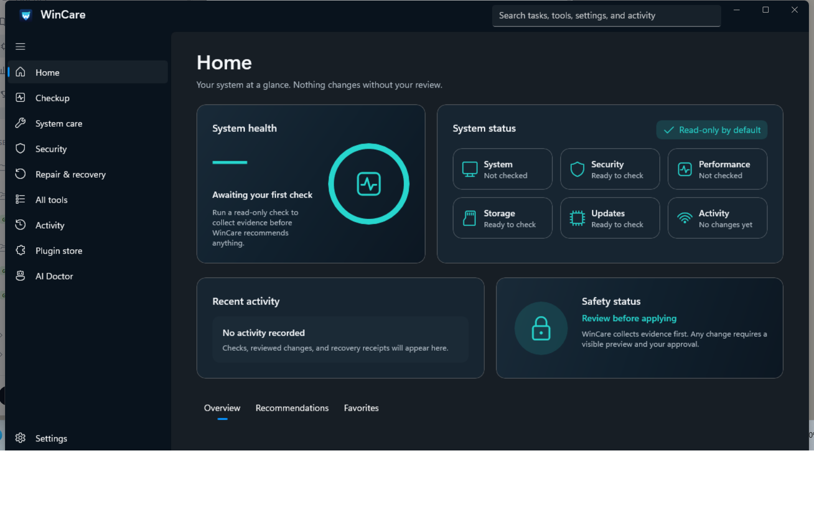

# WinCare User Guide

Use this guide to install WinCare, understand its safety prompts, and choose the right workflow for a diagnostic or repair. WinCare is a release candidate: review every planned change before approving it.

> [!TIP]
> See the [interface screenshots](Screenshots.md) before you begin. They include real v2.5.0-rc1 runtime captures and the original concepts for comparison.

---

## 📑 Table of Contents

1. [Introduction & System Requirements](#1-introduction--system-requirements)
2. [Installation & Getting Started](#2-installation--getting-started)
3. [Core Concepts & Safety Philosophy](#3-core-concepts--safety-philosophy)
4. [Navigation & Workspace Overview](#4-navigation--workspace-overview)
5. [Feature Walkthroughs](#5-feature-walkthroughs)
   - [🏠 Home](#-home)
   - [🩺 System Checkup](#-system-checkup)
   - [⚡ System Care](#-system-care)
   - [🛡️ Security & Privacy](#-security--privacy)
   - [🔧 Repair & Recovery](#-repair--recovery)
   - [🧰 All Tools Catalog](#-all-tools-catalog)
   - [🧠 AI System Doctor](#-ai-system-doctor)
   - [🧩 Plugin Store & Extensions](#-plugin-store--extensions)
   - [📋 Activity & Audit Journal](#-activity--audit-journal)
   - [⚙️ Settings & Encrypted Cloud Sync](#-settings--encrypted-cloud-sync)
6. [Creating Community Plugins](#6-creating-community-plugins)
7. [Keyboard Shortcuts & Accessibility](#7-keyboard-shortcuts--accessibility)
8. [Troubleshooting & Frequently Asked Questions](#8-troubleshooting--frequently-asked-questions)

---

## 1. Introduction & System Requirements

**WinCare** is a native, modern Windows diagnostic, optimization, security, and recovery system engineered with **WinUI 3**, **.NET 8**, and **Rust 2024**. It replaces legacy scripting wrappers with a memory-safe, fail-closed desktop application designed for power users, system administrators, and technicians.

### System Requirements

| Requirement | Specification |
|---|---|
| **Operating System** | Windows 10 (Version 2004 / Build 19041 or newer) or Windows 11 |
| **Architecture** | 64-bit (`x64` or `ARM64`) |
| **Memory (RAM)** | 2 GB minimum (4 GB recommended) |
| **Disk Space** | ~150 MB for application and local ONNX runtime assets |
| **Privileges** | Standard User for read-only diagnostics; Administrator privileges for mutating repairs |

---

## 2. Installation & Getting Started

WinCare offers multiple distribution formats to match your deployment workflow:

### Option A: MSIX Modern App Package (App SDK Integration)
1. Download `WinCare-v<version>-<arch>.msix` from the [GitHub Releases Page](https://github.com/AmirrezaFarnamTaheri/WinCare/releases). Choose `x64` for most Intel and AMD PCs; choose `ARM64` for Windows on ARM.
2. If the release uses a development certificate, download the matching `WinCare-v<version>-<arch>.cer` and run the helper:
   ```bash
   python install_msix.py \
     --package WinCare-v<version>-x64.msix \
     --certificate WinCare-v<version>-x64.cer
   ```
   Run this command from an elevated terminal when the certificate is not already trusted. The helper verifies that the package signer is exactly `CN=WinCare Development`, requires the certificate thumbprint to match the package signer, imports only that certificate into `LocalMachine\TrustedPeople`, and verifies the signature again before installation. Do not import an unverified certificate manually.
3. WinCare is now installed in your Windows Start Menu with full Windows App SDK integration.

### Option B: Standalone Single-File Binary (`.exe`)
1. Download `WinCare-v<version>-<arch>.exe`.
2. Place the executable anywhere on your disk (e.g. `C:\Tools\WinCare.exe` or a USB drive).
3. Double-click to launch directly—no external runtime installation required.

### Option C: Portable ZIP Distribution (`.zip`)
1. Download `WinCare-v<version>-<arch>-portable.zip`.
2. Extract the archive to any folder.
3. Launch `WinCare.App.exe` directly from the extracted folder.

> [!TIP]
> **Portable USB Toolkit**: The portable `.zip` and single-file `.exe` distributions are fully self-contained, making them ideal for offline recovery USB drives and field technician toolkits.

---

## 3. Core Concepts & Safety Philosophy

WinCare is engineered around strict fail-closed safety invariants to protect your operating system from unexpected state changes or corrupted files.

```
                   WinCare Two-Phase Safety Flow
                   
  Select Tool ───> Read-Only Observation ───> Parameter Preflight (Preview)
                                                        │
                                                        ▼
  Receipt & Journal <─── Execute Mutation <─── User Review Approval
```

### 1. Two-Phase Approval (`Preview` → `Apply`)
- **Read-Only Inspection**: Tools first inspect your system without changing any settings or files.
- **Preview & Parameter Preflight**: Before any modifying action can be executed, WinCare performs a dry-run preview, validating all parameters and showing you exactly which files, services, or registry keys will be affected.
- **Explicit Review Approval**: Mutating operations will **never** execute silently. You must explicitly click **Approve** or confirm the action plan.

### 2. Monospaced Status Pills & Risk Badges
Every tool and command displays a standardized, monospaced status pill indicating its operational character:

| Status Badge | Meaning & Impact |
|---|---|
| `[ READ-ONLY ]` | **Safe**: Queries telemetry, hardware status, or logs without changing system state. |
| `[ MUTATING ]` | **Modifying**: Cleans files, modifies settings, disables services, or installs updates. Requires review approval. |
| `[ ELEVATED ]` | **Privileged**: Requires Windows Administrator (UAC) privileges to perform the operation. |
| `[ NOT READY ]` | **Candidate**: An experimental or unverified route that fails closed to protect the system. |

### 3. PII-Safe Activity Journal
WinCare records every executed command and diagnostic check to a local activity journal. To protect your privacy, error logs record **only exception type names** (e.g., `UnauthorizedAccessException`) rather than raw error messages that might expose private file paths or usernames.

---

## 4. Navigation & Workspace Overview



<em>Conceptual interface preview. The shipped application may differ as features evolve.</em>

WinCare's interface uses native **Windows Fluent Mica** depth layering and a clean **Cyber-Teal** visual identity:

```text
+----------------------------------------------------------------------------------------------------+
| WinCare  [ 🔍 Search catalog tools... (Ctrl+K) ]                          [—] [口] [X]             |
+-------------------+--------------------------------------------------------------------------------+
| 🏠 Home           | 🩺 System Checkup                                                              |
| 🩺 Checkup        | [ Quick check ]  [ Full check ]  [ Custom check ]  [ Results ]                  |
| ⚡ System care    |                                                                                |
| 🛡️ Security       | ┌────────────────────────────────────────────────────────────────────────────┐ |
| 🔧 Repair         | │ 🔍 Health Score: 98/100                                                    │ |
| 🧰 All tools      | │ RAM: 6.2 / 16.0 GB (38%)  │  Disk C: 142 GB Free  │  Uptime: 2d 14h        │ |
| 🧠 AI Doctor      | └────────────────────────────────────────────────────────────────────────────┘ |
| 🧩 Plugin Store   |                                                                                |
| 📋 Activity       | Diagnostic Findings                                                           |
|                   | • [ READ-ONLY ]  System temporary files exceed 4.2 GB                          |
| ───────────────── | • [ READ-ONLY ]  2 startup services delayed boot by 1.8s                       |
| ⚙️ Settings       |                                                                                |
+-------------------+--------------------------------------------------------------------------------+
```

- **Sidebar Navigation**: Switch between functional areas (Checkup, Care, Security, Repair, Tools, AI Doctor, Plugins, Activity).
- **Search Palette (`Ctrl+K`)**: Instantly search across all 259 built-in tools, installed plugins, and diagnostic routines.
- **Adaptive Layout**: On compact windows (< 920 DIP), tabular views collapse automatically into stacked, touch-friendly telemetry cards.

---

## 5. Feature Walkthroughs

### 🏠 Home
The **Home** page provides a high-level cockpit of your Windows PC:
- **System Telemetry**: Real-time CPU utilization, active memory pressure, primary drive storage capacity, and OS build info.
- **Recommended Actions**: Key maintenance tasks identified during background health monitoring.
- **Quick Favorites**: 1-click access to tools you've pinned with the favorite star icon.

---

### 🩺 System Checkup
Run comprehensive health evaluations across hardware, services, network, and storage:
- **Quick Check**: Fast 15-second inspection of critical subsystems (RAM pressure, disk thresholds, Defender status, pending reboot flags).
- **Full Check**: In-depth analysis including component store corruption, driver health, event log anomalies, and background service overhead.
- **Custom Check**: Select specific subsystems to inspect (e.g. only Network and Storage).
- **Results Tab**: Detailed finding records with severity tiers and 1-click remediation triggers.

---

### ⚡ System Care
Maintain optimal system performance, clean accumulated junk, and manage startup items:
- **Clean Up**: Safely purge temporary files, Windows Update download caches, browser caches, and error crash dumps. All traversals strictly avoid reparse points and symlink loops.
- **Performance Tuning**: Optimize visual effects, configure power profiles, and tune network throughput settings.
- **Apps & Startup**: Inspect all applications and services configured to run at logon, analyze their impact on boot duration, and toggle them on or off.
- **Network & Updates**: Flush DNS caches, reset TCP/IP stacks, inspect active network interfaces, and review pending Windows Update packages.
- **Routines**: Execute predefined maintenance batches (e.g. *Monthly Deep Clean*).

---

### 🛡️ Security & Privacy
Audit and harden your Windows installation against security threats and telemetry tracking:
- **Protection Status**: Real-time status of Windows Defender Antivirus, Real-Time Protection, and Firewall profiles.
- **Privacy & Telemetry**: Review and disable non-essential diagnostic telemetry, advertising IDs, and tracking services while preserving core OS functionality.
- **Hardening Policies**: Audit Windows Defender Application Control (WDAC), Attack Surface Reduction (ASR) rules, and credential guard settings.

---

### 🔧 Repair & Recovery
Recover your system from corruption, boot errors, or failed updates:
- **System File Integrity**: 1-click DISM (`Deployment Image Servicing and Management`) and SFC (`System File Checker`) repair workflows.
- **System Restore**: View, create, or restore to Windows System Restore checkpoints before making major system changes.
- **Windows Update Repair**: Reset Windows Update components, stop hung services, and re-register update DLLs.
- **Undo History**: Review compensation actions for operations that support reversible rollback.

---

### 🧰 All Tools Catalog
Access the comprehensive catalog of **all 259 native commands**:
- **Search & Filter (`Ctrl+F`)**: Filter by area (System Care, Security, Maintenance), risk level (`Read-Only`, `Mutating`, `Elevated`), or custom keywords.
- **Parameter Customization**: For advanced operations, edit JSON parameter payloads directly in the detail drawer with real-time JSON schema validation.
- **Two-Phase Dry Run**: Click **Preview** to observe affected resources, then click **Approve** to execute the mutation.

---

### 🧠 AI System Doctor
WinCare features an on-device, privacy-first **AI System Doctor** powered by local ONNX DirectML inference:
1. **Natural Language Chat**: Describe your computer's issue in plain English (e.g., *"My audio is crackling when watching videos"* or *"Drive C is almost out of space"*).
2. **Intent & Symptom Extraction**: The local AI categorizes the symptom into specific diagnostic domains without sending any data over the internet.
3. **Evidence Collection**: The AI executes safe, read-only system queries to gather hardware metrics and logs.
4. **Action Plan Execution**: The Doctor generates a structured `DoctorActionPlan` showing root causes and recommended steps. You review and approve each repair step before execution.

---

### 🧩 Plugin Store & Extensions
Extend WinCare's capabilities through community and third-party plugins:
- **Browse Catalog**: Discover tools, cleaning modules, and diagnostic scripts.
- **Publisher Trust Tiers**:
  - 🛡️ **Verified Organization**: Official packages maintained by the WinCare project.
  - 🔑 **Digitally Signed**: Third-party packages with verified cryptographic signatures (`publisher.pem`).
  - ⚠️ **Community / Unsigned**: Unsigned packages that prompt an explicit full-trust consent dialog.
- **Capability Reviews**: View declared permissions (e.g., File Access, Registry Access, Network Access) before installing.
- **Lifecycle Management**: Enable, disable, update, or uninstall plugins on the fly without restarting WinCare.

---

### 📋 Activity & Audit Journal
The **Activity** page maintains a tamper-evident record of all system operations:
- **Real-Time Feed**: Monitor ongoing tasks, long-running diagnostics, and background checks.
- **Needs Attention**: Easily identify commands that returned blocked, failed, or partial results.
- **Audit Export**: Export execution receipts as structured JSON or Markdown reports for IT auditing.

---

### ⚙️ Settings & Encrypted Cloud Sync
Customize your WinCare experience:
- **Appearance**: Toggle between **Cyber-Teal Dark**, **Mica Light**, or **High Contrast** themes.
- **Background Health Guard**: Enable the lightweight Rust `wincare-guard` daemon to monitor RAM pressure, disk quota, and thermal status in the background, receiving Windows Toast notifications when thresholds are exceeded.
- **Encrypted Cloud Sync**: Securely back up and synchronize your custom presets, favorite tools, and settings across multiple PCs using **AES-256-GCM** authenticated encryption with GitHub Gist sync.

---

## 6. Creating Community Plugins

WinCare includes a comprehensive developer toolkit for creating custom plugins:

```bash
# 1. Navigate to the CLI
cd tools/wincare-plugin-cli

# 2. Scaffold a new plugin project
node bin/wincare-plugin.js create my-custom-cleaner --template json-pack

# 3. Lint and validate the manifest and package boundaries
node bin/wincare-plugin.js validate my-custom-cleaner

# 4. Bundle into a distributable .wincare-plugin archive
node bin/wincare-plugin.js pack my-custom-cleaner my-custom-cleaner.wincare-plugin
```

The second positional argument to `pack` is optional. If omitted, the CLI writes `<plugin-id>-<version>.wincare-plugin` inside the plugin directory. Review generated scripts and declared capabilities before installing or distributing the archive; plugins execute in-process with the permissions of WinCare.

---

## 7. Keyboard Shortcuts & Accessibility

| Shortcut | Action |
|---|---|
| <kbd>Ctrl</kbd> + <kbd>K</kbd> | Open the global command search palette |
| <kbd>Ctrl</kbd> + <kbd>F</kbd> | Focus the search filter box in All Tools or Plugin Store |
| <kbd>F5</kbd> | Refresh page diagnostics and telemetry |
| <kbd>Esc</kbd> | Dismiss search, close modal dialog, or collapse detail drawer |
| <kbd>Tab</kbd> / <kbd>Shift</kbd>+<kbd>Tab</kbd> | Navigate between interactive controls with high-contrast 3px focus rings |
| <kbd>Space</kbd> / <kbd>Enter</kbd> | Activate focused button, trigger toggle, or expand detail drawer |

---

## 8. Troubleshooting & Frequently Asked Questions

### Q: Why is a command showing "Blocked" or "Not Ready"?
**A**: WinCare operates on a strict **fail-closed** policy. If a required dependency (e.g. a specific Windows feature or elevated privilege) is missing, or if an operation has not yet passed full live behavioral verification, WinCare blocks execution rather than pretending to succeed or corrupting system state.

### Q: Does WinCare send my data or diagnostic logs to the cloud?
**A**: **No.** WinCare does not collect covert telemetry or transmit diagnostics to external servers. The AI System Doctor runs 100% locally on your machine via DirectML ONNX. Cloud Profile Sync is entirely optional and uses client-side AES-256-GCM encryption before upload.

### Q: Can I run WinCare on Windows 10?
**A**: Yes. WinCare supports Windows 10 (version 2004 / build 19041 and higher) as well as all editions of Windows 11.

### Q: How do I report an issue or suggest a feature?
**A**: Open an issue on the [WinCare GitHub Issues Page](https://github.com/AmirrezaFarnamTaheri/WinCare/issues). For security vulnerabilities, please refer to [SECURITY.md](../SECURITY.md) for private reporting instructions.
