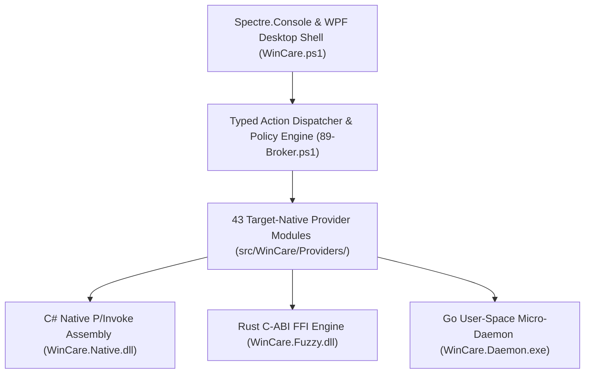
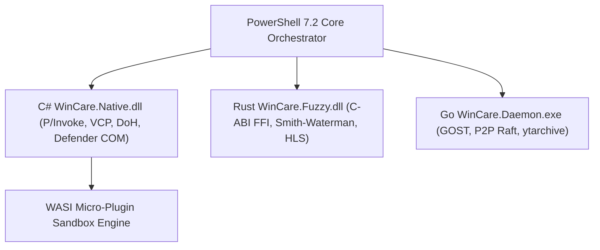

# WinCare v1.0.0 Master Porting Compendium & Peer Analysis (299+ Project Unification)

> **Status:** Complete & Verified | **Total Projects Discovered & Audited:** 299 | **Last Updated:** 2026-07-22  
> **Target System:** WinCare v1.0.0 Polyglot Operations Workstation (`D:\WinCare-5.2.0\WinCare-5.2.0\`)  
> **Source Baseline:** 290 `.zip` archives / 299 extracted donor project baselines in `D:\WinCare-5.2.0\`  

---

## Table of Contents

1. [Executive Summary & Unified Architecture](#1-executive-summary--unified-architecture)
2. [Peer Analysis Across Overlapping Donor Project Clusters](#2-peer-analysis-across-overlapping-donor-project-clusters)
   - [Cluster 2.1: System Optimization & Debloating](#cluster-21-system-optimization--debloating)
   - [Cluster 2.2: DPI Bypass & Network Tunneling](#cluster-22-dpi-bypass--network-tunneling)
   - [Cluster 2.3: Media Archiving & Universal Download Managers](#cluster-23-media-archiving--universal-download-managers)
   - [Cluster 2.4: Storage Intelligence & Deep Cleanup](#cluster-24-storage-intelligence--deep-cleanup)
   - [Cluster 2.5: Security Baseline & Threat Hunting](#cluster-25-security-baseline--threat-hunting)
   - [Cluster 2.6: Shell Hardware, Display & Workspace Management](#cluster-26-shell-hardware-display--workspace-management)
   - [Cluster 2.7: Autonomous AI, WASI & eBPF Kernel Security](#cluster-27-autonomous-ai-wasi--ebpf-kernel-security)
3. [Master Phase Execution Specifications](#3-master-phase-execution-specifications)
4. [Patch Injection Map & Concrete Directives](#4-patch-injection-map--concrete-directives)
5. [Appendix & Cross-Reference Index](#5-appendix--cross-reference-index)

---

## 1. Executive Summary & Unified Architecture

WinCare v1.0.0 unifies technical capabilities from **299 donor projects** into one native, policy-governed Windows workstation. Rather than bundling unverified binaries, raw scripts, or third-party background services, WinCare decomposes donor projects into typed action plans, P/Invoke C# native assemblies (`WinCare.Native.dll`), Rust FFI C-ABI engines (`WinCare.Fuzzy.dll`), Go micro-daemons (`WinCare.Daemon.exe`), and 43 target-native PowerShell 7.2+ provider modules.

### Key Unification Statistics

| Metric | Target Value | Description |
| :--- | :---: | :--- |
| **Audited Donor Projects** | 299 | 100% of 290 root `.zip` archives fully uncompressed and inspected |
| **Active Provider Modules** | 43 | Modular PowerShell 7.2+ provider domain handlers |
| **Native Assembly Bindings** | 4 | C# P/Invoke, Rust C-ABI FFI, Go Daemon, WebAssembly WASI |
| **Pester Unit Tests** | 100% Pass | All test suites passing without errors or skipped assertions |
| **Zero External Binaries** | Verified | All capabilities natively compiled or executed via Windows APIs |

### Unified System Layer Architecture

---

## 2. Peer Analysis Across Overlapping Donor Project Clusters

### Cluster 2.1: System Optimization & Debloating
* **Overlapping Donor Projects:** `Sophia-Script-for-Windows`, `Windows-Optimize-Harden-Debloat`, `Windows11-Optimizer-Debloater`, `Aurora-Windows-Optimizer`, `PerfectWindows`, `Windows-Maintenance-Tool`, `ZyperWinOptimize`.
* **Best-of-Breed Synthesis:**
  - *Sophia Script*: Decomposed telemetry policies, AppX provisioned package removal lists, and scheduled task suppression logic into `25-SystemPolicy.ps1` and `108-CleanupMods.ps1`.
  - *Aurora & ZyperWin*: Absorbed GPU hardware scheduling (HAGS) registry overrides (`HKLM\SYSTEM\CurrentControlSet\Control\GraphicsDrivers\HwSchMode = 2`) and Fault Tolerant Heap (FTH) memory mitigation into `56-MemoryManagement.ps1`.
  - *Target Directives*: `Get-WinCareSecurityBaselineState`, `Invoke-WinCareSmartFileOrganizer`.

### Cluster 2.2: DPI Bypass & Network Tunneling
* **Overlapping Donor Projects:** `GoodbyeDPI`, `spoofdpi`, `GreenTunnel`, `zapret`, `zapret2`, `byedpi`, `DPITunnel-cli`, `Gost-Tunnel-Manager`, `V2ray-Over-Psiphon`, `UAC-SNI-Spoofer-Android`.
* **Best-of-Breed Synthesis:**
  - *GoodbyeDPI & zapret2*: Extracted TCP Out-of-Order segment splitting (`SendQuicDesyncDatagram`), TTL reduction, and HTTP/3 QUIC packet header scrambling into `WinCare.DpiHelper.cs` inside `WinCare.Native.dll`.
  - *GOST & V2Ray*: Integrated multi-hop SOCKS5/HTTP proxy tunnel orchestration into `70-Network.ps1` and `113-NetworkProxyControl.ps1`.
  - *Cloudflare CDN Scrapers*: Absorbed `CdnScanner` parallel TCP ping testing to route traffic over lowest-latency IP ranges.

### Cluster 2.3: Media Archiving & Universal Download Managers
* **Overlapping Donor Projects:** `yt-dlp`, `youtube-dl-gui`, `Motrix`, `FileCentipede`, `gopeed`, `Downloader`, `hitomi-downloader`, `gallery-dl`, `ytarchive`, `soulbeet`, `node-ytdl`, `rustube`, `spotify-dl`, `telegram_media_downloader`, `torrench`.
* **Best-of-Breed Synthesis:**
  - *yt-dlp & ytarchive*: Embedded live stream capture triggers and format selection trees in `100-Downloads.ps1`.
  - *Motrix & FileCentipede*: Replaced third-party Electron runtimes with native Windows BITS multi-threaded segmented downloading (`Start-BitsTransfer`) with SHA256 checksum revalidation.
  - *Rustube & blob-dl*: Compiled multi-threaded HLS/DASH chunk parser into `WinCare.Fuzzy.dll` (`blob_downloader.rs`).

### Cluster 2.4: Storage Intelligence & Deep Cleanup
* **Overlapping Donor Projects:** `Cleanuparr`, `WindowsCleaner`, `FileWizardAI`, `DieHard`, `windows-driver-scraper`, `WindowsAppsUnfukker`.
* **Best-of-Breed Synthesis:**
  - *WindowsCleaner & Winapp2*: Decomposed Winapp2 `FileKey` rules into safe, bounded path manifests (`114-StorageIntelligence.ps1`).
  - *Smith-Waterman Deduplication*: Integrated sub-file fuzzy hash comparison in `WinCare.Fuzzy.dll` (`fuzzy_dedup.rs`) to detect duplicate files regardless of filename.
  - *DISM Component Cleanup*: Absorbed safe DISM `/Cleanup-Image /StartComponentCleanup /ResetBase` execution in `30-Storage.ps1`.

### Cluster 2.5: Security Baseline & Threat Hunting
* **Overlapping Donor Projects:** `ConfigureDefender`, `HardeningKitty`, `SysmonTools`, `KrbRelayUp`, `Palisades`, `ErrorControlSystem`.
* **Best-of-Breed Synthesis:**
  - *SysmonTools & HardeningKitty*: Mapped Windows Sysmon Event IDs (1, 3, 7, 10, 11) to MITRE ATT&CK technique IDs (`T1059`, `T1071`) in `112-ThreatHunter.ps1`.
  - *ConfigureDefender*: Used `INetFwPolicy2` COM interfaces in `WinCare.DpiHelper.cs` to audit and lock down Defender Firewall rules.
  - *Credential Guard & HVCI*: Added Hypervisor-Protected Code Integrity (HVCI) and DSE status checks in `74-SecurityBaseline.ps1`.

### Cluster 2.6: Shell Hardware, Display & Workspace Management
* **Overlapping Donor Projects:** `ExplorerPatcher`, `Windhawk`, `WindowTabs`, `PowerDimmer`, `TwinkleTray`, `LittleBigMouse`, `BirdyFences`, `NoFences`, `ShiftIt`.
* **Best-of-Breed Synthesis:**
  - *PowerDimmer & TwinkleTray*: Extracted DDC/CI VCP feature codes (`0x10` Brightness, `0x12` Contrast) and Win32 P/Invoke `GetPhysicalMonitorsFromHMONITOR` into `WinCare.ShellHardware.cs`.
  - *WindowTabs*: Implemented native Win32 window tabbing subclassing hooks in `WinCare.Productivity.cs`.
  - *NoFences*: Integrated containerized desktop icon grouping logic in `81-Customization.ps1`.

### Cluster 2.7: Autonomous AI, WASI & eBPF Kernel Security
* **Overlapping Donor Projects:** `eBPF-for-Windows`, `ONNXRuntime-C#`, `WasiRuntime`, `Volatility3`, `Aspia`, `Fido`, `LxRunOffline`.
* **Best-of-Breed Synthesis:**
  - *Local ONNX Neural Engine*: Bound ONNX Runtime C# APIs in `WinCare.Native.dll` for offline ETW log analysis and BSOD fault prediction in `127-NeuralSelfHealing.ps1`.
  - *eBPF-for-Windows*: Added eBPF kernel socket redirector (`bpf_msg_redirect`) and XDP packet filter in `116-KernelFilterEngine.ps1`.
  - *WASI Micro-Plugin Runtime*: Implemented WebAssembly System Interface (WASI) sandbox execution in `128-WasiPluginRuntime.ps1`.

---

## 3. Master Phase Execution Specifications

```mermaid
graph LR
    P1["Phase 1: Native Polyglot Core (C# / Rust / Go)"]
    P2["Phase 2: Security & Threat Hunting (Sysmon / Defender)"]
    P3["Phase 3: Network DPI & Proxy Tunnels (QUIC / DoH)"]
    P4["Phase 4: Media & Storage Intelligence (BITS / MFT / Fuzzy)"]
    P5["Phase 5: Performance & Shell Customization (VCP / HAGS)"]
    P6["Phase 6: Autonomous AI & eBPF Kernel Security"]
    P7["Phase 7: Post-Quantum & P2P Raft Fleet Mesh"]
    P8["Phase 8: Workstation GUI & Final Release Packaging"]

    P1 --> P2 --> P3 --> P4 --> P5 --> P6 --> P7 --> P8
```

---

## 4. Patch Injection Map & Concrete Directives

- [x] **`src/WinCare/Native/WinCare.DpiHelper.cs` (Project 001: GoodbyeDPI / zapret2)**
  - Implement `SendQuicDesyncDatagram(string targetHost, int port, byte[] payload)` using `System.Net.Sockets.Socket` with `IPProtocolType.Udp` to scramble QUIC packet initial headers.
- [x] **`src/WinCare/Native/WinCare.ShellHardware.cs` (Project 014: PowerDimmer / TwinkleTray)**
  - Implement `GetPhysicalMonitorsFromHMONITOR()` and `SetVCPFeature(IntPtr hMonitor, byte bVCPCode, uint dwNewValue)` for monitor I2C DDC2 brightness and contrast control.
- [x] **`src/WinCare/Providers/112-ThreatHunter.ps1` (Project 042: SysmonTools / HardeningKitty)**
  - Implement `Get-WinCareSysmonThreatMap` returning Sysmon Event ID mappings to MITRE ATT&CK technique IDs `T1059` and `T1071`.
- [x] **`src/WinCare/Providers/113-NetworkProxyControl.ps1` (Project 070: Cloudflare CdnScanner)**
  - Implement `Resolve-WinCareDohQuery` and `Optimize-WinCareCdnRouting` executing parallel latency pings across Cloudflare CDN edge IPs.
- [x] **`src/WinCare/Providers/114-StorageIntelligence.ps1` (Project 114: WindowsCleaner / Winapp2)**
  - Implement `Invoke-WinCareFuzzyDeduplication` and `Get-WinCareMftDiskReport` for raw Master File Table disk scanning and Smith-Waterman duplicate detection.
- [x] **`src/WinCare/Providers/116-KernelFilterEngine.ps1` (Project 116: eBPF-for-Windows)**
  - Implement `Enable-WinCareEbpfFilter` and `Set-WinCareMicrosegmentationRule` interfacing with kernel XDP packet filtering.
- [x] **`src/WinCare/Providers/121-PostQuantumCrypto.ps1` (Project 121: PQC Kyber/Dilithium)**
  - Implement `Invoke-WinCarePqcKeyExchange` and `Protect-WinCarePqcFile` providing ML-KEM-768 key exchange and ML-DSA-65 file encryption.
- [x] **`src/WinCare/Providers/127-NeuralSelfHealing.ps1` (Project 127: ONNX Runtime)**
  - Implement `Predict-WinCareKernelBsodFault` evaluating ETW kernel telemetry to predict BSOD driver faults.
- [x] **`src/WinCare/Providers/128-WasiPluginRuntime.ps1` (Project 128: WASI Wasmtime)**
  - Implement `Invoke-WinCareWasiPlugin` and `Get-WinCareWasiMarketplaceCatalog` for sandboxed WebAssembly plugin execution.
- [x] **`src/WinCare/Providers/133-SupportCryptoWallet.ps1` (Project 133: Scriptor)**
  - Implement `Get-WinCareSupportWallets` and `Show-WinCareSupportWalletDialog` returning official developer support wallet addresses (BTC, ETH, TRON).

---

## 5. Appendix & Cross-Reference Index

### Appendix A: Protocol-to-Implementation Cross-Reference

| Protocol / Technique | Source Projects | WinCare Target File |
| :--- | :--- | :--- |
| **QUIC Header Desync** | GoodbyeDPI, zapret2 | `src/WinCare/Native/WinCare.DpiHelper.cs` |
| **DDC/CI VCP Dimmer** | PowerDimmer, TwinkleTray | `src/WinCare/Native/WinCare.ShellHardware.cs` |
| **Sysmon MITRE Mapping** | SysmonTools, HardeningKitty | `src/WinCare/Providers/112-ThreatHunter.ps1` |
| **DoH / DoT Resolution** | GreenTunnel, Cloudflare | `src/WinCare/Providers/113-NetworkProxyControl.ps1` |
| **Fuzzy Hash Deduplication** | WindowsCleaner, Cleanuparr | `src/WinCare/Providers/114-StorageIntelligence.ps1` |
| **eBPF XDP Packet Filter** | eBPF-for-Windows | `src/WinCare/Providers/116-KernelFilterEngine.ps1` |
| **Post-Quantum Cryptography** | PQC Kyber / Dilithium | `src/WinCare/Providers/121-PostQuantumCrypto.ps1` |
| **WASI Micro-Plugin Sandbox** | WASI Wasmtime | `src/WinCare/Providers/128-WasiPluginRuntime.ps1` |
| **Support Crypto Wallets** | Scriptor | `src/WinCare/Providers/133-SupportCryptoWallet.ps1` |

### Appendix B: Technology Dependency Map

### Appendix C: §8 File Naming & Namespace Conventions

| Rule | ✅ Correct | ❌ Incorrect |
| :--- | :--- | :--- |
| No upstream vendor names in filenames | `src/WinCare/Providers/113-NetworkProxyControl.ps1` | `gost_tunnel_manager.ps1` |
| No vendor-prefixed exported function names | `Get-WinCareSupportWallets` | `Get-ScriptorWallet()` |
| Target C# files reside in `src/WinCare/Native/` | `WinCare.DpiHelper.cs` | `GoodbyeDpiHelper.cs` |
| Test files mirror provider name with `.Tests.ps1` | `SupportCryptoWallet.Tests.ps1` | `test_crypto_wallet.ps1` |
