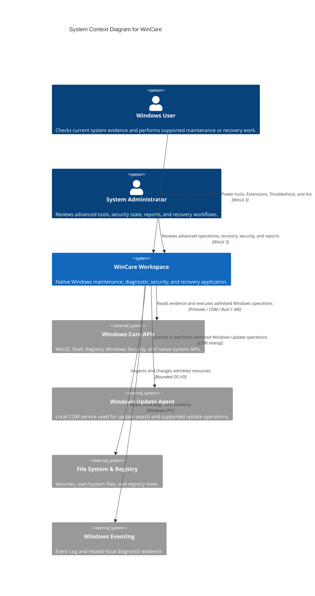
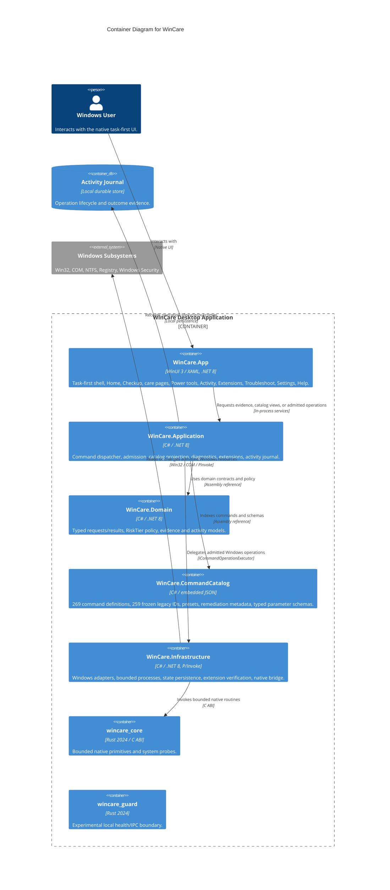
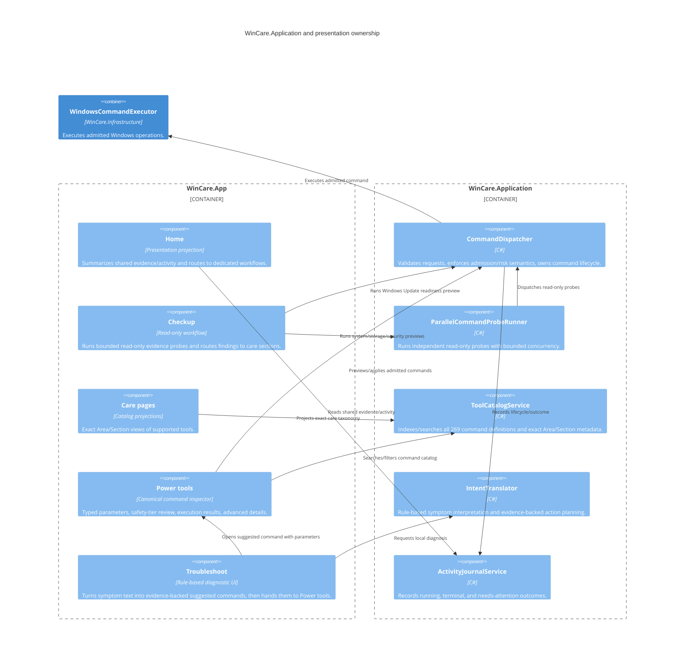
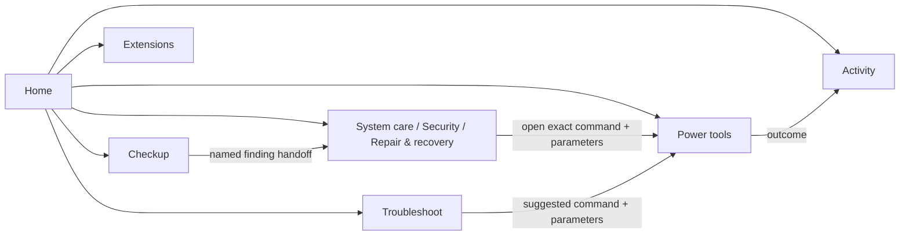
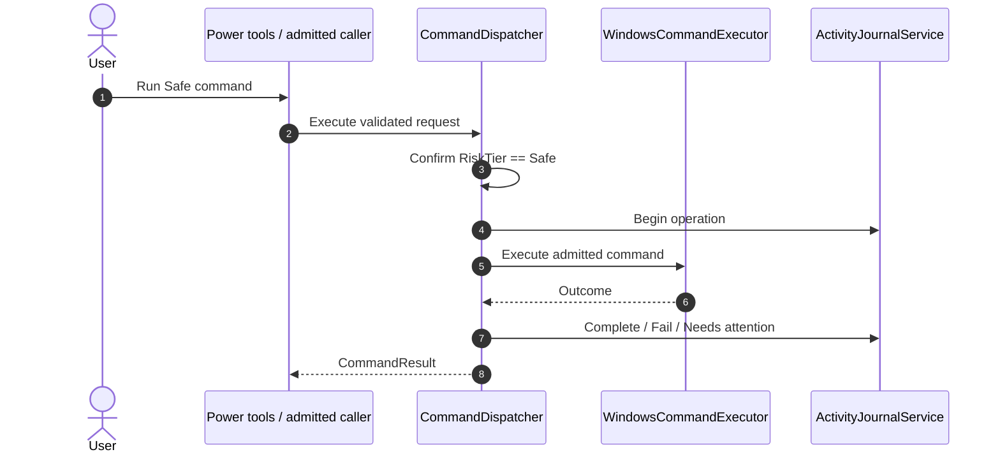
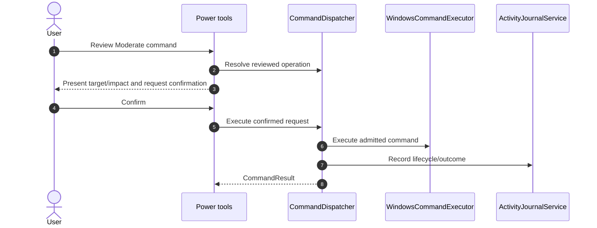
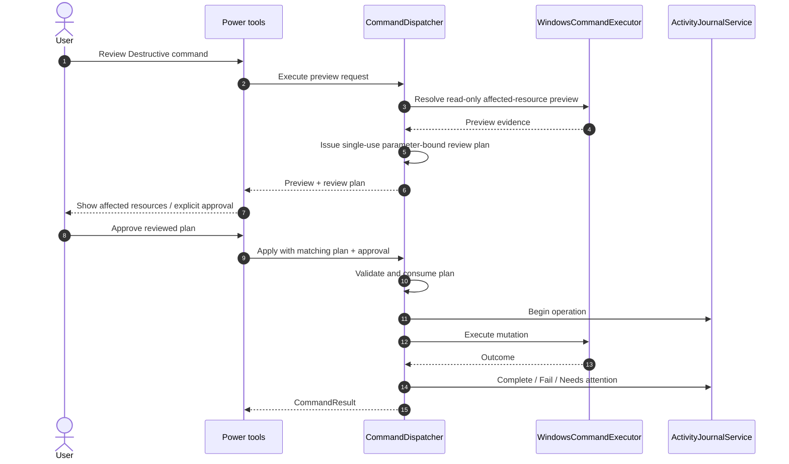
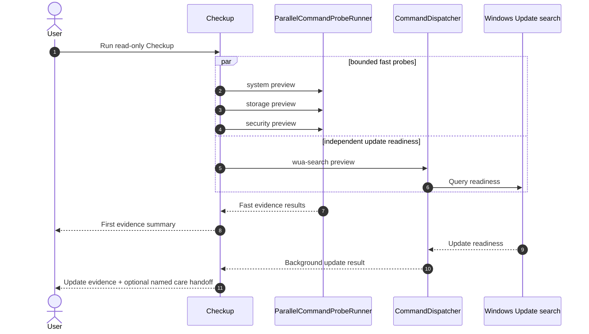
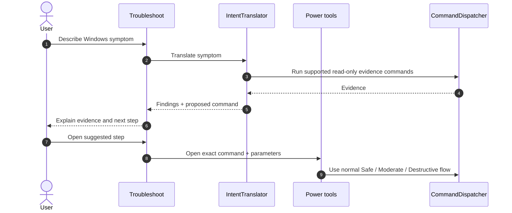

# WinCare C4 Architecture Documentation

**System:** WinCare Windows Maintenance & Recovery Workspace  
**Specification Version:** 2.1 (Task-first product architecture)  
**Standard:** C4 Model (Context, Container, Component)

---

## 1. Level 1: System Context

WinCare is a local-first Windows desktop workspace for evidence collection, maintenance, security, repair, recovery, and advanced operational tooling.

### Context boundary and trust principles

- **Local-first:** core product workflows do not require a cloud service. Network-dependent features fail visibly when unavailable.
- **Least privilege:** read-only and standard-user work does not require unnecessary elevation; commands declare administrator requirements explicitly.
- **Risk-tiered admission:** Safe work can execute directly; Moderate work requires reviewed confirmation; Destructive work requires preview plus explicit approval of a parameter-bound plan.
- **Single execution authority:** Home, care pages, Checkup, and Troubleshoot do not invent their own mutation semantics. Advanced execution converges on the dispatcher and Power tools review surface.

---

## 2. Level 2: Containers

---

## 3. Level 3: Application components

---

## 4. Product navigation and handoffs

Navigation uses stable route IDs. New cross-page care navigation uses named section requests rather than positional tab indices. Integer section parameters remain only for compatibility with older deep links/callers.

Hidden routes such as About can be opened from Help/search without leaving an unrelated visible navigation item selected.

---

## 5. Command admission sequences

### 5.1 Safe command

Safe includes read-only commands and bounded low-risk actions. Read-only is a separate property, not a fourth product safety tier.

### 5.2 Moderate command

### 5.3 Destructive command

---

## 6. Checkup sequence

Checkup itself never applies maintenance.

---

## 7. Troubleshoot sequence

Troubleshoot cannot mint an approval receipt and does not own a private apply path.

---

## 8. Extension trust boundary

Remote extension installation is fail-closed unless a configured WinCare-pinned catalog key verifies the exact freshly fetched catalog used for installation. Package ID/hash, publisher identity/signature, revocation state, declared capabilities, and external admission metadata are revalidated at the security boundary.

The current repository ships without an approved production catalog public key, so remote installation remains browse-only/disabled. The Extensions UI surfaces this trust/availability state explicitly.

Extensions execute full-trust in process with the current user's privileges; declared capabilities are consent metadata rather than a sandbox.

---

## 9. Activity, persistence, and recovery

Activity is the shared operation ledger:

- **Running** — currently executing work.
- **Needs attention** — an operation ended in a state requiring review or follow-up.
- **Completed** — terminal completed/failed/cancelled outcomes.
- **Reports** — aggregated daily summaries.

`UndoAvailable` is exposed only when a concrete executable compensator and sufficient captured state exist. WinCare does not advertise generic undo for irreversible operations.

---

## 10. Adaptivity, accessibility, and validation

The app-level compact breakpoint is `LayoutVisibility.CompactBreakpointDip = 920`; components may use local fit-specific breakpoints without redefining the global compact state. Power tools and Extensions have explicit responsive layouts rather than visual-tree/order heuristics.

High Contrast uses system colors, important controls have UI Automation names/IDs, and core task layouts wrap/stack rather than assuming desktop width.

Successful source tests and Windows compilation do **not** prove Narrator order, keyboard focus order, High Contrast rendering, text/display scaling, dialog focus, or final visual appeal. Those require the installed-candidate Windows validation procedure and fresh screenshots for the exact build.
