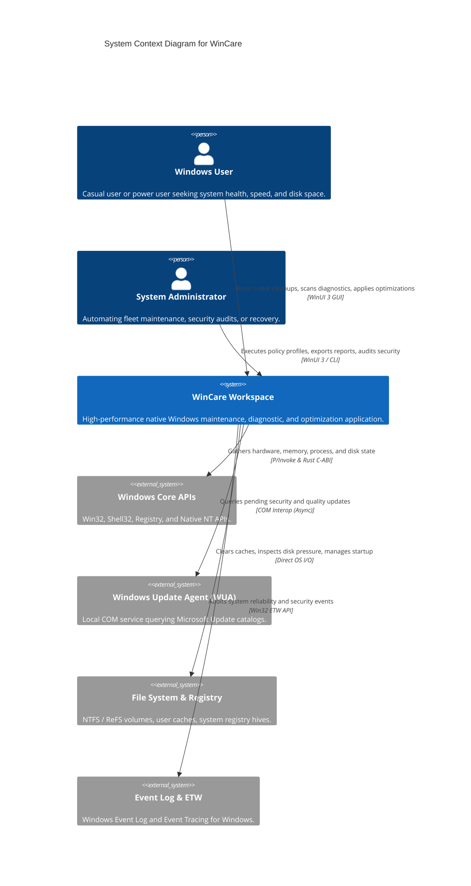
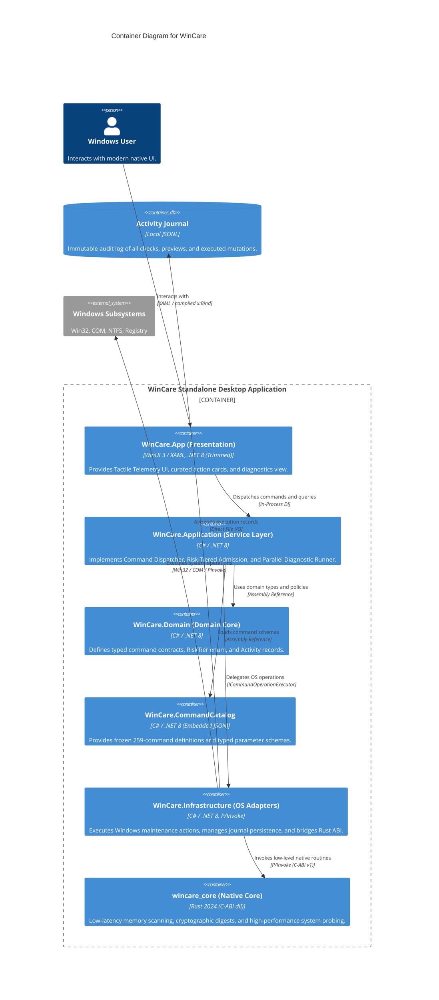
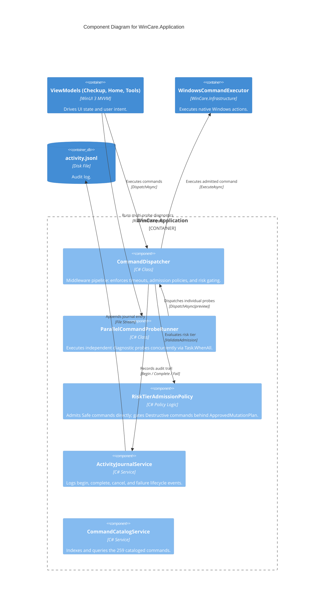
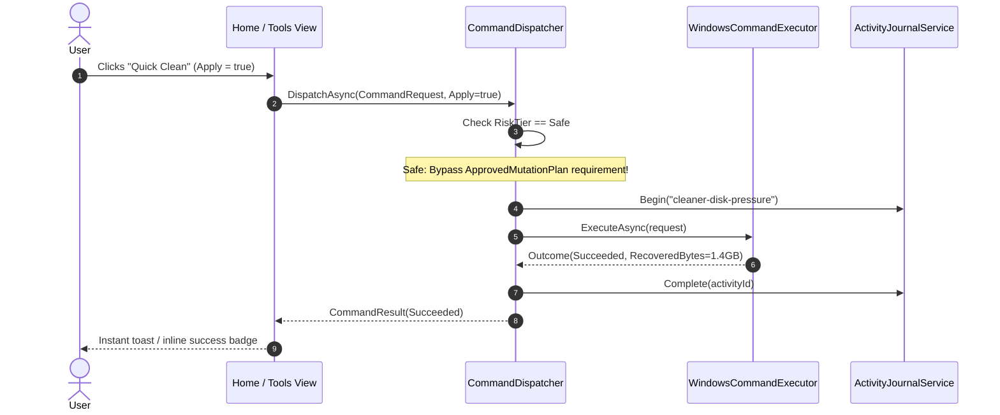
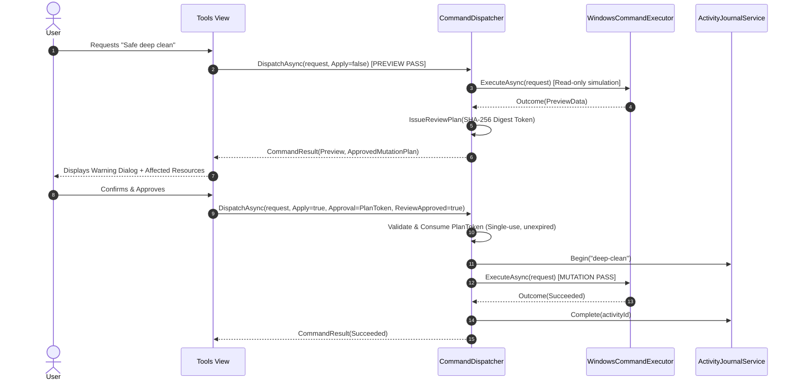

# WinCare C4 Architecture Documentation

**System:** WinCare Windows Maintenance & Optimization Workspace  
**Specification Version:** 2.0 (Modernized & Streamlined)  
**Standard:** C4 Model (Context, Container, Component, Code)

---

## 1. Level 1: System Context Diagram

The System Context shows how the WinCare desktop workspace interacts with users and external Windows OS subsystems.

### Context Boundary & Trust Principles
- **No Cloud Dependency:** WinCare is 100% local-first and operational without an Internet connection (except when checking Windows Updates).
- **Least Privilege vs Elevation:** Runs without elevation for standard queries; prompts for UAC elevation only when executing administrator-level mutations.
- **Fail-Closed Admission:** Commands targeting sensitive Windows settings (registry, component store, drivers) cannot execute without cryptographic plan verification.

---

## 2. Level 2: Container Diagram

The Container Diagram illustrates the high-level technology choices, deployable containers, and communication boundaries within WinCare.

---

## 3. Level 3: Component Diagram (`WinCare.Application`)

The Component Diagram details the core architectural pipeline inside `WinCare.Application`.

---

## 4. Execution & Admission Sequence (Janusian Dialectic)

### 4.1 Tier 1: Safe Mutation (1-Click, Zero Friction)

### 4.2 Tier 3: Destructive Mutation (Full Defense)

