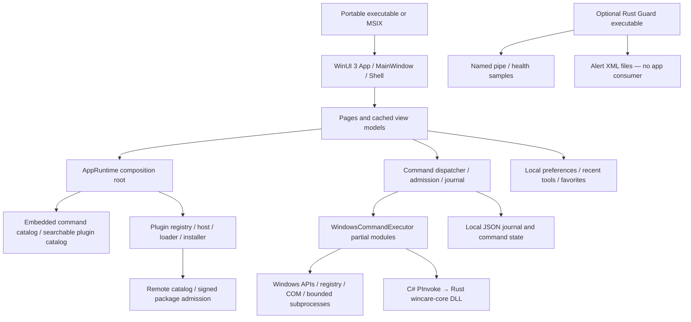

# WinCare end-to-end product and engineering audit

11 September 2026 · reviewed source `b30516a` · Windows x64 host

**Document package finalized; runtime verification remains incomplete.** See the [package index](D:/GitHub/WinCare/docs/audit-2026-09-11/README.md) for authority, reconciled totals and regeneration instructions.

## A. Executive assessment

**Verdict: Not release-ready.** The failures are deeper than styling. Eight installed navigation destinations crash: seven with collection-projection failures and AI Doctor with a missing converter resource. The fresh local build independently reproduces the AI Doctor failure. A shared export helper fails on Windows, typed command inputs do not mount, category shortcuts return empty results, and the advertised safety/review contract does not match execution policy. Diagnostic evidence and visible statuses are not consistently trustworthy.

The evidence does **not** support “nothing works” or “the backend immediately crashes.” Eleven representative read-only backend queries succeeded. Home, Settings, Help and About open in the installed artifact. The two Home read-only actions run, although their result presentation is inadequate. A completed one-minute Home sample did not reproduce sustained idle CPU load. The app is a single process containing its backend; the observed fatal stacks are UI/WinRT failures, not a separately supervised server dying.

This report retains **{{COUNTS}}** findings, with runtime proof, source proof and unresolved causes distinguished. It supersedes the narrower [initial review](D:/GitHub/WinCare/docs/review-2026-09-11.md). It is a broad audit with explicit coverage limits, not a guarantee that every defect has been found. No production source was repaired. Windows cleanup, administrative mutations, remote publication and plugin installation were not performed.

The requested order matters: restore usable navigation and trustworthy execution first; rebuild the check→findings→review→result experience next; then reduce visual and structural complexity around those working workflows.

**Forensic scope correction:** This was a broad, incomplete runtime audit, not completion of the original exhaustive verification request. Of 155 read-only commands, 144 were not executed; all 104 mutation commands remain individually unexecuted. Listing these gaps does not close them. The invalid initial trimming comparison and unresolved installed collection-crash cause remain material gaps. See [forensic follow-up](D:/GitHub/WinCare/docs/audit-2026-09-11/forensic-follow-up.md) for accepted criticisms, factual corrections and remaining validation work.

Navigation: [coverage ledger](D:/GitHub/WinCare/docs/audit-2026-09-11/coverage-ledger.md), [answers to all47 audit questions](D:/GitHub/WinCare/docs/audit-2026-09-11/questions-answered.md), [evidence index](D:/GitHub/WinCare/docs/audit-2026-09-11/evidence-index.md), [machine-readable findings](D:/GitHub/WinCare/docs/audit-2026-09-11/findings.json).

## B. Actual system model

The active product is WinUI3/.NET8 with a native Rust DLL. It is not a web app, Electron frontend or network API server. Browser authentication, CORS and web deployment are not applicable to this runtime. The optional Guard is a separate executable and is not instantiated by ordinary app startup. A namespace or IPC client existing in source does not establish a running backend service.

Source-of-truth hierarchy:

| Concern | Authority | Important distinction |
|---|---|---|
| Actual user failure | Exact executable plus crash/UI evidence | Installed rc5 and source HEAD are separate artifacts |
| Command identity and metadata | `src/WinCare.CommandCatalog/Data/commands.json` and catalog models | Implemented is a migration label, not end-to-end proof |
| Execution behavior | Dispatcher → executor/handler → Windows/native APIs | README and button labels do not override code |
| UI truth | Compiled XAML, code-behind, VM state and runtime UIA | VM-only tests cannot prove page construction |
| ABI | Rust exports and managed declarations, checked against public header | Header drift retained as F-039 |
| Release behavior | Workflows, publish properties, finalization scripts and actual hashes | Local profiles and CI flags currently diverge |
| Historical migration material | `migration/` oracle and migration documents | Comparison/support material, not a second active app |
| Third-party/local skills | Development support under agent/skill locations | Not production app functionality |

## C. Product/feature model

The coherent product promise is to inspect a Windows PC, explain evidence, propose a change, obtain review and show the result. The implementation additionally exposes259 catalog commands spanning maintenance, security, recovery, applications, desktop/windows/monitors, downloads, widgets, notes, workspace utilities, telemetry, plugins and specialist capabilities. There is no demonstrated259-feature product experience: many capabilities are reachable only through a generic catalog and raw parameters.

Three feature types must remain distinct: real Windows inspection/mutation, app-owned saved records, and capability/presence assessment. For example, saving a schedule is not running a scheduler; saving remote-consent metadata is not implementing a remote-support transport; finding a tool executable is not completing its workflow. Those distinctions drive the matrix below and prevent counting route breadth as product completeness.

## D. Coverage map

Detailed evidence/depth/gaps are in the [coverage ledger](D:/GitHub/WinCare/docs/audit-2026-09-11/coverage-ledger.md).

| Inventory | Coverage | What it does not prove |
|---|---|---|
| [Repository inventory](D:/GitHub/WinCare/docs/audit-2026-09-11/repository-inventory.csv) |342 tracked files classified by production/test/tool/oracle/config role | Not every line/branch is certified |
| [Command matrix](D:/GitHub/WinCare/docs/audit-2026-09-11/command-matrix.csv) |259 IDs mapped to routes/implementation locations;155 read-only; tests mentioning IDs distinguished from behavioral proof |248 commands were not individually executed |
| [Control inventory](D:/GitHub/WinCare/docs/audit-2026-09-11/control-inventory.csv) |89 declarative interactive XAML controls with bindings/handlers | Generated, templated and platform chrome controls are not all captured by static counting |
| Native UI navigation | All12 destinations accounted for in installed artifact, including Home | Healthy navigation does not mean every control works |
| Backend fixture |11 read-only queries; state race, plugin persistence and export failure fixtures | Not real administrative mutation validation |
| Visual review | All three supplied images, full Home-region review, XAML and token checks | Images1 and2 duplicate a scrolled state; no full DPI/theme/assistive-tech matrix |

The audit followed the requested passes: topology, visual/product model, reproduction, architecture/wiring, validation tooling, correctness, frontend/backend integration, performance, defensive security, concurrency/lifecycle, persistence, cross-module flows, release, documentation, adversarial challenge, second visual review and gap accounting. The ledger records where the depth is representative rather than exhaustive.

## E. Runtime reproduction results

| Action / artifact | Result | Evidence / limit |
|---|---|---|
| Installed rc5 Home launch | Opens; survives completed60-second idle sample | `evidence/idle-60s.json` |
| Installed Checkup | Crashes in WinRT collection projection while binding rows | Earlier fresh Checkup log and `checkup-navigation.json`; its initial alive snapshot precedes terminal crash reporting |
| Installed System care, Security, Repair | All crash after selection | `NavSystemCare`, `NavSecurity`, `NavRepairRecovery` crash logs |
| Installed All tools, Activity, Plugin store | All crash after selection | Corresponding `Nav*-crash.log` |
| Installed AI Doctor | Crashes | `NavAiDoctor-crash.log` |
| Installed Settings, Help, About | Open; closed normally by audit | Corresponding navigation and UIA files |
| Fresh source local untrimmed Checkup/All tools/Plugin store | All open | `untrimmed-Nav*-navigation.json` |
| Fresh source local AI Doctor | Crashes with missing InverseBooleanConverter | `untrimmed-NavAiDoctor-crash.log` |
| Local All tools → window-search selection | Opens details, but raw JSON editor remains | `tool-editor-uia.json`; no mutation executed |
| Installed Home Analyze Startup / Check Network | Both complete, count-only results; Network says Connected | `Home*Button-after.json` |
| Eleven backend read-only previews | All Succeeded,4–101ms in this fixture | `backend-probes.json`; timing is warm/local, not a benchmark |
| Shared JSON export to an audit sandbox | IOException; no destination file | `export-fixture.json` |
| Two independent stores update fixture counter | Expected2, observed1; one sharing/access failure | `backend-probes.json` |
| Plugin-state save to invalid destination | Returns normally, nothing persisted | `backend-probes.json` |
| Strict restored trimmed publish | Fails three IL2026 errors | `publish-trimmed-restored.txt` |

Reproduction provenance: installed executable `C:/Users/ACER/Desktop/WinCare-v2.5.0-rc5-x64.exe`,36,083,642bytes. Fresh untrimmed executable67,363,526bytes, SHA256 `708957CB06917B7608B99E50FD809608A1045C2114CA6F6C00A34C6A45F3A329`. Local build used the existing staged x64 native DLL; it does not certify that DLL as rebuilt from HEAD. An initial no-restore attempt labeled trimmed produced the **same hash** as untrimmed; all `trimmed-*` navigation evidence therefore describes the same binary and is not independent trimming proof. A corrected restore exposed build errors instead. Exact cause of the installed collection failure remains unresolved.

The first extended resource probe ended early without a new crash log; retained as `idle-interrupted.json`, not counted as a60-second run or claimed as a crash. The repeated probe completed12 samples and both read-only controls, then closed normally.
