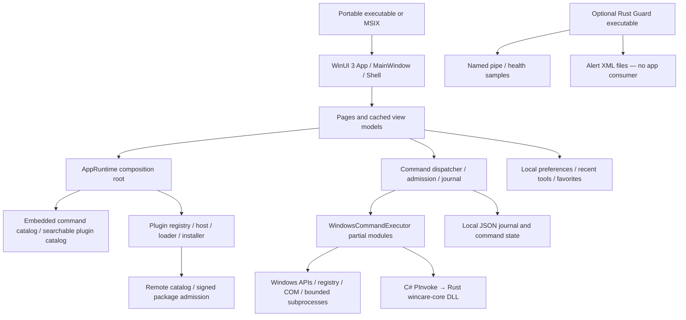

# WinCare end-to-end product and engineering audit

11 September 2026 · reviewed source `b30516a` · Windows x64 host

**Document package finalized; runtime verification remains incomplete.** See the [package index](D:/GitHub/WinCare/docs/audit-2026-09-11/README.md) for authority, reconciled totals and regeneration instructions.

## A. Executive assessment

**Verdict: Not release-ready.** The failures are deeper than styling. Eight installed navigation destinations crash: seven with collection-projection failures and AI Doctor with a missing converter resource. The fresh local build independently reproduces the AI Doctor failure. A shared export helper fails on Windows, typed command inputs do not mount, category shortcuts return empty results, and the advertised safety/review contract does not match execution policy. Diagnostic evidence and visible statuses are not consistently trustworthy.

The evidence does **not** support “nothing works” or “the backend immediately crashes.” Eleven representative read-only backend queries succeeded. Home, Settings, Help and About open in the installed artifact. The two Home read-only actions run, although their result presentation is inadequate. A completed one-minute Home sample did not reproduce sustained idle CPU load. The app is a single process containing its backend; the observed fatal stacks are UI/WinRT failures, not a separately supervised server dying.

This report retains **0 critical, 13 high, 25 medium, 2 low** findings, with runtime proof, source proof and unresolved causes distinguished. It supersedes the narrower [initial review](D:/GitHub/WinCare/docs/review-2026-09-11.md). It is a broad audit with explicit coverage limits, not a guarantee that every defect has been found. No production source was repaired. Windows cleanup, administrative mutations, remote publication and plugin installation were not performed.

The requested order matters: restore usable navigation and trustworthy execution first; rebuild the check→findings→review→result experience next; then reduce visual and structural complexity around those working workflows.

**Forensic scope correction:** This was a broad, incomplete runtime audit, not completion of the original exhaustive verification request. Of 155 read-only commands, 144 were not executed; all 104 mutation commands remain individually unexecuted. Listing these gaps does not close them. The invalid initial trimming comparison and unresolved installed collection-crash cause remain material gaps. See [forensic follow-up](D:/GitHub/WinCare/docs/audit-2026-09-11/forensic-follow-up.md) for accepted criticisms, factual corrections and remaining validation work.

Navigation: [coverage ledger](D:/GitHub/WinCare/docs/audit-2026-09-11/coverage-ledger.md), [answers to all 47 audit questions](D:/GitHub/WinCare/docs/audit-2026-09-11/questions-answered.md), [evidence index](D:/GitHub/WinCare/docs/audit-2026-09-11/evidence-index.md), [machine-readable findings](D:/GitHub/WinCare/docs/audit-2026-09-11/findings.json).

## B. Actual system model

The active product is WinUI3/.NET8 with a native Rust DLL. It is not a web app, Electron frontend or network API server. Browser authentication, CORS and web deployment are not applicable to this runtime. The optional Guard is a separate executable and is not instantiated by ordinary app startup. A namespace or IPC client existing in source does not establish a running backend service.

Source-of-truth hierarchy:

| Concern | Authority | Important distinction |
|---|---|---|
| Actual user failure | Exact executable plus crash/UI evidence | Installed rc5 and source HEAD are separate artifacts |
| Command identity and metadata | `src/WinCare.CommandCatalog/Data/commands.json` and catalog models | Implemented is a migration label, not end-to-end proof |
| Execution behavior | Dispatcher → executor/handler → Windows/native APIs | README and button labels do not override code |
| UI truth | Compiled XAML, code-behind, VM state and runtime UIA | VM-only tests cannot prove page construction |
| ABI | Rust exports and managed declarations, checked against public header | Header drift retained as F-039 |
| Release behavior | Workflows, publish properties, finalization scripts and actual hashes | Local profiles and CI flags currently diverge |
| Historical migration material | `migration/` oracle and migration documents | Comparison/support material, not a second active app |
| Third-party/local skills | Development support under agent/skill locations | Not production app functionality |

## C. Product/feature model

The coherent product promise is to inspect a Windows PC, explain evidence, propose a change, obtain review and show the result. The implementation additionally exposes259 catalog commands spanning maintenance, security, recovery, applications, desktop/windows/monitors, downloads, widgets, notes, workspace utilities, telemetry, plugins and specialist capabilities. There is no demonstrated259-feature product experience: many capabilities are reachable only through a generic catalog and raw parameters.

Three feature types must remain distinct: real Windows inspection/mutation, app-owned saved records, and capability/presence assessment. For example, saving a schedule is not running a scheduler; saving remote-consent metadata is not implementing a remote-support transport; finding a tool executable is not completing its workflow. Those distinctions drive the matrix below and prevent counting route breadth as product completeness.

## D. Coverage map

Detailed evidence/depth/gaps are in the [coverage ledger](D:/GitHub/WinCare/docs/audit-2026-09-11/coverage-ledger.md).

| Inventory | Coverage | What it does not prove |
|---|---|---|
| [Repository inventory](D:/GitHub/WinCare/docs/audit-2026-09-11/repository-inventory.csv) |342 tracked files classified by production/test/tool/oracle/config role | Not every line/branch is certified |
| [Command matrix](D:/GitHub/WinCare/docs/audit-2026-09-11/command-matrix.csv) |259 IDs mapped to routes/implementation locations;155 read-only; tests mentioning IDs distinguished from behavioral proof |248 commands were not individually executed |
| [Control inventory](D:/GitHub/WinCare/docs/audit-2026-09-11/control-inventory.csv) |89 declarative interactive XAML controls with bindings/handlers | Generated, templated and platform chrome controls are not all captured by static counting |
| Native UI navigation | All12 destinations accounted for in installed artifact, including Home | Healthy navigation does not mean every control works |
| Backend fixture |11 read-only queries; state race, plugin persistence and export failure fixtures | Not real administrative mutation validation |
| Visual review | All three supplied images, full Home-region review, XAML and token checks | Images1 and2 duplicate a scrolled state; no full DPI/theme/assistive-tech matrix |

The audit followed the requested passes: topology, visual/product model, reproduction, architecture/wiring, validation tooling, correctness, frontend/backend integration, performance, defensive security, concurrency/lifecycle, persistence, cross-module flows, release, documentation, adversarial challenge, second visual review and gap accounting. The ledger records where the depth is representative rather than exhaustive.

## E. Runtime reproduction results

| Action / artifact | Result | Evidence / limit |
|---|---|---|
| Installed rc5 Home launch | Opens; survives completed60-second idle sample | `evidence/idle-60s.json` |
| Installed Checkup | Crashes in WinRT collection projection while binding rows | Earlier fresh Checkup log and `checkup-navigation.json`; its initial alive snapshot precedes terminal crash reporting |
| Installed System care, Security, Repair | All crash after selection | `NavSystemCare`, `NavSecurity`, `NavRepairRecovery` crash logs |
| Installed All tools, Activity, Plugin store | All crash after selection | Corresponding `Nav*-crash.log` |
| Installed AI Doctor | Crashes | `NavAiDoctor-crash.log` |
| Installed Settings, Help, About | Open; closed normally by audit | Corresponding navigation and UIA files |
| Fresh source local untrimmed Checkup/All tools/Plugin store | All open | `untrimmed-Nav*-navigation.json` |
| Fresh source local AI Doctor | Crashes with missing InverseBooleanConverter | `untrimmed-NavAiDoctor-crash.log` |
| Local All tools → window-search selection | Opens details, but raw JSON editor remains | `tool-editor-uia.json`; no mutation executed |
| Installed Home Analyze Startup / Check Network | Both complete, count-only results; Network says Connected | `Home*Button-after.json` |
| Eleven backend read-only previews | All Succeeded,4–101ms in this fixture | `backend-probes.json`; timing is warm/local, not a benchmark |
| Shared JSON export to an audit sandbox | IOException; no destination file | `export-fixture.json` |
| Two independent stores update fixture counter | Expected2, observed 1; one sharing/access failure | `backend-probes.json` |
| Plugin-state save to invalid destination | Returns normally, nothing persisted | `backend-probes.json` |
| Strict restored trimmed publish | Fails three IL2026 errors | `publish-trimmed-restored.txt` |

Reproduction provenance: installed executable `C:/Users/ACER/Desktop/WinCare-v2.5.0-rc5-x64.exe`,36,083,642 bytes. Fresh untrimmed executable67,363,526 bytes, SHA256 `708957CB06917B7608B99E50FD809608A1045C2114CA6F6C00A34C6A45F3A329`. Local build used the existing staged x64 native DLL; it does not certify that DLL as rebuilt from HEAD. An initial no-restore attempt labeled trimmed produced the **same hash** as untrimmed; all `trimmed-*` navigation evidence therefore describes the same binary and is not independent trimming proof. A corrected restore exposed build errors instead. Exact cause of the installed collection failure remains unresolved.

The first extended resource probe ended early without a new crash log; retained as `idle-interrupted.json`, not counted as a60-second run or claimed as a crash. The repeated probe completed12 samples and both read-only controls, then closed normally.

## F. Critical findings

None established at the requested catastrophic/security-compromise severity. This does not diminish the release-blocking usability failures.

## G. High findings

### [F-001] Seven installed navigation destinations terminate the app

**Severity:** High. **Confidence:** Runtime confirmed; exact artifact cause unresolved.

**Affected location:** [src/WinCare.App/Views/Pages/CheckupPage.xaml:122](D:/GitHub/WinCare/src/WinCare.App/Views/Pages/CheckupPage.xaml:122)

**Problem:** Checkup, System care, Security, Repair and recovery, All tools, Activity and Plugin store crash the installed rc5 artifact. This is separate from AI Doctor below.

**Trigger / user-visible manifestation:** Start the supplied desktop executable and select the destination; no command execution is needed.

**Impact:** Most core workflows cannot be entered. An apparently working Home masks a largely unusable release.

**Root cause:** Recorded stacks fail in WinRT collection projection / XAML ItemsSource binding. Current local untrimmed Checkup, All tools and Plugin store survive, so source/artifact build differences matter.

**Proof and limits:** evidence/Nav*-crash.log and *-navigation.json; Checkup also has the earlier fresh crash evidence. No independent backend daemon failure is established.

**Remediation:** Reproduce from the exact release build configuration; repair projection/binding preservation and validate every route in the final artifact. Do not merely swallow the fatal exception.

**Regression test:** Portable and MSIX navigation matrix across every destination, x64/ARM64, with crash-log and process-exit assertions.

**Related findings:** F-002, F-003, F-037, F-038

### [F-002] AI Doctor references a nonexistent converter and crashes

**Severity:** High. **Confidence:** Runtime and source confirmed.

**Affected location:** [src/WinCare.App/Views/Pages/AiDoctorPage.xaml:77](D:/GitHub/WinCare/src/WinCare.App/Views/Pages/AiDoctorPage.xaml:77)

**Problem:** Two IsEnabled bindings request InverseBooleanConverter, but there is no definition anywhere under src.

**Trigger / user-visible manifestation:** Navigate to AI Doctor in the fresh local build.

**Impact:** Doctor cannot open, even in the build where collection-backed pages work.

**Root cause:** A missing StaticResource dependency in compiled XAML bindings.

**Proof and limits:** evidence/untrimmed-NavAiDoctor-crash.log explicitly reports Cannot find a resource with the given key: InverseBooleanConverter. Line 85 repeats the reference.

**Remediation:** Define and test the resource or use an explicit inverse view-model property; verify the generated page bindings.

**Regression test:** Load the real page and toggle idle/analyzing/error states, asserting controls enable correctly.

**Related findings:** F-003, F-006

### [F-003] Artifact smoke tests omit the routes that fail

**Severity:** High. **Confidence:** Source confirmed.

**Affected location:** [src/WinCare.App/App.xaml.cs:53](D:/GitHub/WinCare/src/WinCare.App/App.xaml.cs:53)

**Problem:** Smoke testing opens the shell, verifies ABI, initializes plugins, runs system preview and exits. It never opens the failing pages.

**Trigger / user-visible manifestation:** CI passes --smoke-test while meaningful navigation remains broken.

**Impact:** Passing CI provides little evidence that a person can use the shipped app.

**Root cause:** Release acceptance is built around startup and backend availability instead of user journeys.

**Proof and limits:** RunPortableSmokeTestAsync and .github/workflows/native-winui.yml; page VM tests do not instantiate compiled XAML.

**Remediation:** Require final-artifact navigation and representative read-only workflows before promotion.

**Regression test:** Detect both the missing converter and collection binding failures in the packaging gate.

**Related findings:** F-001, F-002, F-032, F-037

### [F-004] Mutation approval promises differ from dispatcher policy

**Severity:** High. **Confidence:** Source confirmed.

**Affected location:** [src/WinCare.CommandCatalog/Models/CommandDefinition.cs:117](D:/GitHub/WinCare/src/WinCare.CommandCatalog/Models/CommandDefinition.cs:117)

**Problem:** Home promises review receipts and explicit approval for every change. Cleaner identifiers are downgraded to Safe, which executes directly; Moderate actions accept confirmation without a prior receipt. Quick Clean also requires elevation but offers no elevation handoff.

**Trigger / user-visible manifestation:** Normal Home cleanup is blocked unelevated; elevated Home cleanup can apply directly.

**Impact:** Users cannot rely on the advertised review boundary and may encounter immediate deletion or an unexplained prerequisite.

**Root cause:** Identifier-derived risk exceptions, dispatcher admission and user copy encode different policies.

**Proof and limits:** CommandDispatcher.cs admission near line 196, HomePageViewModel.cs:131, WindowsCommandExecutor.cs:96, ToolExecutionViewModel.cs:159. Host cleanup was not executed.

**Remediation:** Use one explicit mutation admission contract and privilege preflight. Review resolved targets before applying; align the UI with actual requirements.

**Regression test:** Table-driven tests for every risk tier/preview/receipt/elevation combination, plus Home cleanup on disposable fixtures.

**Related findings:** F-005, F-007, F-010, F-021

### [F-005] Cleanup preview names different roots from execution

**Severity:** High. **Confidence:** Source confirmed.

**Affected location:** [src/WinCare.Infrastructure/Commands/WindowsCommandExecutor.cs:696](D:/GitHub/WinCare/src/WinCare.Infrastructure/Commands/WindowsCommandExecutor.cs:696)

**Problem:** Preview metadata names TEMP and WINDIR/Temp; CleanerDiskPressure executes the current temp and LocalApplicationData/Temp roots.

**Trigger / user-visible manifestation:** Review and apply the cleanup command.

**Impact:** The proposed scope is not a reliable description of what will be changed.

**Root cause:** Preview targets are separately hard-coded rather than derived from the execution plan.

**Proof and limits:** WindowsCommandExecutor.Experience.cs:305 target list versus preview metadata. No real files deleted in this audit.

**Remediation:** Resolve a single immutable target plan for preview and execution, deduplicate equivalent roots, and include exclusions.

**Regression test:** Fixture with distinct temp/Windows/local roots; verify preview set equals visited execution set.

**Related findings:** F-004, F-021

### [F-006] Doctor labels hard-coded network text as measured evidence

**Severity:** High. **Confidence:** Source confirmed.

**Affected location:** [src/WinCare.Application/Diagnostics/DiagnosticEvidenceCollector.cs:32](D:/GitHub/WinCare/src/WinCare.Application/Diagnostics/DiagnosticEvidenceCollector.cs:32)

**Problem:** The network evidence branch creates a fixed DNS/socket observation and sets HasMeasuredEvidence=true without a network probe.

**Trigger / user-visible manifestation:** A network-related diagnostic intent reaches the collector, after the page crash is repaired or through application-layer callers.

**Impact:** Diagnostic recommendations rest on invented evidence.

**Root cause:** A placeholder was promoted into the same evidence model as real measurements.

**Proof and limits:** Collector branch contains no actual network query; default translator uses the collector.

**Remediation:** Collect a bounded real observation or mark it unavailable; carry source, timestamp and confidence into recommendations.

**Regression test:** Disconnected, DNS-failure and healthy fixtures must produce distinct measured results; no fixed healthy observation.

**Related findings:** F-002, F-019, F-020

### [F-007] Typed command inputs never mount in the observed UI

**Severity:** High. **Confidence:** Runtime and source confirmed; secondary synchronization risk source-only.

**Affected location:** [src/WinCare.App/Views/Pages/AllToolsPage.xaml.cs:22](D:/GitHub/WinCare/src/WinCare.App/Views/Pages/AllToolsPage.xaml.cs:22)

**Problem:** The constructor searches the visual tree before it is ready. ReplaceRawParameterEditor returns when no expander is found and is not retried on Loaded. The working local page retains Command parameters JSON. If the generated editor is mounted later, its controls also copy initial values without model-to-control updates after raw JSON import.

**Trigger / user-visible manifestation:** Open All tools, search window-search, select the tool.

**Impact:** Ordinary users receive raw JSON instead of the intended typed controls. A future mount-only fix would expose stale displayed values.

**Root cause:** UI initialization depends on a template visual tree at constructor time; generated fields lack two-way binding.

**Proof and limits:** evidence/tool-editor-uia.json retains Command parameters JSON and Advanced Parameters (JSON), with no AdvancedParameterEditing control; constructor lines 28-29 and editor methods near 171/251.

**Remediation:** Use named declarative controls or Loaded/template lifecycle, then real two-way field bindings. Surface invalid JSON conversion errors instead of swallowing them.

**Regression test:** Real-page tests covering every field type, raw-to-typed round trip, invalid JSON, tool switching and execution payload/display equality.

**Related findings:** F-003, F-004, F-032

### [F-008] Shared JSON exports fail because their source stream is still open

**Severity:** High. **Confidence:** Isolated runtime and source confirmed.

**Affected location:** [src/WinCare.Infrastructure/Commands/WindowsCommandExecutor.State.cs:132](D:/GitHub/WinCare/src/WinCare.Infrastructure/Commands/WindowsCommandExecutor.State.cs:132)

**Problem:** WriteJsonExportAsync holds an await-using FileStream with FileShare.None through File.Move. The stream is disposed only after the move attempt.

**Trigger / user-visible manifestation:** Export harmless JSON to a new writable path on Windows.

**Impact:** Shared exports fail, including widget, maintenance, telemetry, studio monitoring, hardware report, terminal, file preview, system shortcuts and visual manifest paths.

**Root cause:** Incorrect stream lifetime around an otherwise appropriate temporary-file replacement design.

**Proof and limits:** evidence/export-fixture.json: IOException (file in use), targetExists=false; harness invokes the actual helper with {audit:true} in its own sandbox.

**Remediation:** Close the temporary stream before replacement; retain cleanup and preserve an existing destination on failure.

**Regression test:** New destination, replacement destination, cancellation and denied-write tests on Windows; assert valid content and no leaked temp files.

**Related findings:** F-010, F-011, F-013

### [F-009] Five category shortcuts search for phrases that match no tools

**Severity:** High. **Confidence:** Source and catalog query confirmed.

**Affected location:** [src/WinCare.Application/Tools/ToolCatalogService.cs](D:/GitHub/WinCare/src/WinCare.Application/Tools/ToolCatalogService.cs)

**Problem:** Search treats the whole query as one substring. Built-in shortcuts send storage cleanup, network update, defender firewall, export backup and recovery reset; all return zero matches.

**Trigger / user-visible manifestation:** Follow the corresponding category-page shortcut after its navigation crash is fixed.

**Impact:** The product leads users to empty results for advertised workflows.

**Root cause:** Navigation intent was encoded as prose instead of structured area/category/command selection.

**Proof and limits:** Embedded 259-command catalog evaluated with Matches semantics; SystemCarePageViewModel, SecurityPageViewModel and RepairRecoveryPageViewModel supply these strings.

**Remediation:** Use stable command IDs or explicit category filters for product navigation; define user search token semantics separately.

**Regression test:** Every built-in shortcut must resolve to the intended nonempty command set.

**Related findings:** F-024, F-025

### [F-010] Partial mutations can be described as having failed safely

**Severity:** High. **Confidence:** Source confirmed; host mutation not exercised.

**Affected location:** [src/WinCare.Infrastructure/Commands/WindowsCommandExecutor.cs:121](D:/GitHub/WinCare/src/WinCare.Infrastructure/Commands/WindowsCommandExecutor.cs:121)

**Problem:** Common IO/Win32 errors are converted into failed safely; access failures become Blocked. A multi-step command may already have applied earlier changes. Cancellation also lacks a universal partial-effect outcome.

**Trigger / user-visible manifestation:** A later step fails after an earlier mutation succeeds, such as brightness succeeding before contrast fails.

**Impact:** Users may retry or assume no change even though system state is partially modified.

**Root cause:** The executor loses mutation certainty before the dispatcher can classify unknown/partial execution; progress records are not a universal transactional log.

**Proof and limits:** ExecuteAsync catch ladder and WindowsCommandExecutor.Desktop.cs DisplayCalibrate; remediation records accumulate across incremental steps. This is a failure-path source proof, not an observed hardware change.

**Remediation:** Track started/applied steps and return explicit partial/unknown outcomes with reconciliation guidance. Do not claim rollback unless verified.

**Regression test:** Injected dependency fails on step two; assert first-step effects and partial status survive reporting, cancellation and restart.

**Related findings:** F-004, F-008, F-013, F-021

### [F-035] Release reruns can mix a new tag with old assets

**Severity:** High. **Confidence:** Source confirmed; no remote action performed.

**Affected location:** [.github/workflows/native-winui.yml:426](D:/GitHub/WinCare/.github/workflows/native-winui.yml:426)

**Problem:** Manual publication force-retags to the current SHA; existing same-name assets are skipped rather than checksum-compared or replaced. Tag push failure is tolerated.

**Trigger / user-visible manifestation:** Rerun publication for an existing version from changed source.

**Impact:** Published source and binaries may disagree; partial reruns can retain a mixed artifact set.

**Root cause:** Version identity is mutable while asset identity is based only on filenames.

**Proof and limits:** Release shell block lines426–438.

**Remediation:** Make releases immutable; reject SHA/checksum mismatch and upload an attested complete set from one validated run.

**Regression test:** Local mocked release API with old tag/assets must fail safely instead of mixing versions.

**Related findings:** F-003, F-036, F-038

### [F-036] Stable publication uses the release-candidate readiness gate

**Severity:** High. **Confidence:** Source confirmed.

**Affected location:** [.github/workflows/native-winui.yml:52](D:/GitHub/WinCare/.github/workflows/native-winui.yml:52)

**Problem:** The main gate always invokes --mode rc. Later publication marks non-prerelease versions --latest without invoking production readiness. Production mode requires BehaviorVerified while the 259 catalog entries are Implemented.

**Trigger / user-visible manifestation:** Publish a stable version through the normal workflow.

**Impact:** The workflow can bypass the repository’s own behavior-verification promotion requirement.

**Root cause:** Release classification and readiness enforcement are disconnected jobs/policies.

**Proof and limits:** native-winui.yml:52 and407; finalize_native_release.py:183–206. A separate manual production workflow does not make this gate mandatory.

**Remediation:** Select/enforce production readiness for stable publication and make it a required dependency.

**Regression test:** A stable version with any non-BehaviorVerified command must fail; RC behavior remains explicit.

**Related findings:** F-003, F-035, F-037

### [F-037] A restored strict trimmed build fails serialization analysis

**Severity:** High. **Confidence:** Build confirmed.

**Affected location:** [src/WinCare.Domain/Commands/CommandRequest.cs:30](D:/GitHub/WinCare/src/WinCare.Domain/Commands/CommandRequest.cs:30)

**Problem:** With trimming enabled and warnings visible, restored publication fails IL2026 in CommandRequest and ApprovedMutationPlan serialization.

**Trigger / user-visible manifestation:** Publish the current source with PublishTrimmed=true and SuppressTrimAnalysisWarnings=false after restore.

**Impact:** The trimmed configuration is not cleanly validated, and suppression conceals unresolved compatibility warnings.

**Root cause:** Reflection-dependent JSON serialization crosses the trim analysis boundary without an explicit contract.

**Proof and limits:** evidence/publish-trimmed-restored.txt has three IL2026 errors; ApprovedMutationPlan.cs:107/113. Earlier no-restore variants were byte-identical and are NOT a valid trim comparison.

**Remediation:** Use explicit serialization metadata or verified preservation, then perform a clean profile-specific restore/publish and route tests.

**Regression test:** Strict clean trimmed publish must pass without blanket suppression and all serialized contracts must round-trip in the artifact.

**Related findings:** F-001, F-003, F-038

## H. Medium findings

### [F-011] Independent state-store instances conflict on updates

**Severity:** Medium. **Confidence:** Isolated runtime and source confirmed.

**Affected location:** [src/WinCare.Infrastructure/Commands/CommandStateStore.cs:88](D:/GitHub/WinCare/src/WinCare.Infrastructure/Commands/CommandStateStore.cs:88)

**Problem:** UpdateAsync is atomic only within one instance. App startup does not enforce single-instance ownership, and independent stores use independent semaphores.

**Trigger / user-visible manifestation:** Two instances update the same state key concurrently.

**Impact:** An update can fail or be lost. The atomicity claim does not cover real multi-instance ownership.

**Root cause:** Read-modify-write locks are process/object local while the file is shared.

**Proof and limits:** evidence/backend-probes.json: expected counter2, actual1; one update UnauthorizedAccessException and the other Succeeded, using two harmless stores.

**Remediation:** Choose single-instance application ownership or a cross-process transaction/lock protocol with version checks and bounded wait.

**Regression test:** Two processes update distinct records repeatedly; both survive without lost updates, sharing violations or corrupt JSON.

**Related findings:** F-008, F-012, F-013

### [F-012] Plugin state persistence suppresses failures

**Severity:** Medium. **Confidence:** Isolated runtime and source confirmed.

**Affected location:** [src/WinCare.Infrastructure/Plugins/PluginStateRepository.cs:68](D:/GitHub/WinCare/src/WinCare.Infrastructure/Plugins/PluginStateRepository.cs:68)

**Problem:** SaveEnabledPluginIds catches all failures and returns normally. Load errors become an empty set with no diagnostic distinction.

**Trigger / user-visible manifestation:** The persistence destination is unwritable or invalid.

**Impact:** Enable/disable state can appear saved and then revert after restart; storage problems are hidden.

**Root cause:** A void persistence contract uses silent catch-all recovery.

**Proof and limits:** evidence/backend-probes.json pluginPersistence: writeThrew=false and fileExists=false for a directory used as the target.

**Remediation:** Return or publish persistence failure, retain the last known good state, and distinguish missing from damaged data.

**Regression test:** Denied path/corrupt file/restart tests must expose a warning and avoid false persistence success.

**Related findings:** F-011, F-034

### [F-013] Shutdown does not settle the journal or runtime services

**Severity:** Medium. **Confidence:** Source confirmed; loss window not force-tested.

**Affected location:** [src/WinCare.App/MainWindow.xaml.cs:66](D:/GitHub/WinCare/src/WinCare.App/MainWindow.xaml.cs:66)

**Problem:** Close flushes preferences but not the queued activity journal. AppRuntime owns disposable executor/catalog/installer and plugin lifecycle without an application shutdown coordinator.

**Trigger / user-visible manifestation:** Close immediately after an outcome or while plugin/background work is active.

**Impact:** Late history can be lost and plugin shutdown work has no deterministic completion boundary. OS process exit reclaims handles, so this alone is not proof of an idle leak.

**Root cause:** Process-lifetime ownership is implicit and separate persistence queues have different shutdown treatment.

**Proof and limits:** MainWindow close handler, AppRuntime composition, ActivityJournalService queued persistence and registry shutdown methods.

**Remediation:** Add a bounded shutdown sequence: stop new work, cancel owned tasks, settle mutation certainty, flush durable state, then dispose services.

**Regression test:** Close immediately after success/failure and during background work; restart and verify recorded outcomes and no owned tasks remain.

**Related findings:** F-010, F-011, F-014

### [F-014] Checkup can overlap update searches beyond its apparent deadline

**Severity:** Medium. **Confidence:** Source confirmed.

**Affected location:** [src/WinCare.App/ViewModels/Pages/CheckupPageViewModel.cs:146](D:/GitHub/WinCare/src/WinCare.App/ViewModels/Pages/CheckupPageViewModel.cs:146)

**Problem:** Fast probes clear IsRunning while WUA continues. Another check can start; version guards suppress old UI updates but do not stop old work. The 25-second cancellation deadline is cooperative, while synchronous searcher.Search cannot observe it during the call.

**Trigger / user-visible manifestation:** Start another check before the previous update search finishes or leave the page.

**Impact:** Redundant system work and misleading completion/cancellation state; a plausible active-work resource problem, not a proven idle loop.

**Root cause:** Run ownership stops at the UI version counter; underlying COM work is not bounded by that counter.

**Proof and limits:** CheckupPageViewModel update task, ParallelCommandProbeRunner and WindowsCommandExecutor.Security.cs WUA Search path.

**Remediation:** Keep one owned run, prevent overlap, cancel superseded tasks and isolate operations that cannot honor deadlines.

**Regression test:** Slow/non-cooperative fake update provider: repeat, navigate away, cancel and close without accumulating work.

**Related findings:** F-013, F-015

### [F-015] Checkup summary and Results use divergent copies

**Severity:** Medium. **Confidence:** Source confirmed.

**Affected location:** [src/WinCare.App/ViewModels/Pages/CheckupPageViewModel.cs:303](D:/GitHub/WinCare/src/WinCare.App/ViewModels/Pages/CheckupPageViewModel.cs:303)

**Problem:** Results rows are created before disk/security evaluation updates Quick check rows.

**Trigger / user-visible manifestation:** A collected measurement produces a warning or critical finding.

**Impact:** A problem can appear in one section while Results merely says Collected.

**Root cause:** Derived display rows are copied before the final state transition.

**Proof and limits:** Run/evaluation sequence and separate PageRow updates.

**Remediation:** Represent findings once and derive every visible summary from that model.

**Regression test:** Low disk and protection-warning fixtures must agree across tabs and Home.

**Related findings:** F-017, F-020

### [F-016] Home read-only actions hide useful data and overstate the result

**Severity:** Medium. **Confidence:** Runtime and source confirmed.

**Affected location:** [src/WinCare.App/ViewModels/Pages/HomePageViewModel.cs:162](D:/GitHub/WinCare/src/WinCare.App/ViewModels/Pages/HomePageViewModel.cs:162)

**Problem:** Startup displays a count and Audit Complete; Network displays an interface count and Connected. Returned entry/adapter details are discarded. The names Startup Boost and Network Refresh imply effects these queries do not perform.

**Trigger / user-visible manifestation:** Invoke either Home read-only button.

**Impact:** The button runs but does not complete a useful user decision, and adapter enumeration is confused with connectivity.

**Root cause:** Technical success is mapped directly to a product outcome without interpreting results.

**Proof and limits:** evidence/HomeStartupBoostButton-after.json and HomeNetworkRefreshButton-after.json:14 entries and8 interfaces; source maps successful query to Connected.

**Remediation:** Show actionable inspected entries and actual connectivity evidence; name the actions for inspection.

**Regression test:** Empty/offline/disabled interfaces and startup entries with no impact data must produce truthful visible outcomes.

**Related findings:** F-006, F-020, F-028

### [F-017] Home calls unrelated old records current evidence

**Severity:** Medium. **Confidence:** Source confirmed.

**Affected location:** [src/WinCare.App/ViewModels/Pages/HomePageViewModel.cs:284](D:/GitHub/WinCare/src/WinCare.App/ViewModels/Pages/HomePageViewModel.cs:284)

**Problem:** Each command contributes its latest successful record without age limit or common run ID; newest timestamp labels the combined state.

**Trigger / user-visible manifestation:** Records exist from different check sessions or dates.

**Impact:** A stale mixed set can appear as a fresh 4/4 check.

**Root cause:** Activity retention is being used as a measurement-session store.

**Proof and limits:** RefreshActivity selects command records independently.

**Remediation:** Persist coherent check sessions and show per-area freshness/unavailable states.

**Regression test:** Mixed old/new, failed-latest and expired records must never become a fresh complete session.

**Related findings:** F-015, F-020, F-023

### [F-018] Telemetry loses metric validity and volume identity

**Severity:** Medium. **Confidence:** Source confirmed.

**Affected location:** [native/wincare-core/src/telemetry.rs:106](D:/GitHub/WinCare/native/wincare-core/src/telemetry.rs:106)

**Problem:** CPU baseline and GetSystemTimes failure yield zero while aggregate snapshot success marks CPU available. Disk telemetry always probes C: and is shown beside generic cleanup targets.

**Trigger / user-visible manifestation:** First inspector sample, failed CPU API or Windows/cleanup volume other than C:.

**Impact:** Unknown becomes measured zero and the displayed disk may not be the task target.

**Root cause:** The aggregate FFI result lacks per-metric validity and explicit target identity.

**Proof and limits:** Native snapshot implementation and HomePageViewModel.TryRefreshNativeTelemetry availability mapping.

**Remediation:** Return per-metric status, sample interval and actual volume; derive task targets explicitly.

**Regression test:** First sample/API failure and non-C system-volume fixtures; do not display unknown as zero.

**Related findings:** F-019, F-020, F-039

### [F-019] Doctor memory evidence is stale or absent but counted as live

**Severity:** Medium. **Confidence:** Source confirmed.

**Affected location:** [src/WinCare.Application/Diagnostics/DiagnosticEvidenceCollector.cs:122](D:/GitHub/WinCare/src/WinCare.Application/Diagnostics/DiagnosticEvidenceCollector.cs:122)

**Problem:** GC memory information is used as current machine pressure; absent/zero values are treated as measured. Evidence counts include records with HasMeasuredEvidence=false.

**Trigger / user-visible manifestation:** A memory diagnosis before useful GC information or after machine pressure changes.

**Impact:** Doctor can give reassuring advice without a fresh measurement.

**Root cause:** Runtime GC bookkeeping and system telemetry share an undifferentiated evidence label.

**Proof and limits:** ProbeMemoryUsage and AI Doctor evidence-count projection.

**Remediation:** Use a current system probe and count only valid measured evidence, with timestamps.

**Regression test:** Unavailable/stale/changed system-memory inputs must preserve uncertainty.

**Related findings:** F-006, F-018, F-020

### [F-020] Health classifications disagree and exceed their evidence

**Severity:** Medium. **Confidence:** Source confirmed.

**Affected location:** [src/WinCare.App/ViewModels/Pages/CheckupPageViewModel.cs:303](D:/GitHub/WinCare/src/WinCare.App/ViewModels/Pages/CheckupPageViewModel.cs:303)

**Problem:** Checkup uses10/20 GB disk thresholds, Doctor15 GB or10%, and health10%. Checkup Healthy does not reflect all collected fields; stopped Defender alone is not a complete assessment of installed protection.

**Trigger / user-visible manifestation:** The same machine is assessed by different product paths.

**Impact:** Contradictory warnings and overly broad healthy/critical labels.

**Root cause:** Diagnostic policies are duplicated across UI/application/executor layers.

**Proof and limits:** Checkup evaluation, DiagnosticEvidenceCollector storage and System executor health/security functions.

**Remediation:** Centralize explicit, versioned assessment rules and state the limits of each check.

**Regression test:** Shared boundary fixtures across every entry point, including alternate protection and disabled UAC.

**Related findings:** F-006, F-015, F-017, F-018, F-019

### [F-021] Cleanup reports completion despite skips and scan caps

**Severity:** Medium. **Confidence:** Source confirmed.

**Affected location:** [src/WinCare.Infrastructure/Commands/WindowsCommandExecutor.Experience.cs:305](D:/GitHub/WinCare/src/WinCare.Infrastructure/Commands/WindowsCommandExecutor.Experience.cs:305)

**Problem:** Cleanup counts skipped files, caps enumeration at 200,000 and returns success; Home reduces this to Clean Complete.

**Trigger / user-visible manifestation:** Inaccessible files, a large target or partial work.

**Impact:** The user cannot tell what was omitted or whether the intended cleanup completed.

**Root cause:** Bounded/partial execution metadata is discarded by the success presentation.

**Proof and limits:** CleanerDiskPressure and Home cleanup status mapping; no host cleanup run.

**Remediation:** Expose reclaimed bytes, omissions and truncation with a partial outcome.

**Regression test:** Fixtures with skips and an artificial low scan cap must show partial completion.

**Related findings:** F-004, F-005, F-010

### [F-022] Admission rejections are absent from Activity

**Severity:** Medium. **Confidence:** Source confirmed.

**Affected location:** [src/WinCare.Application/Commands/CommandDispatcher.cs:196](D:/GitHub/WinCare/src/WinCare.Application/Commands/CommandDispatcher.cs:196)

**Problem:** Admission rejection returns before journal.Begin.

**Trigger / user-visible manifestation:** An action is rejected for approval/receipt/deadline policy.

**Impact:** The failed attempt leaves no activity trail, making apparently dead controls harder to understand.

**Root cause:** Only admitted execution enters the event model.

**Proof and limits:** Admission sequence precedes journal creation; distinguish this from executor-level blocked outcomes, which can be journaled.

**Remediation:** Record rejected attempts as non-mutating outcomes with actionable reasons.

**Regression test:** Every admission rejection appears once with no false success or mutation record.

**Related findings:** F-004, F-013, F-023

### [F-023] Reports hide the journal retention limit

**Severity:** Medium. **Confidence:** Source confirmed.

**Affected location:** [src/WinCare.Application/Activity/ActivityJournalService.cs:14](D:/GitHub/WinCare/src/WinCare.Application/Activity/ActivityJournalService.cs:14)

**Problem:** Only 200 records are retained, while daily report aggregates do not explain eviction.

**Trigger / user-visible manifestation:** More than 200 operations or a report spanning evicted data.

**Impact:** A report can look complete while omitting older events.

**Root cause:** Recent-feed retention and durable reporting use the same limited store.

**Proof and limits:** Retention constant and Activity report projection.

**Remediation:** Label coverage/retention or maintain a separate durable report store.

**Regression test:** 201+ events across dates: reports disclose or preserve excluded history.

**Related findings:** F-013, F-017, F-022

### [F-024] Category workspaces show fixed content instead of current state

**Severity:** Medium. **Confidence:** Source confirmed.

**Affected location:** [src/WinCare.App/ViewModels/Pages/SystemCarePageViewModel.cs](D:/GitHub/WinCare/src/WinCare.App/ViewModels/Pages/SystemCarePageViewModel.cs)

**Problem:** System care, Security and Repair construct static rows and mostly forward to All tools. Security can still show Not checked after a successful query elsewhere; Undo/Routines sections lack completed flows.

**Trigger / user-visible manifestation:** Perform a check elsewhere and revisit these categories.

**Impact:** Navigation adds work without providing a coherent task workspace.

**Root cause:** A directory of tools is presented using status-oriented workspace language.

**Proof and limits:** The three category view models and their event handlers.

**Remediation:** Build live task summaries and direct actions, or clearly present these pages as directories.

**Regression test:** Complete a check/action, navigate away/back and verify results and next steps.

**Related findings:** F-009, F-015, F-025

### [F-025] Global search promises unavailable scopes and retains stale queries

**Severity:** Medium. **Confidence:** Source confirmed.

**Affected location:** [src/WinCare.App/MainWindow.xaml:39](D:/GitHub/WinCare/src/WinCare.App/MainWindow.xaml:39)

**Problem:** Placeholder promises tasks, settings and activity, but Shell only opens tool search. Empty navigation queries are ignored, so a cached tool page keeps its old search.

**Trigger / user-visible manifestation:** Search for a setting/activity, or clear a previous global query.

**Impact:** Search appears broken or silently searches the wrong scope.

**Root cause:** Search copy, navigation parameters and catalog filtering have different contracts.

**Proof and limits:** ShellPage.OpenGlobalSearch and AllToolsPage.OnNavigatedTo:36.

**Remediation:** Implement explicit supported scopes or narrow the promise; treat an explicit empty query as reset.

**Regression test:** Settings/activity queries and nonempty→empty navigation tests.

**Related findings:** F-009, F-024

### [F-026] Cleaner schedules have no execution consumer

**Severity:** Medium. **Confidence:** Source confirmed.

**Affected location:** [src/WinCare.Infrastructure/Commands/WindowsCommandExecutor.cs:423](D:/GitHub/WinCare/src/WinCare.Infrastructure/Commands/WindowsCommandExecutor.cs:423)

**Problem:** cleaner-disk-pressure-schedule writes cleaner-schedules state; no scheduler reader or execution loop is connected.

**Trigger / user-visible manifestation:** Save a cleanup schedule and wait for its intended time.

**Impact:** A saved record is mistaken for an automatic maintenance capability.

**Root cause:** Persistence was implemented without the feature lifecycle.

**Proof and limits:** Route invokes UpsertStateItemAsync; repository-wide src/native search finds no consumer of the key.

**Remediation:** Implement an owned, observable scheduler or explicitly label saved configuration as non-executing.

**Regression test:** Controlled clock plus restart/missed-run/cancel tests; exactly one admitted action at due time.

**Related findings:** F-024, F-027

### [F-027] Experimental Guard notifications are not delivered by the app

**Severity:** Medium. **Confidence:** Source confirmed; documented limitation.

**Affected location:** [native/wincare-guard/src/main.rs:50](D:/GitHub/WinCare/native/wincare-guard/src/main.rs:50)

**Problem:** Guard writes XML alerts into LOCALAPPDATA; the app has no notification-queue reader or GuardPipeClient use. Repeated critical ticks create more files without a consumer/retention loop.

**Trigger / user-visible manifestation:** Run the optional Guard with a sustained critical threshold.

**Impact:** No promised in-app notification delivery; accumulating orphan alert files in an experimental path.

**Root cause:** Producer, app consumer and lifecycle were never joined.

**Proof and limits:** Guard main/notification path and absence of app call sites. Guard is not started by normal app launch.

**Remediation:** Keep explicitly experimental or implement namespaced bounded queue, acknowledgement, retention and notification activation.

**Regression test:** Controlled repeated alerts yield deduplicated delivered notifications and bounded storage.

**Related findings:** F-026, F-013

### [F-028] Home hides the primary check action below decorative content

**Severity:** Medium. **Confidence:** Screenshot and source confirmed.

**Affected location:** [src/WinCare.App/Views/Pages/HomePage.xaml:461](D:/GitHub/WinCare/src/WinCare.App/Views/Pages/HomePage.xaml:461)

**Problem:** The hero has no primary check action. Run Checkup appears after quick-action cards and lower panels; the supplied first-screen image does not reach it.

**Trigger / user-visible manifestation:** First launch at the supplied window size.

**Impact:** The user must scroll past secondary actions to start the central workflow; large empty cards and repeated status furniture weaken hierarchy.

**Root cause:** Layout follows decorative dashboard sections rather than the check→findings→review task order.

**Proof and limits:** All supplied screenshots; Home XAML order and UIA offscreen flag for HomeRunCheckup.

**Remediation:** Place the main read-only check in the hero; use compact summaries and contextual actions after evidence exists.

**Regression test:** At representative window/text scales, a first-time user can discover and activate Checkup without scrolling.

**Related findings:** F-016, F-029, F-031

### [F-029] Action-card headers have no allocated space for title versus badge

**Severity:** Medium. **Confidence:** Source-layout risk; intermediate-width overlap not runtime reproduced.

**Affected location:** [src/WinCare.App/Views/Pages/HomePage.xaml](D:/GitHub/WinCare/src/WinCare.App/Views/Pages/HomePage.xaml)

**Problem:** The title/icon group and right badge share one grid cell while three columns persist to a narrow breakpoint.

**Trigger / user-visible manifestation:** Intermediate width near920 DIP or larger text.

**Impact:** Headers may overlap or become cramped before responsive reflow occurs.

**Root cause:** Breakpoint and content minimum widths are unrelated; siblings compete for the same space.

**Proof and limits:** Three-column width/padding calculation and shared-cell XAML; supplied wide images alone do not prove the narrow failure.

**Remediation:** Reserve separate layout columns and reflow based on minimum usable card width.

**Regression test:** Boundary widths around breakpoint plus200% text and keyboard focus screenshots.

**Related findings:** F-028, F-030

### [F-030] Startup action label has inconsistent visible contrast

**Severity:** Medium. **Confidence:** Screenshot confirmed; state/cause unresolved.

**Affected location:** [src/WinCare.App/Styles/ControlStyles.xaml](D:/GitHub/WinCare/src/WinCare.App/Styles/ControlStyles.xaml)

**Problem:** Analyze Startup is black on teal in supplied images, while adjacent primary labels are white.

**Trigger / user-visible manifestation:** The state captured in the supplied screenshots.

**Impact:** Visual inconsistency and reduced readability of a primary action.

**Root cause:** Exact resource/state cause is unconfirmed: current source uses the same style, so no unique hard-coded black label is alleged.

**Proof and limits:** Images1–3; token contrast tests pass but do not exercise actual control visual states.

**Remediation:** Inspect normal/hover/pressed/disabled/focus/theme resources in the release artifact before choosing the correction.

**Regression test:** Rendered contrast and screenshots of all primary-button states in Light/Dark/High Contrast.

**Related findings:** F-028, F-029

### [F-032] All-tools selectable rows expose type names to accessibility APIs

**Severity:** Medium. **Confidence:** Runtime confirmed.

**Affected location:** [src/WinCare.App/Views/Pages/AllToolsPage.xaml](D:/GitHub/WinCare/src/WinCare.App/Views/Pages/AllToolsPage.xaml)

**Problem:** ListItem accessible names are WinCare.App.ViewModels.Pages.ToolRowViewModel rather than the tool title.

**Trigger / user-visible manifestation:** Navigate the selectable tools list through UI Automation or assistive technology.

**Impact:** Rows are difficult to distinguish without relying on descendant text; full screen-reader behavior still needs testing.

**Root cause:** The item container has no meaningful bound accessible name.

**Proof and limits:** evidence/untrimmed-NavAllTools-uia.json contains repeated type-name ListItem names.

**Remediation:** Bind item-container AutomationProperties.Name to a concise title/risk summary and verify selection announcements.

**Regression test:** UIA names must identify each row; Narrator/keyboard selection must announce the actual command.

**Related findings:** F-003, F-007, F-031

### [F-033] Remote catalog reads have no explicit body-size bound

**Severity:** Medium. **Confidence:** Source confirmed; no hostile input tested.

**Affected location:** [src/WinCare.Infrastructure/Plugins/RemoteCatalogService.cs:99](D:/GitHub/WinCare/src/WinCare.Infrastructure/Plugins/RemoteCatalogService.cs:99)

**Problem:** Catalog and signature bodies are buffered in full before parsing/verification. Unlike package downloads, these paths have no explicit byte cap or shared body-read deadline.

**Trigger / user-visible manifestation:** A catalog response is unexpectedly large or slow.

**Impact:** Memory/time consumption can exceed the limits applied elsewhere in plugin admission.

**Root cause:** Transport headers, body consumption and admission bounds are treated separately.

**Proof and limits:** ResponseHeadersRead followed by ReadAsByteArrayAsync/ReadAsStringAsync; PluginInstallerService has explicit package limits.

**Remediation:** Apply bounded streaming reads and a full-operation deadline to catalog/signature/cache inputs; fail closed for installation freshness.

**Regression test:** Controlled oversized/slow local fixtures must fail within byte/time budgets without allocating the whole body.

**Related findings:** F-034

### [F-034] Widget failure changes plugin state without reconciling registered commands

**Severity:** Medium. **Confidence:** Source confirmed.

**Affected location:** [src/WinCare.Application/Plugins/PluginRegistryService.cs:124](D:/GitHub/WinCare/src/WinCare.Application/Plugins/PluginRegistryService.cs:124)

**Problem:** GetActivePluginWidgets marks an entry Error on exception but does not unregister its commands or publish the same catalog transition as lifecycle operations.

**Trigger / user-visible manifestation:** An enabled admitted plugin throws while supplying widgets.

**Impact:** Registry state, searchable tools and dispatcher availability can disagree.

**Root cause:** A read-style widget enumeration mutates lifecycle state outside the normal transition path.

**Proof and limits:** GetActivePluginWidgets catch block and host registration ownership.

**Remediation:** Route failures through one serialized lifecycle transition, or keep widget failure distinct from whole-plugin failure.

**Regression test:** Throwing-widget fixture: registry, catalog and dispatcher must agree after failure and recovery.

**Related findings:** F-012, F-013, F-033

### [F-038] CI portable publication does not use the portable trimming profile

**Severity:** Medium. **Confidence:** Source/property inspection confirmed.

**Affected location:** [.github/workflows/native-winui.yml:297](D:/GitHub/WinCare/.github/workflows/native-winui.yml:297)

**Problem:** The portable profile enables trimming, but the CI command supplies neither that profile nor PublishTrimmed. The app only defaults PublishProfile for packaged builds.

**Trigger / user-visible manifestation:** Compare local portable-profile publication with the CI single-binary command.

**Impact:** Different publication paths validate different artifacts, frustrating crash reproduction and size/runtime expectations.

**Root cause:** Duplicated publish configuration rather than one canonical profile.

**Proof and limits:** WinCare.App.csproj PublishProfile condition and Properties/PublishProfiles/portable-x64.pubxml; initial local no-restore binary hashes equal despite variant labels, disclosed separately.

**Remediation:** Use one checked-in configuration for local and CI builds; record effective properties, hashes and native DLL provenance.

**Regression test:** Assert intended effective publish properties and compare signed build manifests across paths.

**Related findings:** F-001, F-035, F-037

### [F-040] Native directory-size entry limit does not bound pending allocations

**Severity:** Medium. **Confidence:** Source confirmed; stress not executed.

**Affected location:** [native/wincare-core/src/lib.rs:283](D:/GitHub/WinCare/native/wincare-core/src/lib.rs:283)

**Problem:** The 500,000 entry cap is checked when popping work, but read_dir pushes every child path into pending before that check runs again.

**Trigger / user-visible manifestation:** A very wide directory is sized.

**Impact:** Memory and enumeration work can exceed the advertised processing cap before the truncated status is reached.

**Root cause:** The bound is applied after work expansion instead of at queue admission.

**Proof and limits:** accumulate_dir_size loop: read_dir pushes child paths without checking the remaining budget.

**Remediation:** Bound queued plus processed entries and make cancellation observable during enumeration.

**Regression test:** Use a synthetic enumerator with a small limit and assert maximum pending work and explicit truncation.

**Related findings:** F-018, F-033

## I. Low findings

### [F-031] Internal terminology and duplicate inspector names confuse users

**Severity:** Low. **Confidence:** Screenshot and source confirmed.

**Affected location:** [src/WinCare.App/Views/Pages/HomePage.xaml:225](D:/GitHub/WinCare/src/WinCare.App/Views/Pages/HomePage.xaml:225)

**Problem:** Home exposes cleaner-disk-pressure and dispatcher-issued preview receipt; four checks sit next to six area tiles without explanation. Three inspector buttons share Toggle Telemetry Inspector and the same command.

**Trigger / user-visible manifestation:** Read or navigate the Home dashboard, including with accessible names.

**Impact:** Users must infer technical concepts and cannot identify an inspector by its name.

**Root cause:** Developer diagnostic language leaked into the main product flow.

**Proof and limits:** Supplied images, Home UIA tree and inspector command bindings.

**Remediation:** Use task/result language, explain check coverage, and name contextual actions distinctly.

**Regression test:** Content review plus UIA name assertions and first-use task walkthrough.

**Related findings:** F-028, F-032

### [F-039] The documented C header omits exported telemetry/cleaner ABI

**Severity:** Low. **Confidence:** Source confirmed.

**Affected location:** [native/wincare-core/include/wincare_core.h](D:/GitHub/WinCare/native/wincare-core/include/wincare_core.h)

**Problem:** The public header documents version/hash/directory/system JSON functions but omits the newer aggregate snapshot and cleaner exports and their structures.

**Trigger / user-visible manifestation:** A consumer implements bindings from the supplied header.

**Impact:** The header is not a complete contract for the library actually exported.

**Root cause:** Rust exports and C# P/Invoke evolved independently of the published header.

**Proof and limits:** native/wincare-core/src/lib.rs:546/560 versus include/wincare_core.h and managed interop declarations.

**Remediation:** Generate or maintain one ABI definition with layout/version compatibility tests.

**Regression test:** Compile a C consumer for every supported export on x64/ARM64 and compare struct sizes/offsets.

**Related findings:** F-018

## J. Systemic/root-cause findings

| Root cause | Concrete consequences | Structural response |
|---|---|---|
| Artifact acceptance stops at shell/backend smoke | Seven collection-route crashes and missing Doctor resource escape validation | Make final-artifact user journeys the release gate |
| Product promises are separate from executable contracts | Safe cleanup exception, mismatched preview roots, Connected without connectivity | One plan/result model drives policy, UI and tests |
| State is copied or inferred rather than owned | Stale Home evidence, divergent Checkup rows, plugin state/catalog disagreement | Explicit session and lifecycle state machines |
| Generic infrastructure substitutes for completed features | Raw JSON, category-to-empty search, schedules without scheduler | Commit to a small set of complete supported workflows |
| Durability boundaries are inconsistent | Open-stream exports, store race, silent plugin save failure, journal exit window | Common transaction/failure/shutdown contracts |
| Build/release configuration is duplicated | Local/CI trim mismatch, strict trim failure, tag/asset mismatch | One canonical reproducible artifact pipeline |

The architecture has useful layers: domain contracts, application dispatcher, infrastructure adapters, native ABI and declarative UI. The main defect is not that these layers exist. They do not yet enforce common truth about readiness, evidence, mutation certainty and lifecycle. Splitting a large partial executor into more files alone would not fix that.

## K. Visual/UI assessment

| Supplied-image region | Observation | Assessment and correction |
|---|---|---|
| Title bar/search | Large universal-looking search promise | Actual scope is tools; correct scope and discoverability, F-025 |
| Left navigation | Nine primary destinations plus three footer destinations, all equally credible | Most installed destinations crash; reduce supported surface and distinguish unavailable/experimental areas |
| Home heading/subtitle | Generic evidence copy above a passive hero | Give the page a clear next step and a visible primary Check action |
| Check-evidence hero | Large0/4, circular decoration, no action | Decorative weight exceeds useful information; explain what the four checks cover |
| Evidence-by-area grid | Six tiles beside a four-check score, all unchecked | Explain coverage and freshness; Activity is history, not another system health measurement |
| Quick-action headers | Technical IDs, repeated Safe/1-click badges, shared-cell title/badge layout | Remove internal IDs from default view, correct risk/prerequisites, reserve actual layout space |
| Quick-action bodies | Large empty regions, repeated Status/Ready | Replace empty furniture with compact explanation and outcome details |
| Main buttons | Startup text differs in contrast from adjacent controls | Reproduce control states; token tests alone are inadequate |
| Inspector icons | Same accessible names and same generic inspector | Use specific accessible labels or one clearly labeled diagnostics control |
| Recent activity | Honest empty-state text but too far from main workflow | Keep relevant outcomes beside the action and make rejection/history persistence reliable |
| Safety panel | Implementation jargon plus an inaccurate universal promise | Explain actual scope/review behavior in ordinary language |
| Bottom actions | Run Checkup is below the fold in Image3 | Move the central action to the hero; leave secondary links subordinate |
| Scrolled images1/2 | Header naturally above viewport | Not evidence of a clipping bug; they are duplicate views |

Typography, consistent icons and light surfaces provide some continuity. The issue is hierarchy, semantic accuracy and state visibility more than absence of styling. Thick borders and oversized cards amplify the sense of bulk. The design should be rebuilt around a working journey rather than restyled with another set of generic dashboard cards.

Runtime visual-state coverage remains limited. Light Home screenshots and native accessibility trees are available; source contains Light/Dark/High Contrast tokens and responsive rules. Dark/high-contrast rendering, hover/pressed/disabled/focus, text scaling, narrow widths, multiple monitors and localization were not all rendered. F-029 is explicitly a source-layout risk. No screenshot-based claim of full accessibility compliance is made.

## L. UX/product assessment

The first useful journey should be: open → run read-only check → understand findings and uncertainty → choose one change → inspect affected targets and prerequisites → approve → see completed/partial/failed outcome. The installed build breaks at navigation. The fresh build still burdens the user with generic tools, raw JSON, static category pages and incomplete evidence. This explains why a technically executing command can feel like a nonfunctional button.

Errors vary in quality. All-tools result areas and parameter validation can supply details; the Home elevation failure gives a restart instruction but no integrated recovery. Fatal navigation has no recoverable page outcome. “Failed safely,” “Connected,” “Healthy” and “Clean Complete” should be reserved for evidence that supports those statements. Secondary diagnostic details should not replace the task result.

## M. Functionality matrix

The [259-command matrix](D:/GitHub/WinCare/docs/audit-2026-09-11/command-matrix.csv) provides per-ID metadata, implementation location and runtime status. This product-level matrix accounts for the main modules without pretending a successful helper test proves every command.

| Feature / module | Classification | Established behavior |
|---|---|---|
| Home shell/navigation | Partially working | Opens; most destination pages fail in installed artifact |
| Startup inspection from Home | Partially working | Query succeeds, visible count, no useful entry/impact view |
| Network inspection from Home | Partially working | Query succeeds, unsupported Connected interpretation |
| Quick Clean | Broken product contract; host mutation unverified | Privilege gate/review/targets/partial results inconsistent |
| Checkup | Broken installed; partial fresh-source page | Navigation failure plus lifecycle/result-model defects |
| System care/Security/Repair | Broken installed; static directory implementation | Navigation crashes, fixed rows, wrong shortcut searches |
| All tools | Broken installed; partial fresh-source page | Search/selection works locally, typed editor absent, generic raw JSON |
| Activity/reports | Broken installed; backend journal partial | Crash plus rejection/retention/shutdown gaps |
| AI Doctor | Broken | Missing converter; independently fabricated/stale evidence paths |
| Settings | Navigation working; detailed persistence combinations unverified | Theme/window preference model exists |
| Help/About | Navigation working; content partly inaccurate | Safety/readiness claims require correction |
| System/storage/startup/network/security/health/application queries | Working in isolated representative read-only probes | Actual Windows data returned; semantic accuracy varies |
| Catalog/presets queries | Working in isolated probes | Embedded data returned; not proof all presets apply safely |
| Memory queries | Working in isolated probes | Data returned; Doctor uses a different problematic collector |
| JSON exports | Broken shared implementation | Real helper fails on Windows open-file rename |
| Administrative remediation/recovery | Source-reviewed; runtime unverified | Receipt/elevation mechanisms exist; partial-effect reporting flawed |
| Desktop/window/monitor controls | Source-reviewed; runtime unverified | Actual API adapters exist; hardware/failure matrix absent |
| Downloads/media/productivity/customization | Representative source review; runtime unverified | Includes real operations, presence probes and saved state; not one uniform capability |
| Notes/telemetry/maintenance/workspace saved records | Partial infrastructure, workflows unverified | Shared state exists, multi-instance race and export defect affect reliability |
| Cleaner scheduling | Disconnected | Saved records without a due-run consumer |
| Remote-consent records | Local metadata, not a demonstrated remote support service | No remote session was established or claimed |
| Local plugin management | Partially working; full external lifecycle unverified | Admission/registration machinery exists; persistence/widget-state defects |
| Remote Plugin store | Intentionally unavailable for installation without configured trust root | Browsing/offline illustrative metadata must not be mistaken for installability |
| Optional Guard | Experimental/disconnected from app notification delivery | Pipe/monitor code exists; no app queue consumer |
| Native hash/size/system ABI | Tested foundations; limits remain | Rust suite passes; header/queue/validity issues recorded |

## N. Interactive-control audit

| Control group | Actual wiring/result | Audit outcome |
|---|---|---|
| Sidebar destinations | Shell page navigation | All destinations accounted for;8 crashes installed |
| Home evidence tiles | Category/page navigation | Real handlers, but routes enter crashing/static pages |
| Clean Now | Direct execute through VM/dispatcher | Misleading review/elevation contract; not safely claimed dead |
| Analyze Startup / Check Network | Read-only dispatcher calls | Runtime complete; incomplete/misleading visible results |
| Three inspector icons | Shared toggle command | Wired; duplicate names/context, telemetry validity gaps |
| Run Checkup / View Activity / Browse All Tools | Page navigation | Wired but offscreen primary action and failing installed destinations |
| Global search | Submit → All tools query | Wrong advertised scopes; empty query retention |
| Category action buttons | Prewritten query → catalog | Five queries resolve to no commands |
| All-tools search/select | Catalog filter and selected-tool details | Native local runtime works |
| Typed parameter controls | Constructor visual-tree replacement | Not mounted in observed local runtime |
| Raw JSON/execute/review | Execution VM/dispatcher | Source path exists; exact mutation semantics require correction; host changes not exercised |
| Favorite/recent/filter/tab controls | VM/preferences/catalog | Source traced and statically inventoried; complete keyboard/restart runtime matrix unverified |
| Doctor analyze/plan buttons | Compiled bindings + translator/dispatcher | Page crashes before use; result tooltips/raw detail are insufficient workflow presentation |
| Plugin install/enable/disable | Store VM → trust/installer/registry | Trust limitations intentional; persistence/lifecycle failure cases remain |
| Settings controls | Preferences model | Navigation verified; every setting/restart combination not tested |

The static inventory contains 89 declarative interactive controls. Some runtime controls are generated by code or WinUI templates, so this count is not a claim of 89 total app controls. No genuinely unbound button is inferred merely from appearance. Dead-feeling controls are traced to page crashes, empty search results, unavailable prerequisites or insufficient outcomes.

## O. Backend reliability assessment

The backend is in-process C# plus Rust. Eleven representative commands succeeded without a crash: system, storage, startup, network, security, health, catalog, presets, applications, internals-memory and memory-anomalies. The measurements are warm fixture latencies, not performance guarantees. Root startup constructs the journal, native services, executor, dispatcher and plugin services eagerly; ABI mismatch is fail-fast.

Positive mechanisms include explicit command definitions, parameter validation, bounded subprocess output/time, cancellation tokens, native status codes and plugin admission gates. Reliability weaknesses are partial-mutation certainty, unbounded/non-cooperative waits at some boundaries, missing shutdown settlement and file-operation lifetime errors. The app has no separate crash-isolated backend supervisor: a fatal WinUI or native-process failure terminates the same application.

## P. Frontend/runtime-state assessment

XAML construction is an essential runtime boundary and is under-tested. The missing Doctor resource is a direct example. Cached pages retain view models, which is reasonable for navigation but makes stale query/evidence ownership significant. Checkup copies results before final assessment; Home reconstructs check state from unrelated journal entries; plugin enumeration can change state without catalog reconciliation.

Adopt explicit states such as NotChecked, Running, Partial, Failed, Unavailable and Completed for a named run. Include measurement freshness and separate execution success from diagnostic meaning. Raw parameter JSON should be an advanced view of the same typed model, not an independent authority. View-model tests need real-page integration companions.

## Q. Architecture assessment

The large WindowsCommandExecutor spans many independent concerns. Its shared helpers materially amplify defects: one export lifetime error breaks multiple modules, one risk heuristic changes many commands, and one failure mapper loses partial-effect certainty. These are stronger reasons to improve boundaries than file size or an “AI-generated” appearance.

Recommended boundaries are diagnostic evidence/assessment, reviewed mutation planning/execution, durable app state, plugin lifecycle, and optional specialist tooling. Keep a common command envelope, but use typed result/plan contracts for the supported user journeys. Give each boundary an owner and regression suite. Avoid a wholesale rewrite justified only by frustration: existing probe/admission/native/test foundations are reusable.

## R. Security assessment

Threat model: a local maintenance app can run elevated, consume user-selected files/paths, load admitted plugins and scripts, read remote catalog/package metadata, and alter Windows state. Its important assets are user files/settings, truthful review scope, plugin trust state and audit history. There is no general login/session service in the desktop runtime to audit as web authentication.

Confirmed concerns are the mismatch between mutation review promises and actual admission (F-004/F-005), loss of partial-effect certainty (F-010), inconsistent plugin lifecycle/persistence (F-012/F-034) and catalog body bounds (F-033). These findings are defensive source/fixture analysis; no third-party target was attacked and no exploit payload is included.

Positive controls inspected: parameter validation; process argument lists instead of shell concatenation in the bounded runner; package size/entry/uncompressed limits; path containment checks; pinned/admitted signature metadata; install freshness failing closed; installer cross-process operation locking and staged rollback; local Guard ACL excluding Everyone/Anonymous and rejection of remote clients; bounded one-line IPC protocol. Those controls do not make a loaded assembly plugin a sandbox: admitted plugin code runs with host trust and privilege.

No hard-coded production secret was established in the inspected runtime/release paths. This is not a historical secret scan or certification of user configuration. Release signing uses development certificates in the examined workflow; production signing identity, key custody and revocation operations still require dedicated validation. No credential values were printed or modified.

## S. Concurrency/lifecycle assessment

Confirmed race: two store instances do not share a transaction lock (F-011). Confirmed ownership gaps: WUA can outlive a Checkup run (F-014), journal/services lack a common close boundary (F-013), widget failures bypass normal lifecycle reconciliation (F-034). Plugin initialization/shutdown callbacks can hold the registry gate and require cooperative completion; a stuck trusted plugin is an unresolved availability risk.

The process runner has bounded output, cancellation and process-tree termination. Guard’s pipe server uses bounded reads and stop polling rather than an unlimited request buffer. These positives rule out blanket claims of unlimited loops everywhere. FFI hash/size calls check cancellation around synchronous native work; that does not interrupt work already inside the native call. Guard’s30-second loop is optional and is not the cause of ordinary app idle activity.

## T. Persistence/data-integrity assessment

Temporary-file replacement is used in several stores and the plugin installer has staged rollback logic. However, atomic rename is not equivalent to an atomic cross-process transaction or durable power-loss recovery. The shared export helper violates the required stream lifetime (F-008); state transactions are per-instance (F-011); plugin save errors disappear (F-012); journal close has an unflushed window (F-013).

Multi-step Windows remediation cannot be treated as an all-or-nothing JSON update. Recovery must record what actually happened before failure, cancellation or restart. A blanket failed safely message is not a rollback guarantee. No forced power-loss, disk-full, administrative rollback or state-migration matrix was run; those remain explicit release work.

## U. API/compatibility assessment

The catalog and route inventory agree on available command IDs, but a route is not behavioral parity. A concrete contract discrepancy remains in `SystemOverviewAsync`: the native branch returns snake_case fields such as logical_cpus/os_build, while the fallback returns processorCount/osBuild and a different field set. Callers must not assume a single stable shape merely because the command ID is the same. The production composition injects native services, so fallback-client breakage was not reproduced; normalize this in the contract backlog.

Command parameters need typed schemas shared with UI controls; result JSON needs stable field/version/availability semantics. The public native header is incomplete (F-039). ABI version checks are useful but do not replace structure size/offset and error-contract tests. Existing Rust release settings use panic=abort while exports contain catch_unwind; a release panic would terminate rather than be converted to an error. No reachable production panic was reproduced, so this is a native failure-containment risk, not the asserted cause of current crashes.

## V. Performance/resource-usage assessment

| Dimension | Measured / inspected result | Conclusion |
|---|---|---|
| Startup process CPU |1.0625 CPU seconds by first sample at 5.02 wall seconds | Startup work exists; not a cold-start benchmark |
| Idle CPU |1.09375 cumulative CPU seconds at 60.23s; only 0.03125s added after first sample | No sustained idle CPU load reproduced in this run |
| Working set |About 144.9–145.5 MiB during completed sample | Modest stable short sample; no universal budget judgment |
| Private memory |About 65 MiB | No short-run growth pattern established |
| Threads |29 initially →23 at end | No accumulating thread pattern observed |
| Handles |996 initially →991 at end | No short-run handle growth observed |
| Processes |One app PID being sampled; no normal-app Guard startup | No separate backend daemon implicated |
| TCP |Earlier interrupted sample recorded0 owned TCP connections | Only one snapshot; no packet capture or whole-run network claim |
| I/O |Interrupted raw process snapshot read165,919 / write40 bytes | Not cold extraction or whole-system disk attribution |
| GPU/rendering |Not measured | No GPU root cause asserted |
| Active/background work |WUA overlap source path; eager initialization; noninterruptible FFI; remote body buffering; native pending queue | Real profiling targets, distinguished from idle evidence |
| Leaks |No multi-hour profiling or forced plugin lifecycle run | Long-run leaks remain unverified |

The failed first extended probe is disclosed in E. The final completed sample used simple per-process counters to reduce observer overhead. Hidden-window launches, warm caches, antivirus activity and existing machine load limit interpretation. The user’s “system works hard” report is plausible but not reproduced as sustained WinCare idle CPU. Cold extraction, Windows Defender scanning, GPU composition, active Checkup and whole-system ETW need separate attribution. Binary size alone does not prove bloat; the source build and installed build are also different sizes/configurations.

## W. Platform-specific assessment

The actual runtime targets Windows10 build19041+ with x64/ARM64 project configurations. This audit ran on one Windows x64 host. The current workflow includes an ARM64 runner smoke job; claiming ARM runtime is completely absent from CI would be false. That smoke still lacks the failing page navigation.

MSIX installation, uninstallation, upgrade, certificate trust, clean-user profile, enterprise policy, non-C Windows volume, alternative antivirus, high DPI, multi-monitor placement, accessibility tools and ARM64 hardware behavior were not all exercised. Browser/Linux/macOS UI testing is not applicable to this Windows product. Cross-platform Rust tooling tests do not establish Windows UI behavior.

## X. CI/CD and release assessment

The pipeline has meaningful controls: pinned action SHAs, lockfiles, native builds/tests, managed tests, package/signature checks, artifact staging, and x64/ARM64 portable smoke. Yet it misses basic page construction and allows readiness/configuration drift (F-003/F-035–038). The production gate recognizes that Implemented is weaker than BehaviorVerified, but the ordinary stable publication path does not enforce that distinction.

A clean, reproducible release requires: one immutable source SHA; freshly built native DLL per architecture; one canonical effective publish profile; strict trim analysis; artifact hashes and signing identity; full page navigation plus representative workflows; immutable tag/assets; installation/upgrade checks. The current local untrimmed build passing is insufficient to certify any existing release artifact. The strict trimmed build failure is retained as evidence rather than suppressed to make the audit appear green.

## Y. Test-quality assessment

| Validation | Result | Scope / limitation |
|---|---|---|
| Managed suites, same source, initial audit |73 Application +89 Infrastructure +18 Catalog =180 passed | Not re-counted as new runtime UI coverage; VM/test doubles omit compiled page resource loading |
| Native foundation verifier |Pass | Structural/source expectations |
| Python native/tooling tests |94 ran,1 skipped | Includes structural checks; not94 actual product journeys |
| Plugin CLI tests |9 ran,1 skipped | CLI packaging/validation fixtures |
| Rust tests |53 passed across groups | Native/Guard unit and integration coverage; release panic behavior not injected |
| Rust formatting and strict clippy |Pass | Style/static diagnostics |
| Theme token verification |33 entries:11 tokens ×3 themes pass | Token presence/values, not rendered-state usability |
| Contrast script |8 pairs pass | Does not cover screenshot’s actual Startup button state |
| NuGet advisory query |No findings in returned project results | Current feed query, not a full supply-chain guarantee |
| Fresh untrimmed publish |Pass | Existing staged native DLL; not full clean-machine certification |
| Strict restored trimmed publish |Fail,3 IL2026 diagnostics | Material negative evidence |
| New harmless audit fixtures |Export/state/plugin failures reproduced | Diagnostic harnesses, not production fixes |

Strong tests cover parts of admission, compatibility, isolation and native limits. False confidence arises when test names, source-string assertions, catalog counts or a process-start smoke are treated as evidence of end-to-end feature completion. No coverage percentage was fabricated. No browser axe/lighthouse score is claimed for a native WinUI application.

## Z. Dependency/supply-chain assessment

Central NuGet versions and architecture-specific lockfiles reduce accidental drift. Rust has pinned toolchain/dependency state; the plugin CLI uses standard Node modules rather than a large third-party dependency tree. WindowsAppSDK/runtime self-containment has a real distribution footprint but cannot be declared unnecessary just by size.

The app project manually prunes several heavyweight Windows projections from the portable bundle. That strategy needs artifact-level compatibility tests as SDK packages evolve; no pruning-induced current crash was proven. Existing staged native binaries must be tied to source/toolchain hashes. The advisory query found no reported vulnerable NuGet dependencies, but Rust advisory scanning, full historical secret scanning, provenance attestation and external plugin ecosystem trust were not comprehensively audited.

## AA. Dead-code/duplication/incomplete-feature assessment

Confirmed disconnected/incomplete paths: cleaner schedule records without a scheduler; Guard XML without an app consumer; typed editor code not reached at the correct lifecycle stage; remote store installation intentionally disabled without a production catalog trust root. Remote consent and maintenance records are local state machinery, not demonstrated remote transport or automatic orchestration.

Concrete duplication: diagnostic thresholds/evidence collectors; native versus managed system JSON shapes; separate native cleaner and managed cleanup semantics; independent persistence/error conventions; duplicated publishing flags/profile. The native cleaner has no established Home call path and should not be confused with the managed Home cleanup. Migration oracles, tests, documentation and local development skills are not automatically dead production weight. Removing them solely to reduce repository size would be unjustified.

## AB. Documentation drift

Confirmed mismatches: universal preview/approval copy versus risk admission; “current evidence” versus stale journal synthesis; safety labels versus prerequisites; Guard queue-delivery comment versus missing consumer; public header versus exports; portable profile versus CI publish flags; documented production behavior gate versus stable publication path. Catalog Implemented labels and generic Ready UI must not be interpreted as behavior verification.

The initial review’s trimming hypothesis remains a hypothesis for the installed collection crash. Its narrower Checkup-only scope is expanded here to all installed routes. The previously documented experimental Guard and fail-closed remote-store limitations remain intentional limits, not invented vulnerabilities. Current ARM64 smoke support is acknowledged.

## AC. Prioritized remediation roadmap

| Priority | Work | Depends on / acceptance |
|---|---|---|
| P0 — release blockers |Fix installed route crashes and missing Doctor resource; stop stable promotion without artifact journeys |Exact reproducible build/provenance; every route opens in shipped portable/MSIX |
| P0 — unsafe/misleading operation boundary |Unify mutation review/elevation/targets and partial-effect certainty; remove fabricated evidence |One authoritative plan/result/evidence contract; disposable-machine verification |
| P1 — core functionality |Mount typed inputs correctly, repair export helper, category routing, useful Startup/Network results |Core page stability; regression tests F-007/F-008/F-009/F-016 |
| P1 — reliability |Cross-process state ownership, persistence warnings, journal flush, cancellation/run ownership |Fault-injected persistence and noncooperative provider tests |
| P1 — release integrity |Canonical publish profile, strict trim fixes, mandatory production gate, immutable tag/assets |Clean restore/build plus x64/ARM64 artifact manifest and journeys |
| P2 — product/state/UX |One check-session model; truthful health/freshness; primary check in hero; task-based categories |Working core flows; agree on supported product scope |
| P2 — performance/accessibility |Cold/warm/active profiling; bounded native/catalog work; rendered contrast/UIA/screen-reader matrix |Stable reproducible artifact; explicit budgets |
| P3 — controlled scope/debt |Isolate optional tooling; complete or remove schedule/Guard promises; align ABI/docs |Supported features have owners and tests; keep useful oracles |

These priorities are repair sequencing, not a redefinition of finding severity. No catastrophic compromise was established. Cosmetic restyling before fixing navigation, execution and evidence would leave the principal failure intact.

## AD. Recommended regression-test backlog

1. Final-artifact page construction/navigation on x64/ARM64, portable/MSIX; fail on crash logs or unexpected exit.
2. Home→Checkup→findings→review→apply→result→Activity on disposable Windows fixtures, including unavailable/partial/failed states.
3. Every declarative resource and converter used by compiled bindings resolves; Doctor analyzing state toggles correctly.
4. Typed parameter rendering and raw JSON round trips; invalid conversion stays visible; displayed values equal submitted values.
5. Every category shortcut resolves to the intended commands; explicit empty search resets cached state.
6. Every mutation tier/elevation/receipt combination; preview/execution target identity; failed second step preserves partial effects.
7. Windows exports: new/replaced target, cancellation, denied path, no temp leaks; all shared callers exercised.
8. Check-session coherence/freshness and identical diagnostic thresholds across all entry points; no fabricated measurements.
9. WUA slow/noncooperative completion, repeated run, navigation away and shutdown with no accumulating work.
10. Two-process state updates, failed persistence warning, immediate-close/restart history, corrupt/disk-full fixtures.
11. Plugin widget/initialize/shutdown failures with consistent registry/catalog/dispatcher state and bounded shutdown.
12. Bounded catalog/signature input and native enumeration queue; no stress against external targets.
13. UIA row names, distinct inspector names, keyboard focus, Narrator, high contrast, text scaling and breakpoint screenshots.
14. Immutable release rerun, stable/RC readiness selection, canonical effective publish properties, strict trim and serialization in artifact.
15. Cold/warm startup,60-second idle, active check, repeated workflows and multi-hour resource baseline with explicit budgets.

Every retained finding also specifies a focused regression test. These are proposed tests; they were not all implemented in this review.

## AE. Unresolved/unverified risks

Exact installed collection-crash cause and installed-source provenance; all 259 handlers on real supported environments; actual cleanup/registry/service/recovery mutations; partial rollback under host failure; clean MSIX install/upgrade/uninstall and production signing; full ARM64 runtime; high DPI/dark/high-contrast/text scaling/screen readers; cold startup/whole-system GPU/disk/antivirus attribution; multi-hour leaks; stuck admitted plugin callbacks; FFI in-flight cancellation/panic containment; historical secrets and full external dependency/plugin trust; disk-full/power-loss recovery and migration.

The audit did not silently classify these as healthy. Source-layout findings and prospective failure paths are labeled accordingly. Evidence files preserve failed/incomplete experiments as well as successful ones. The first two publish variants were not independent, and an interrupted idle sample was not represented as a completed measurement.

## AF. Final verdict

**Not release-ready.** Navigation crashes alone block ordinary use. The fresh-source Doctor failure, broken export helper, missing typed-input UI, false diagnostic evidence and inconsistent mutation review make this a functional/reliability problem requiring coordinated repair, not a cosmetic cleanup. At the same time, successful read-only commands, useful infrastructure controls and existing tests show that wholesale reconstruction of every module is not justified by the evidence. Release confidence requires working, truthful, durable user journeys in the exact artifacts that will be distributed.

The [coverage ledger](D:/GitHub/WinCare/docs/audit-2026-09-11/coverage-ledger.md), [findings data](D:/GitHub/WinCare/docs/audit-2026-09-11/findings.json), command/control inventories and retained evidence are the handoff for that work.
