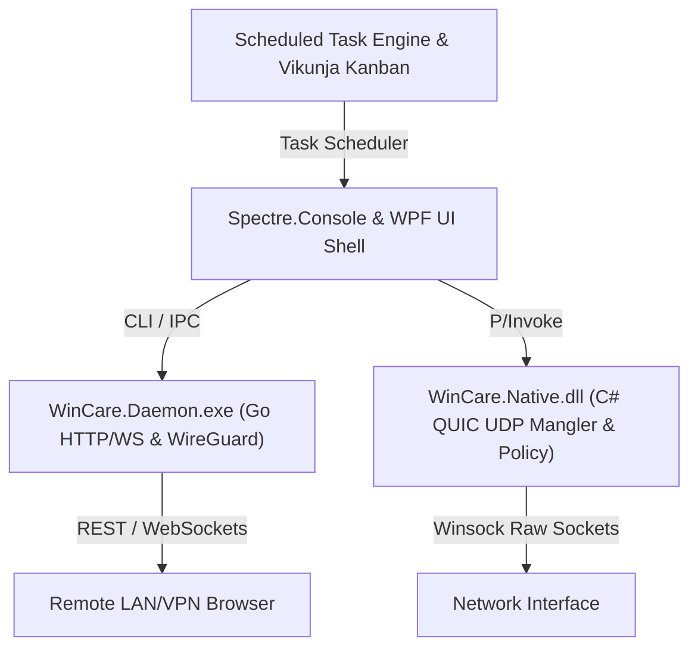

# WinCare v1.1.0 Enterprise Subsystems Design Specification

**Date:** 2026-07-22  
**Status:** Approved for Implementation Planning  
**Target Release:** WinCare v1.1.0  

---

## 1. Overview & Architectural Goals

WinCare v1.1.0 expands the polyglot core architecture with three enterprise-grade subsystems:
1. **Local Host Telemetry & REST/WebSockets Studio**: Embedded local HTTP server streaming system diagnostics over LAN/VPN.
2. **Automated Maintenance Playbooks**: Task Scheduler-driven maintenance engine updating Vikunja Kanban task boards.
3. **Advanced Network DPI & WireGuard Engine**: Native C# QUIC UDP desynchronization and Go userspace WireGuard proxy.

---

## 2. Subsystem Architecture & Component Breakdown

### Subsystem 1: Local Host Telemetry & REST/WebSockets Studio
* **Core Module**: `src/WinCare/Host/TelemetryHttpServer.ps1` & `WinCare.Daemon.exe` (Go HTTP/WS listener).
* **Network Binding**: Listens on `http://127.0.0.1:8899` and LAN/VPN interface with token-based HTTP Authorization headers.
* **Endpoints**:
  * `GET /api/v1/telemetry`: JSON payload containing real-time CPU, RAM, WorkingSet, VCP monitor brightness, and Winsock latency.
  * `WS /api/v1/stream`: High-frequency WebSockets stream (250ms ticks) for live dashboard graphs.

### Subsystem 2: Automated Maintenance Playbooks
* **Core Module**: `src/WinCare/Providers/87-Playbooks.ps1` & `src/WinCare/Core/ScheduledTaskEngine.ps1`.
* **Kanban Integration**: Reads/writes task state JSON at `src/WinCare/Data/Catalog/vikunja-kanban-state.json`.
* **Trigger Mechanism**: Native Windows Task Scheduler XML task templates registered via `Register-ScheduledTask`.
* **Playbook Inventory**:
  * `DailyStoragePurge`: Reclaims temp files and runs DISM component cleanup.
  * `WeeklySecurityBaseline`: Audits Firewall COM rules, HVCI/DSE policy, and telemetry suppression.

### Subsystem 3: Advanced Network DPI & Proxy Engine
* **Core Module**: `src/WinCare/Native/WinCare.DpiHelper.cs` (C# UDP Raw Mangler) & `src/WinCare/Daemon/wireguard_proxy.go` (Go WireGuard Engine).
* **QUIC Desynchronization**: Scrambles QUIC initial packet Connection IDs (CID) and scrambles UDP payload offsets to bypass HTTP/3 inspection.
* **WireGuard Tunneling**: Embedded Go userspace WireGuard engine interfacing via `WinCare.Daemon.exe` IPC.

---

## 3. Data Flow & Interop Boundaries

---

## 4. Error Handling, Safety & Security Boundaries

* **HTTP Server Security**: Enforces localhost/LAN binding and checks `X-WinCare-Token` headers.
* **Task Scheduler Isolation**: Runs playbooks under `NT AUTHORITY\SYSTEM` or executing user context with non-zero exit code error handling.
* **Raw Socket Safety**: Gracefully falls back to TCP desync if raw UDP socket creation lacks administrative privileges.

---

## 5. Testing & Verification Plan

1. **Telemetry Studio Unit Tests**: Verify REST endpoint JSON payloads and WebSockets connection lifecycle (`UITestSuite.Tests.ps1`).
2. **Playbooks Integration Tests**: Test task registration, execution output, and Vikunja Kanban state updates (`MasterProviders.Tests.ps1`).
3. **DPI & WireGuard Tests**: Validate QUIC UDP packet scrambling signatures and WireGuard proxy initialization.
