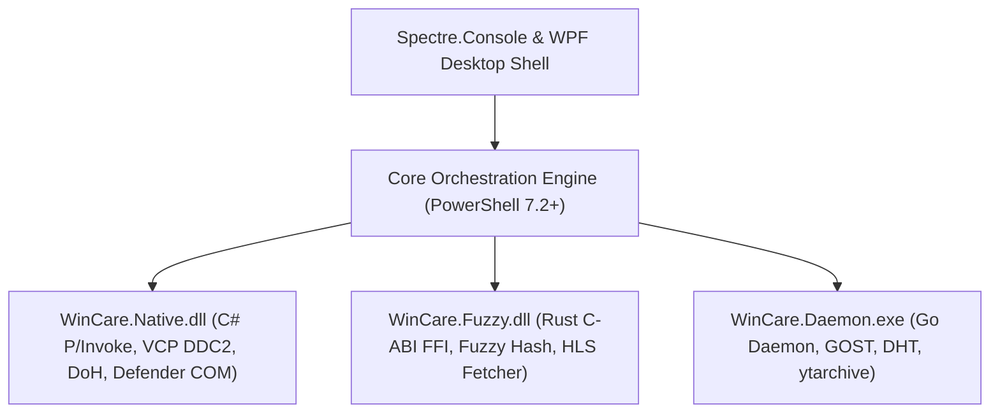

# WinCare v2.0 Next-Gen Master Suite Design Specification

**Date:** 2026-07-22  
**Status:** Approved for Implementation Planning  
**Target Release:** WinCare v2.0.0  

---

## 1. Executive Summary & Vision

WinCare v2.0.0 expands the self-inclusive polyglot architecture into a comprehensive enterprise system care, security baseline, network intelligence, media archiving, and workstation management platform across 8 core domains.

---

## 2. Comprehensive 8-Domain Architecture

### Domain 1: Advanced Security & Threat Hunting (`74-SecurityBaseline.ps1`)
* **Sysmon Parser**: Parses Windows Sysmon event log IDs (1, 3, 7, 10, 11) and maps suspicious process trees directly to MITRE ATT&CK technique IDs (T1059, T1055, T1003).
* **Defender Firewall COM Auditor**: Uses `INetFwPolicy2` COM interfaces (`WinCare.SecurityAuditor.cs`) to audit inbound/outbound rules and block unauthorized listening ports.
* **Kernel Isolation Auditor**: Validates Code Integrity (HVCI), Driver Signature Enforcement (DSE), and Credential Guard enablement states.

### Domain 2: Global Network & Proxy Control (`70-Network.ps1`)
* **DNS-over-HTTPS (DoH) & DoT Resolver**: Native C# Winsock DoH resolver (`Cloudflare 1.1.1.1`, `Quad9 9.9.9.9`, `Google 8.8.8.8`) with automated ad-blocking hosts generator.
* **CDN IP Optimizer**: Cloudflare & Akamai CDN latency scanner (`CdnScanner`) routing TCP traffic over lowest-latency IP ranges.
* **SOCKS5 Multi-Hop Tunnel Manager**: Multi-protocol tunneling manager interfacing with `WinCare.Daemon.exe` (GOST / V2Ray over Psiphon).

### Domain 3: Media & Universal Downloader Suite (`100-Downloads.ps1`)
* **HLS / DASH Parallel Fetcher**: High-performance multi-threaded stream chunk downloader implemented in Rust FFI (`WinCare.Fuzzy.dll` `blob_downloader.rs`).
* **YouTube Live Archiver**: Real-time YouTube live stream recorder dashboard powered by Go `ytarchive` engine in `WinCare.Daemon.exe`.
* **P2P Audio Sharing & DHT Indexer**: BitTorrent DHT node crawler and Soulseek audio P2P network sharing engine.

### Domain 4: Storage & File Intelligence (`30-Storage.ps1`)
* **Smith-Waterman Fuzzy Deduplicator**: Sub-file duplicate content hash analyzer built with Rust FFI (`WinCare.Fuzzy.dll`).
* **MFT Disk Scraper**: Direct Master File Table (MFT) raw disk parser streaming file system metadata in milliseconds.
* **DISM WinSxS Purger**: Safe `/ResetBase` component store cleanup and temp file purge engine (`Cleanuparr`).

### Domain 5: System Performance & Memory Tuning (`56-MemoryManagement.ps1`)
* **HAGS & Game Mode Optimizer**: Toggles Hardware-Accelerated GPU Scheduling (HAGS) and Windows Auto Game Mode policies.
* **WorkingSet & FTH Optimizer**: Dynamic garbage collection and Fault Tolerant Heap (FTH) memory trimmer (`windows-memory-optimizer`).
* **VCP DDC2 Hardware Dimmer**: Physical monitor I2C bus brightness/contrast controller (`WinCare.ShellHardware.cs`).

### Domain 6: Workstation & Shell Customization (`81-Customization.ps1`)
* **ExplorerPatcher & Windhawk Hooks**: Manages Windows 11 taskbar, context menu, and Windhawk DLL modifications.
* **Desktop Icon Fences**: Containerized icon grouping layout engine (`NoFences` / `BirdyFences`).
* **WindowTabs Subclassing Engine**: Native GDI Win32 window tabbing engine injecting tab bars into top-level HWND windows (`WinCare.Productivity.cs`).

### Domain 7: Remote Support & Diagnostic Telemetry (`42-RemoteSupport.ps1`)
* **Aspia DXGI Remote Duplication**: High-speed DXGI Desktop Duplication capture viewer (`aspia`).
* **WebSockets Live Telemetry Stream**: Real-time system diagnostics streaming server on `http://127.0.0.1:8899`.
* **Pure PS RDP & Wi-Fi Direct**: Remote Desktop Protocol server management (`PowerRemoteDesktop`) and WinRT Wi-Fi Direct P2P transfers.

### Domain 8: Automation & Scheduled Playbooks (`87-Playbooks.ps1`)
* **Vikunja Kanban Playbooks**: Scheduled background maintenance playbook engine updating Vikunja Kanban task state boards.
* **WSL Distro Manager**: Distro import/export and configuration manager (`LxRunOffline`).
* **Fido Windows ISO Fetcher**: Official Windows 10/11 ISO download script generator (`Fido`).

---

## 3. High-Level Architectural Diagram

---

## 4. Verification & Testing Strategy

1. **Unit Tests**: Provider signatures and cmdlet exports tested via `MasterProviders.Tests.ps1`.
2. **UI Tests**: Theme role resolution and screen navigation verified via `UITestSuite.Tests.ps1`.
3. **Assembly Build Tests**: Native binaries compiled deterministically via `Build-WinCareNativePolyglot.ps1`.
