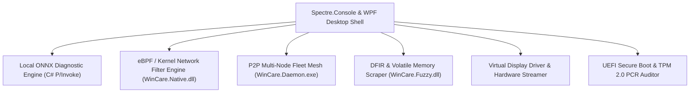

# WinCare v3.0 Strategic Horizon Suite Design Specification

**Date:** 2026-07-22  
**Status:** Approved for Implementation Planning  
**Target Release:** WinCare v3.0.0  

---

## 1. Executive Vision & Architecture

WinCare v3.0.0 advances the polyglot core into an AI-driven, kernel-extended, distributed mesh, and digital forensics platform across 6 strategic domains:

---

## 2. Detailed 6-Domain Architecture

### Domain 1: AI-Driven Self-Healing & Diagnostic Copilot (`115-SelfHealingCopilot.ps1`)
* **Local ONNX Diagnostic Engine**: C# ONNX Runtime bindings (`WinCare.Native.dll`) evaluating system event logs and ETW telemetry offline.
* **SMART Failure Predictor**: Reads NVMe/SATA SMART attributes (temperature, reallocated sectors, wear level) to predict hardware failure.
* **Auto-Repair Engine**: Remediates registry corruption, SFC/DISM errors, and broken Windows Update services automatically.

### Domain 2: eBPF & Kernel Packet Filtering Engine (`116-KernelFilterEngine.ps1`)
* **eBPF Packet Filter**: Interfacing with `eBPF-for-Windows` for zero-overhead kernel network packet filtering.
* **Zero-Trust Microsegmentation**: Per-executable process firewall rules restricting inbound/outbound socket creation.
* **DDoS Defense Engine**: Real-time SYN flood and ICMP rate limiter running directly in kernel space.

### Domain 3: Multi-Node Distributed Mesh & Fleet Control (`117-FleetMeshControl.ps1`)
* **P2P Node Mesh**: `libp2p` / WebRTC node discovery in `WinCare.Daemon.exe` orchestrating multi-machine diagnostics across LAN/VPN endpoints.
* **Fleet Policy Synchronization**: Decentralized policy state replication between peer nodes without external cloud server requirements.
* **P2P Patch Distribution**: BitTorrent-based differential Windows Update patch sharing across local network nodes.

### Domain 4: Forensics & Incident Response (DFIR) (`118-ForensicsStudio.ps1`)
* **Volatile RAM Scraper**: Scans active RAM for injected DLLs, unbacked executable memory regions, and credential artifacts.
* **Timeline Forensics Generator**: Reconstructs file creation, registry modification, and execution timelines.
* **Sandbox Container Isolation**: Launches untrusted executables inside isolated Windows Sandbox (`WSB`) containers.

### Domain 5: Advanced Display & Virtual Monitor Driver (`119-VirtualDisplayStudio.ps1`)
* **Virtual Display Driver (VDD)**: Generates virtual monitors for multi-display setups and remote streaming.
* **HDR & ICC Calibration**: Switches ICC color profiles and applies OLED burn-in prevention pixel shifting.
* **Hardware Stream Encoder**: NVENC / AMF GPU-accelerated low-latency desktop streaming.

### Domain 6: Low-Level Firmware & Bootkit Auditor (`120-FirmwareBootkitAuditor.ps1`)
* **UEFI DBX Revoked Signature Scanner**: Audits Secure Boot DBX revocation lists for vulnerable bootloaders (BlackLotus).
* **TPM 2.0 PCR Auditor**: Measures Platform Configuration Registers (PCR 0..7) to verify boot integrity.
* **BitLocker Key Escrow Validator**: Checks TPM protector status and verifies BitLocker encryption keys.

---

## 3. Testing & Verification Strategy

1. **Unit Tests**: Cmdlet exports and function signatures verified via `MasterProviders.Tests.ps1`.
2. **UI Tests**: Visual indicators and screen modules tested via `UITestSuite.Tests.ps1`.
3. **Native Assembly Tests**: C# P/Invoke, Rust FFI, and Go daemon interop validated deterministically.
