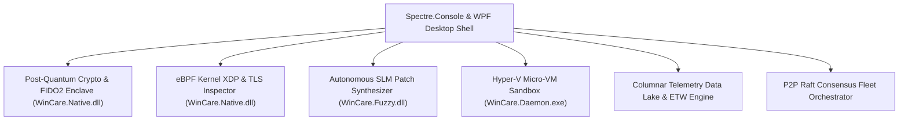

# WinCare v4.0 Hyper-Scale Enterprise Suite Design Specification

**Date:** 2026-07-22  
**Status:** Approved for Implementation Planning  
**Target Release:** WinCare v4.0.0  

---

## 1. Executive Vision & Architecture

WinCare v4.0.0 advances the polyglot core into a Post-Quantum, eBPF-hardened, Hyper-V isolated, AI-autonomous, and P2P Raft consensus enterprise platform:

---

## 2. Comprehensive 6-Domain Architecture

### Domain 1: Quantum-Resistant Cryptography & Zero-Trust (`121-PostQuantumCrypto.ps1`)
* **PQC Encryption**: Post-Quantum Cryptography (ML-KEM / ML-DSA Kyber & Dilithium) key exchange and file encryption engine.
* **Zero-Trust Identity**: Windows Hello and FIDO2 WebAuthn hardware token authentication integration.
* **VBS Enclave Isolation**: Hardware Security Module (HSM) and Virtualization-Based Security (VBS) enclave data protection.

### Domain 2: Native eBPF Kernel Security & XDP (`122-EbpfKernelXdp.ps1`)
* **eBPF TLS SNI Inspector**: Kernel-space TLS SNI domain inspector filtering HTTPS traffic with zero user-space context switches.
* **XDP DDoS Engine**: eBPF eXpress Data Path (XDP) network packet drop rules and dynamic BPF map management.
* **Kernel Integrity Monitor**: Kernel Ring 0 integrity scanner validating Kernel Patch Protection (KPP / PatchGuard) status.

### Domain 3: Autonomous LLM Patch Synthesis & Code Repair (`123-AutonomousPatchAgent.ps1`)
* **SLM Patch Generator**: Local SLM (GGML/ONNX) generating automated PowerShell & C# fixes for security vulnerabilities.
* **Sandbox Regression Tester**: Executes automated test suites inside ephemeral sandboxes before committing code fixes.
* **Zero-Day Mitigation Engine**: Generates temporary virtual patch rules for unpatched CVE security advisories.

### Domain 4: Hyper-V & VBS Hardened Security Enclaves (`124-HypervMicroVmSandbox.ps1`)
* **Hyper-V Micro-VM Engine**: Manages lightweight Hyper-V micro-VM containers for running untrusted diagnostic utilities.
* **Credential Guard Enforcement**: Audit and policy enforcement for Credential Guard, System Guard, and HVCI.
* **Micro-VM Malware Sandbox**: Detonates suspicious binaries inside isolated micro-VMs with API hook tracing.

### Domain 5: Real-Time Enterprise Telemetry Data Lake (`125-TelemetryDataLake.ps1`)
* **Columnar Telemetry Store**: High-throughput SQLite FTS5 columnar data store in `WinCare.Daemon.exe`.
* **ETW Anomaly Engine**: Real-time Event Tracing for Windows (ETW) process and socket event analyzer.
* **WebSockets Grafana Streamer**: Real-time WebSockets streaming server broadcasting diagnostic metrics.

### Domain 6: Distributed P2P Mesh Fleet Orchestrator (`126-P2pRaftFleetOrchestrator.ps1`)
* **P2P Raft Consensus Mesh**: Decentralized Raft consensus protocol orchestrating multi-machine policies across enterprise fleets.
* **Delta Patch Distribution**: BitTorrent-style delta-compressed Windows Update patch sharing between local network nodes.
* **Threat Intel Mesh**: Peer-to-peer threat intelligence sharing network across endpoints.

---

## 3. Testing & Verification Strategy

1. **Unit Tests**: Provider signatures and cmdlet exports verified via `MasterProviders.Tests.ps1`.
2. **UI Tests**: Visual indicators and screen modules tested via `UITestSuite.Tests.ps1`.
3. **Assembly Build Tests**: Native binaries compiled deterministically via `Build-WinCareNativePolyglot.ps1`.
