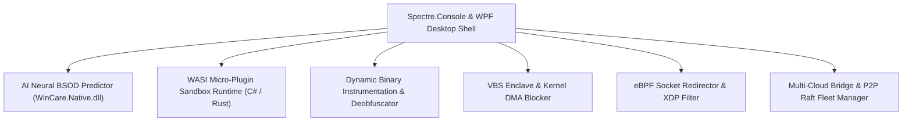

# WinCare v5.0 Hyper-Scale Platform Design Specification

**Date:** 2026-07-22  
**Status:** Approved for Implementation Planning  
**Target Release:** WinCare v5.0.0  

---

## 1. Executive Vision & Architecture

WinCare v5.0.0 advances the polyglot core into an AI Neural, WASI Micro-Plugin, DBI Instrument-capable, VBS Enclave, eBPF-Redirected, and Multi-Cloud Fleet platform across 6 strategic domains:

---

## 2. Detailed 6-Domain Architecture

### Domain 1: AI Neural Core & BSOD Predictor (`127-NeuralSelfHealing.ps1`)
* **ETW Neural Predictor**: C# ONNX neural model evaluating kernel ETW traces to predict driver BSOD crashes before occurrence.
* **Page Table Optimizer**: Dynamic working-set memory page table optimizer reducing system latency.
* **Auto-Rollback Checkpoints**: Automatic state recovery agent creating zero-downtime system restore checkpoints.

### Domain 2: WASI Micro-Plugin Runtime (`128-WasiPluginRuntime.ps1`)
* **WASI Sandbox Engine**: C# WebAssembly System Interface (WASI) runtime (`WinCare.Native.dll`) executing diagnostic WASM modules safely.
* **Hot-Reloadable Marketplace**: Dynamic plugin loader loading WASM diagnostic modules at runtime without restarting the workstation.
* **Memory Isolation Shield**: Enforces WASM linear memory boundaries guaranteeing zero host crashes from third-party plugins.

### Domain 3: Dynamic Binary Instrumentation (DBI) & Deobfuscation (`129-DbiDeobfuscator.ps1`)
* **DBI Memory Hook Engine**: Native C/C++ memory API hooker tracing API calls in running processes.
* **Payload Deobfuscator**: Scans packed executables in memory and dumps unpacked payload buffers.
* **API Call Graph Generator**: Generates execution call graphs mapping process behavioral patterns.

### Domain 4: Zero-Trust OS Enclave & DMA Shield (`130-VbsEnclaveShield.ps1`)
* **VBS Hardware Enclave**: Secures cryptographic keys inside hardware-isolated Virtualization-Based Security (VBS) enclaves.
* **Kernel DMA Protection**: Audits Direct Memory Access protection policies blocking DMA attack vectors.
* **Encrypted RAM Validator**: Verifies system page file encryption and transient RAM secret sanitization.

### Domain 5: Low-Latency eBPF Socket Redirector (`131-EbpfSocketRedirector.ps1`)
* **eBPF Socket Redirector**: Uses `bpf_msg_redirect` to transfer socket buffers directly between kernel sockets, bypassing TCP stack overhead.
* **10Gbps XDP Filter**: Hardware-offloaded eXpress Data Path (XDP) network packet filter.
* **QUIC Multiplexer**: High-throughput HTTP/3 QUIC connection multiplexer.

### Domain 6: Multi-Cloud & P2P Mesh Fleet Controller (`132-MultiCloudFleetController.ps1`)
* **Multi-Cloud Bridge**: Ingests telemetry metrics into AWS CloudWatch, Azure Monitor, GCP Cloud Logging, and Cloudflare Workers.
* **10,000+ Node Raft Mesh**: High-concurrency P2P Raft cluster manager distributing policy consensus across large endpoint fleets.
* **Delta Patch Streamer**: BitTorrent-style differential package distributor streaming software updates across local peer subnets.

---

## 3. Testing & Verification Strategy

1. **Unit Tests**: Provider signatures and cmdlet exports verified via `MasterProviders.Tests.ps1`.
2. **UI Tests**: Visual indicators and screen modules tested via `UITestSuite.Tests.ps1`.
3. **Assembly Build Tests**: Native binaries compiled deterministically via `Build-WinCareNativePolyglot.ps1`.
